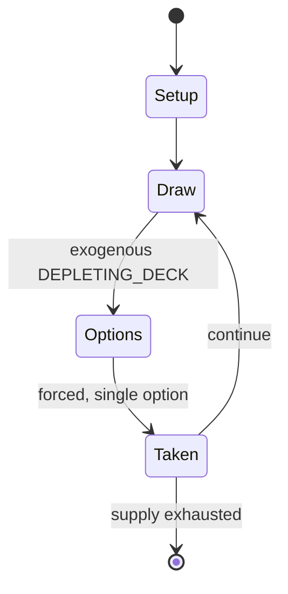

# Ferme

*French gambling game*

`ferme` &nbsp; state: **DEEPENED** &nbsp; method: **heuristic**

## Found layer (recorded, not trusted)

| field | value |
| --- | --- |
| wikidata | Q108551275 |
| wikipedia | Ferme (card game) |
| genres (source) | -- |
| instance of (source) | banking game |
| country of origin | France |

## Declared layer (orders bench work)

| field | value |
| --- | --- |
| year created | -- |
| epoch | -- |
| region | EUROPE_WEST |
| media | GAMBLING |
| players | -- |
| age band | -- |
| exogenous process | DEPLETING_DECK |
| loss shape | -- |
| live axes | BID |
| horizon | -- |
| scoring shape | -- |
| information | -- |
| interaction | COMPETITIVE |
| turn structure | PRIORITY_QUEUE |
| tractability | EXACT_WITH_CUT |
| randomness | DECK_SHUFFLE |
| luck factor | 0.48 |
| rules complexity | 2.9 |
| strategic depth | 2.25 |
| novelty | 0.7501 |
| solved status | -- |
| strategies | spatial_packing |
| algorithms | -- |

## Object model

```
Episode
  players      : ?
  turn_structure: PRIORITY_QUEUE
  horizon       : ?
  scoring       : ?

Auction        -- priced competition resolving to one winner
```

## State transition diagram



## Research item -- turn trace

```
# Ferme -- simulated turn events
# generated from the DECLARED vector, not from a rulebook.
# structure: exo=DEPLETING_DECK loss=None horizon=None scoring=None axes=BID

t=0    SETUP        players=2  pot=0  capacity=6
t=1    DRAW         p1 draw from deck -> outcome #2  (p=0.231)
t=2    FORCED       p1 single legal option taken (pot_gain=+0.7)
t=3    BID          p1 sealed bid of 3 against 1 rivals
t=4    DRAW         p1 draw from deck -> outcome #5  (p=0.164)
t=5    FORCED       p1 single legal option taken (pot_gain=+1.0)
t=6    BID          p1 sealed bid of 4 against 1 rivals
t=7    ENDTURN      turn passes to p2
t=8    DRAW         p2 draw from deck -> outcome #1  (p=0.059)
t=9    FORCED       p2 single legal option taken (pot_gain=+1.5)
t=10   BID          p2 sealed bid of 6 against 1 rivals
t=11   ENDTURN      turn passes to p1
t=12   DRAW         p1 draw from deck -> outcome #5  (p=0.284)
t=13   FORCED       p1 single legal option taken (pot_gain=+1.9)
t=14   DRAW         p1 draw from deck -> outcome #3  (p=0.286)
t=15   FORCED       p1 single legal option taken (pot_gain=+0.7)
t=16   BID          p1 sealed bid of 9 against 1 rivals
t=17   ENDTURN      turn passes to p2
t=18   DRAW         p2 draw from deck -> outcome #4  (p=0.079)
t=19   FORCED       p2 single legal option taken (pot_gain=+0.6)
t=20   BID          p2 sealed bid of 9 against 1 rivals
t=21   DRAW         p2 draw from deck -> outcome #3  (p=0.201)
t=22   FORCED       p2 single legal option taken (pot_gain=+1.7)
t=23   DRAW         p2 draw from deck -> outcome #3  (p=0.016)
t=24   FORCED       p2 single legal option taken (pot_gain=+1.3)
t=25   ENDTURN      turn passes to p1
t=26   DRAW         p1 draw from deck -> outcome #4  (p=0.162)
t=27   FORCED       p1 single legal option taken (pot_gain=+2.0)
t=28   BID          p1 sealed bid of 3 against 1 rivals
t=29   ENDTURN      turn passes to p2

terminal: VARIABLE
```

## Conditions

| kind | threshold | effect | trigger |
| --- | --- | --- | --- |
| PENALTY | -- | -- | Although forfeiting the chance of winning the farm, such a player may still win the pool. |

## Source extract

Ferme ('farm') is an historical French gambling game of the banking type for ten to twelve
players that dates to the mid-17th century. It was described then as being "fun and
recreational".   == History == The game is first mentioned in 1640 and first described by de la
Marinière in 1659, but continued to be regularly featured in French games compendia until the
end of the 19th century, for example, in Boussac (1896). According to Parlett (1991), "'farm' is
metaphorical for 'bank', and the proprietors of Parisian gaming houses were known as 'farmers'".
Ferme is ancestral to the American game of farmer which was purportedly played in rural parts of
America "well into the 20th century".   == Rules ==   === Earliest rules (1659) === De la
Marinière's 1659 rules are sketchy, but essentially players vie for the right to become the
farmer which is the name of the banker in this game. The highest bidder becomes the farmer and
places his bid amount, called the farm, "under the candelabra or in the coin purse". The 8s are
removed from the pack, the reason being that these cards would enable players to make the target
score of 16 too easily. Each player except the farmer also antes a stake t

<sub>Wikipedia, CC BY-SA. Retained as evidence for the structural
classification above. Every rule inferred from it is HYPOTHESIZED
until audited against a rulebook.</sub>
