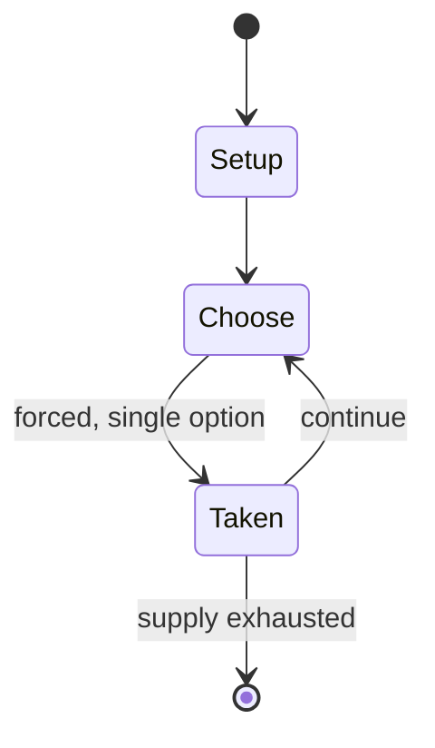

# Fetaix

`fetaix` &nbsp; state: **DEEPENED** &nbsp; method: **heuristic**

## Found layer (recorded, not trusted)

| field | value |
| --- | --- |
| wikidata | Q5445895 |
| wikipedia | Fetaix |
| genres (source) | -- |
| instance of (source) | -- |
| country of origin | -- |

## Declared layer (orders bench work)

| field | value |
| --- | --- |
| year created | -- |
| epoch | -- |
| region | -- |
| media | ABSTRACT, BOARD |
| players | -- |
| age band | -- |
| exogenous process | -- |
| loss shape | -- |
| live axes | ORDER, SPATIAL |
| horizon | -- |
| scoring shape | -- |
| information | -- |
| interaction | SOLITAIRE |
| turn structure | STRICT_TURN |
| tractability | SAMPLING_ONLY |
| randomness | -- |
| luck factor | 0.35 |
| rules complexity | 2.43 |
| strategic depth | 2.0 |
| novelty | 0.5164 |
| solved status | -- |
| strategies | -- |
| algorithms | -- |

## Object model

```
Episode
  players      : ?
  turn_structure: STRICT_TURN
  horizon       : ?
  scoring       : ?

Board          -- spatial substrate; cells carry position and occupancy
Piece          -- movable token owned by a player
Sequence       -- the permutation under the player's control
Placement      -- position subject to geometric legality
```

## State transition diagram



## Research item -- turn trace

```
# Fetaix -- simulated turn events
# generated from the DECLARED vector, not from a rulebook.
# structure: exo=None loss=None horizon=None scoring=None axes=ORDER,SPATIAL

t=0    SETUP        players=2  pot=0  capacity=6
t=1    FORCED       p1 single legal option taken (pot_gain=+1.2)
t=2    FORCED       p1 single legal option taken (pot_gain=+1.6)
t=3    SPATIAL      p1 places at (0,0); adjacency legal
t=4    FORCED       p1 single legal option taken (pot_gain=+0.9)
t=5    SPATIAL      p1 places at (1,1); adjacency legal
t=6    ENDTURN      turn passes to p2
t=7    FORCED       p2 single legal option taken (pot_gain=+1.1)
t=8    ENDTURN      turn passes to p1
t=9    FORCED       p1 single legal option taken (pot_gain=+1.1)
t=10   FORCED       p1 single legal option taken (pot_gain=+1.7)
t=11   FORCED       p1 single legal option taken (pot_gain=+1.0)
t=12   SPATIAL      p1 places at (7,3); adjacency legal
t=13   ENDTURN      turn passes to p2
t=14   FORCED       p2 single legal option taken (pot_gain=+0.6)
t=15   ENDTURN      turn passes to p1
t=16   FORCED       p1 single legal option taken (pot_gain=+2.0)
t=17   SPATIAL      p1 places at (3,1); adjacency legal
t=18   ENDTURN      turn passes to p2
t=19   FORCED       p2 single legal option taken (pot_gain=+0.8)
t=20   SPATIAL      p2 places at (7,0); adjacency legal
t=21   ENDTURN      turn passes to p1
t=22   FORCED       p1 single legal option taken (pot_gain=+1.4)
t=23   FORCED       p1 single legal option taken (pot_gain=+1.9)
t=24   SPATIAL      p1 places at (7,3); adjacency legal
t=25   FORCED       p1 single legal option taken (pot_gain=+1.2)
t=26   ENDTURN      turn passes to p2

terminal: VARIABLE
```

## Conditions

| kind | threshold | effect | trigger |
| --- | --- | --- | --- |
| WIN | -- | -- | The player who captures all of their opponent's pieces is the winner. |

## Source extract

Fetaix is a two-player abstract strategy board game from Morocco.  It is very similar to
Alquerque.  The only difference is that pieces cannot move backwards until they are promoted to
Mullah which is the equivalent of King in draughts.  Furthermore, Mullahs can move any number of
vacant points on the board, and capture enemy pieces from any distance similar to the Kings in
International draughts.  Another name for the game is qireq.   == Goal == The player who
captures all of their opponent's pieces is the winner.   == Equipment == The board used is an
Alquerque board.  Each player has 12 pieces as in Alquerque.  One player plays the black pieces,
and the other player plays the white pieces.   == Game Play and Rules == 1.  Players decide what
color pieces to play. 2.  The board is initially set up exactly as in Alquerque.  Each player's
pieces are set up in the first two ranks (two rows) of their side, and also on the two right-
most points of the third rank (center row of the board).  The only point vacant on the board is
the middle point. 3.  Players alternate their turns.  A player on their turn may either move one
of their pieces, or use one of their pieces to capture the other

<sub>Wikipedia, CC BY-SA. Retained as evidence for the structural
classification above. Every rule inferred from it is HYPOTHESIZED
until audited against a rulebook.</sub>
