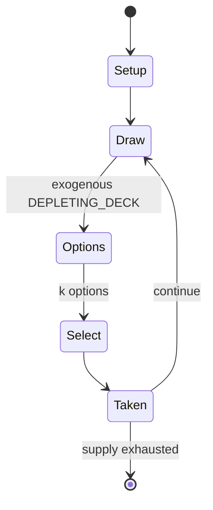

# Fictionary

*party game*

`fictionary` &nbsp; state: **DEEPENED** &nbsp; method: **heuristic**

## Found layer (recorded, not trusted)

| field | value |
| --- | --- |
| wikidata | Q472991 |
| wikipedia | Fictionary |
| genres (source) | -- |
| instance of (source) | party game, word play |
| country of origin | Japan |

## Declared layer (orders bench work)

| field | value |
| --- | --- |
| year created | -- |
| epoch | -- |
| region | EAST_ASIA |
| media | BOARD, PARTY, WORD |
| players | -- |
| age band | -- |
| exogenous process | DEPLETING_DECK |
| loss shape | -- |
| live axes | BLUFF, SELECT, TRADE |
| horizon | -- |
| scoring shape | LINEAR_ACCUMULATION |
| information | IMPERFECT |
| interaction | SOLITAIRE |
| turn structure | PHASE_STRUCTURED |
| tractability | SAMPLING_ONLY |
| randomness | DECK_SHUFFLE |
| luck factor | 0.48 |
| rules complexity | 3.86 |
| strategic depth | 2.25 |
| novelty | 0.7169 |
| solved status | -- |
| strategies | bluffing |
| algorithms | -- |

## Object model

```
Episode
  players      : ?
  turn_structure: PHASE_STRUCTURED
  horizon       : ?
  scoring       : LINEAR_ACCUMULATION

Board          -- spatial substrate; cells carry position and occupancy
Piece          -- movable token owned by a player
Belief         -- what an observer is induced to think is true
OptionSet      -- the choices available after an exogenous draw
Offer          -- proposed exchange between two agents
```

## State transition diagram



## Research item -- turn trace

```
# Fictionary -- simulated turn events
# generated from the DECLARED vector, not from a rulebook.
# structure: exo=DEPLETING_DECK loss=None horizon=None scoring=LINEAR_ACCUMULATION axes=BLUFF,SELECT,TRADE

t=0    SETUP        players=2  pot=0  capacity=8
t=1    DRAW         p1 draw from deck -> outcome #3  (p=0.070)
t=2    SELECT       p1 1 options; take #1  (pot_gain=+1.1, capacity=-1)
t=3    TRADE        p1 offers 2:1 exchange to p2
t=4    BLUFF        p1 represents a holding it does not have
t=5    ENDTURN      turn passes to p2
t=6    DRAW         p2 draw from deck -> outcome #4  (p=0.038)
t=7    SELECT       p2 4 options; take #1  (pot_gain=+1.2, capacity=-2)
t=8    ENDTURN      turn passes to p1
t=9    DRAW         p1 draw from deck -> outcome #1  (p=0.006)
t=10   SELECT       p1 2 options; take #1  (pot_gain=+1.8, capacity=-1)
t=11   BLUFF        p1 represents a holding it does not have
t=12   ENDTURN      turn passes to p2
t=13   DRAW         p2 draw from deck -> outcome #5  (p=0.132)
t=14   SELECT       p2 4 options; take #2  (pot_gain=+3.5, capacity=-1)
t=15   TRADE        p2 offers 2:1 exchange to p1
t=16   DRAW         p2 draw from deck -> outcome #1  (p=0.159)
t=17   SELECT       p2 4 options; take #3  (pot_gain=+2.1, capacity=-0)
t=18   BLUFF        p2 represents a holding it does not have
t=19   DRAW         p2 draw from deck -> outcome #4  (p=0.252)
t=20   SELECT       p2 3 options; take #2  (pot_gain=+1.9, capacity=-2)
t=21   ENDTURN      turn passes to p1
t=22   DRAW         p1 draw from deck -> outcome #3  (p=0.073)
t=23   SELECT       p1 1 options; take #1  (pot_gain=+3.3, capacity=-2)
t=24   TRADE        p1 offers 2:1 exchange to p2
t=25   BLUFF        p1 represents a holding it does not have
t=26   ENDTURN      turn passes to p2

terminal: VARIABLE
```

## Conditions

| kind | threshold | effect | trigger |
| --- | --- | --- | --- |
| ELIMINATE | 1 round | -- | In one round of the board game Derivation, players describe or fabricate a word's etymology; players who provide a correct etymology receive one point for doing so, but their entries are then removed from play, and they  |
| TERMINATE | -- | -- | In the final round, players use the synonyms in a sentence. |

## Source extract

Fictionary, also known as the Dictionary Game or simply Dictionary, is a word game in which
players guess the definition of an obscure word. Each round consists of one player selecting and
announcing a word from the dictionary, and other players composing a fake definition for it. The
definitions, as well as the correct definition, are collected blindly by the selector and read
aloud, and players vote on which definition they believe to be correct. Points are awarded for
correct guesses, and for having a fake definition guessed by another player.   == Gameplay ==
The game requires a large and preferably unabridged dictionary, a pencil, pen or other writing
implement for each player, and notecards or identical pieces of paper for each player.
Individual house rules may vary when playing Fictionary, but play usually proceeds like this:
One player, the "picker" for the turn, chooses an obscure word from the dictionary and announces
and spells it to the other players. The chosen word should be one that the picker expects no
other player to know. If a player is familiar with the chosen word, they should say so and the
picker should choose a different word. If a word has more than one d

<sub>Wikipedia, CC BY-SA. Retained as evidence for the structural
classification above. Every rule inferred from it is HYPOTHESIZED
until audited against a rulebook.</sub>
