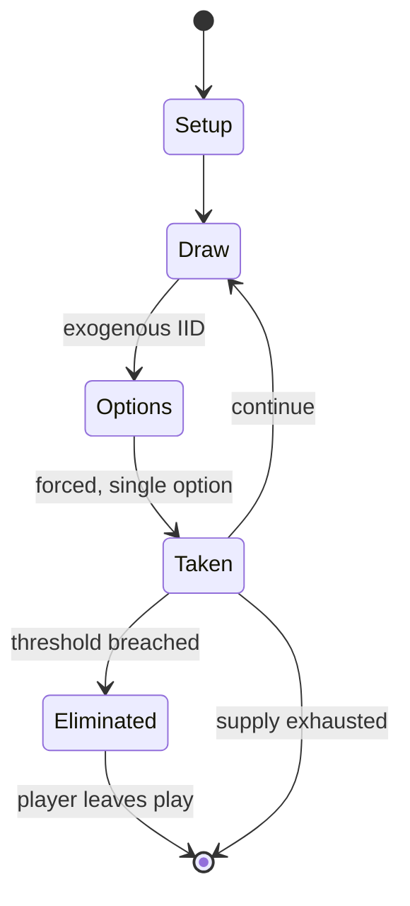

# Fifth Frontier War

*tabletop wargame*

`fifth_frontier_war` &nbsp; state: **DEEPENED** &nbsp; method: **heuristic**

## Found layer (recorded, not trusted)

| field | value |
| --- | --- |
| wikidata | Q55611627 |
| wikipedia | Fifth Frontier War |
| genres (source) | science fiction |
| instance of (source) | board wargame |
| country of origin | -- |

## Declared layer (orders bench work)

| field | value |
| --- | --- |
| year created | 1981 |
| epoch | DIGITAL |
| region | -- |
| media | DICE, WARGAME |
| players | -- |
| age band | -- |
| exogenous process | IID |
| loss shape | ELIMINATION |
| live axes | ORDER |
| horizon | -- |
| scoring shape | LINEAR_ACCUMULATION |
| information | -- |
| interaction | SOLITAIRE |
| turn structure | PHASE_STRUCTURED |
| tractability | EXACT_WITH_CUT |
| randomness | DICE |
| luck factor | 0.58 |
| rules complexity | 4.04 |
| strategic depth | 2.12 |
| novelty | 0.7721 |
| solved status | -- |
| strategies | probability_estimation |
| algorithms | -- |

## Object model

```
Episode
  players      : ?
  turn_structure: PHASE_STRUCTURED
  horizon       : ?
  scoring       : LINEAR_ACCUMULATION

DicePool       -- n dice, each an iid categorical draw
Roll           -- realised outcome of a pool
Sequence       -- the permutation under the player's control
```

## State transition diagram



## Research item -- turn trace

```
# Fifth Frontier War -- simulated turn events
# generated from the DECLARED vector, not from a rulebook.
# structure: exo=IID loss=ELIMINATION horizon=None scoring=LINEAR_ACCUMULATION axes=ORDER

t=0    SETUP        players=2  pot=0  capacity=3
t=1    DRAW         p1 roll from d6 pool -> outcome #6  (p=0.268)
t=2    FORCED       p1 single legal option taken (pot_gain=+1.2)
t=3    ENDTURN      turn passes to p2
t=4    DRAW         p2 roll from d6 pool -> outcome #2  (p=0.283)
t=5    FORCED       p2 single legal option taken (pot_gain=+1.5)
t=6    DRAW         p2 roll from d6 pool -> outcome #1  (p=0.008)
t=7    FORCED       p2 single legal option taken (pot_gain=+1.2)
t=8    ENDTURN      turn passes to p1
t=9    DRAW         p1 roll from d6 pool -> outcome #4  (p=0.275)
t=10   FORCED       p1 single legal option taken (pot_gain=+1.3)
t=11   DRAW         p1 roll from d6 pool -> outcome #1  (p=0.274)
t=12   FORCED       p1 single legal option taken (pot_gain=+0.8)
t=13   DRAW         p1 roll from d6 pool -> outcome #1  (p=0.221)
t=14   FORCED       p1 single legal option taken (pot_gain=+1.4)
t=15   DRAW         p1 roll from d6 pool -> outcome #1  (p=0.126)
t=16   FORCED       p1 single legal option taken (pot_gain=+0.8)
t=17   DRAW         p1 roll from d6 pool -> outcome #3  (p=0.034)
t=18   FORCED       p1 single legal option taken (pot_gain=+1.9)
t=19   DRAW         p1 roll from d6 pool -> outcome #6  (p=0.136)
t=20   FORCED       p1 single legal option taken (pot_gain=+0.7)
t=21   ENDTURN      turn passes to p2
t=22   DRAW         p2 roll from d6 pool -> outcome #5  (p=0.294)
t=23   FORCED       p2 single legal option taken (pot_gain=+0.6)
t=24   DRAW         p2 roll from d6 pool -> outcome #2  (p=0.051)
t=25   FORCED       p2 single legal option taken (pot_gain=+1.6)
t=26   DRAW         p2 roll from d6 pool -> outcome #3  (p=0.095)
t=27   FORCED       p2 single legal option taken (pot_gain=+1.1)

terminal: VARIABLE
```

## Conditions

| kind | threshold | effect | trigger |
| --- | --- | --- | --- |
| TERMINATE | 1 player | -- | The game ends either when one player accumulates a pre-determined number of victory points, or when both sides agree to an armistice. |
| ELIMINATE | -- | -- | (This can be modified by the tactical ratings of admirals, if applicable.) The result is expressed as defense factors which have to be lost, either by reducing the strength of squadrons, or by eliminating squadrons. |

## Source extract

Fifth Frontier War two-player science fiction board wargame published by Game Designers'
Workshop (GDW) in 1981. Fifth Frontier War is the fifth Traveller boardgame published by GDW. It
was republished in 2004 as part of Far Future Enterprises Traveller: The Classic Games, Games
1-6+.   == Setting == Although Fifth Frontier War shares the universe and history of the
Traveller role-playing game, it is a stand-alone board game with no elements of role-playing. In
the Traveller universe, the Imperium and the Zhodani Consulate have been warring with each other
for control of the Spinward Marches. The title of this game refers to the fifth confrontation
between the two superpowers, a Zhodani offensive.   == Gameplay == The game components are:  a
22" x 28" map depicting the Jewell, Regina, Lanth, and Vilis subsectors, and parts of four other
subsectors, which involve a total of 146 star systems. The map includes details of each star
system (starport class, presence of gas giant for refuelling, bases, and high population if
applicable) 480 counters representing combat units 240 counters to record losses of ground
troops and system defense boats a rulebook 2 six-sided dice The game starts

<sub>Wikipedia, CC BY-SA. Retained as evidence for the structural
classification above. Every rule inferred from it is HYPOTHESIZED
until audited against a rulebook.</sub>
