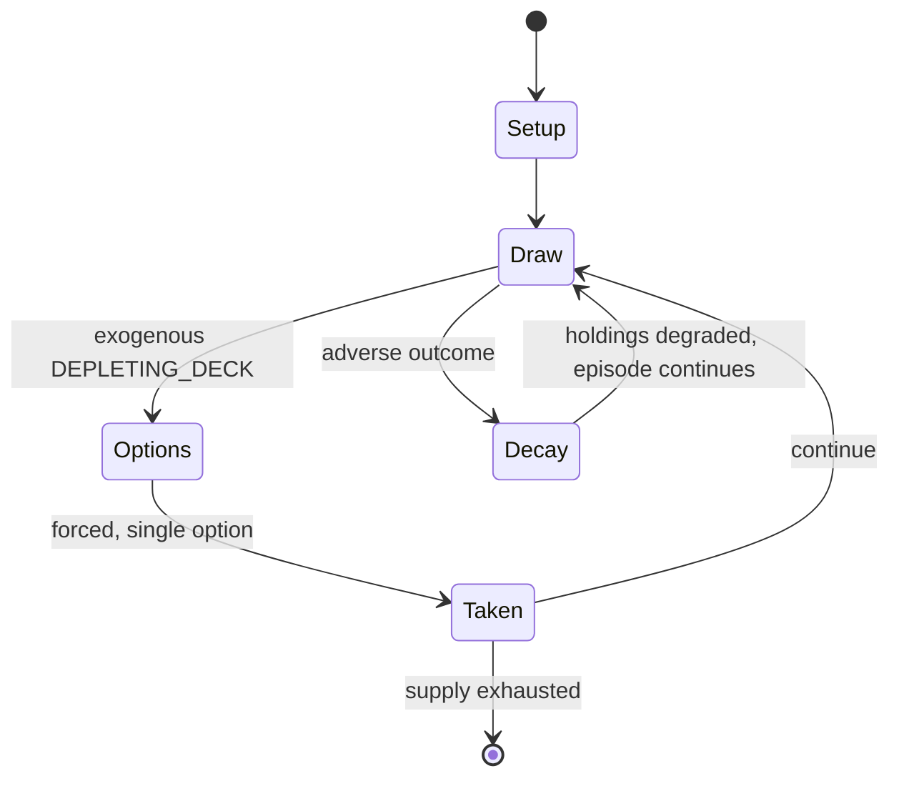

# Fingerkloppe

`fingerkloppe` &nbsp; state: **DEEPENED** &nbsp; method: **heuristic**

## Found layer (recorded, not trusted)

| field | value |
| --- | --- |
| wikidata | Q20827440 |
| wikipedia | Fingerkloppe |
| genres (source) | -- |
| instance of (source) | -- |
| country of origin | -- |

## Declared layer (orders bench work)

| field | value |
| --- | --- |
| year created | -- |
| epoch | -- |
| region | -- |
| media | CARD |
| players | -- |
| age band | -- |
| exogenous process | DEPLETING_DECK |
| loss shape | PARTIAL_DECAY |
| live axes | - |
| horizon | -- |
| scoring shape | -- |
| information | -- |
| interaction | -- |
| turn structure | -- |
| tractability | EXACT_WITH_CUT |
| randomness | DECK_SHUFFLE |
| luck factor | 0.48 |
| rules complexity | 1.73 |
| strategic depth | 2.25 |
| novelty | 0.7402 |
| solved status | -- |
| strategies | spatial_packing |
| algorithms | -- |

## Object model

```
Episode
  players      : ?
  turn_structure: ?
  horizon       : ?
  scoring       : ?

Deck           -- ordered multiset, drawn without replacement
Hand           -- private multiset held by one player
DiscardPile    -- public accumulation of spent cards
```

## State transition diagram



## Research item -- turn trace

```
# Fingerkloppe -- simulated turn events
# generated from the DECLARED vector, not from a rulebook.
# structure: exo=DEPLETING_DECK loss=PARTIAL_DECAY horizon=None scoring=None axes=-

t=0    SETUP        players=2  pot=0  capacity=5
t=1    DRAW         p1 draw from deck -> outcome #2  (p=0.264)
t=2    FORCED       p1 single legal option taken (pot_gain=+1.2)
t=3    DRAW         p1 draw from deck -> outcome #2  (p=0.138)
t=4    FORCED       p1 single legal option taken (pot_gain=+0.6)
t=5    DRAW         p1 draw from deck -> outcome #3  (p=0.251)
t=6    FORCED       p1 single legal option taken (pot_gain=+1.5)
t=7    DRAW         p1 draw from deck -> outcome #5  (p=0.155)
t=8    FORCED       p1 single legal option taken (pot_gain=+1.1)
t=9    DRAW         p1 draw from deck -> outcome #2  (p=0.297)
t=10   FORCED       p1 single legal option taken (pot_gain=+0.9)
t=11   DRAW         p1 draw from deck -> outcome #1  (p=0.222)
t=12   FORCED       p1 single legal option taken (pot_gain=+0.9)
t=13   DRAW         p1 draw from deck -> outcome #2  (p=0.144)
t=14   FORCED       p1 single legal option taken (pot_gain=+1.4)
t=15   DRAW         p1 draw from deck -> outcome #3  (p=0.185)
t=16   FORCED       p1 single legal option taken (pot_gain=+1.0)
t=17   DRAW         p1 draw from deck -> outcome #6  (p=0.290)
t=18   FORCED       p1 single legal option taken (pot_gain=+1.6)
t=19   DRAW         p1 draw from deck -> outcome #6  (p=0.064)
t=20   FORCED       p1 single legal option taken (pot_gain=+1.9)
t=21   DRAW         p1 draw from deck -> outcome #4  (p=0.183)
t=22   FORCED       p1 single legal option taken (pot_gain=+1.8)
t=23   ENDTURN      turn passes to p2
t=24   DRAW         p2 draw from deck -> outcome #5  (p=0.225)
t=25   FORCED       p2 single legal option taken (pot_gain=+1.1)
t=26   DRAW         p2 draw from deck -> outcome #1  (p=0.035)
t=27   FORCED       p2 single legal option taken (pot_gain=+1.9)

terminal: VARIABLE
```

## Conditions

| kind | threshold | effect | trigger |
| --- | --- | --- | --- |
| ELIMINATE | -- | out of the game | If a card does the complete circuit it is out of the game and a new card is drawn from the top of the talon. |
| PENALTY | -- | -- | After the card game follows the award of penalties to the loser. |
| PENALTY | -- | -- | Two different penalty systems have established themselves: |
| PENALTY | -- | -- | The suit of that card indicates what penalty the loser receives: |
| PENALTY | -- | -- | If the loser withdraws his or her hand when being punished, the entire stack is used as a penalty. |

## Source extract

Fingerkloppe, also just Kloppe, sometimes also called Rot Händle ("Little Red Hand")  Metzger
("Butcher"), Bratzln ‚ Pfötchen ("Little Paw"), Knipper, Fleischer ("Butcher"), Feuer ("Fire")
or Folter Mau Mau ("Torture Mau-Mau") ("Torture Mau Mau") is a card game, which is normally
played with a Skat pack of 32 cards. Depending on the number of players, the number of cards
may, however, be greater. The game is common in the German-speaking region among children and
young people.   == Playing ==   === Card game === Each player is dealt four cards, except the
player to the right of the dealer who is dealt five and starts the game. The aim is to collect
four cards of the same value (a so-called quartet) in one's hand (e. g. four Unters or Bauern).
This is achieved by passing the "fifth" card each time to the player on the right. The latter
takes the card and gives another card, or the passed card, to the right in turn. If a card does
the complete circuit it is out of the game and a new card is drawn from the top of the talon. A
player who achieves the aim of having four cards of equal rank in hand, places them face up and
calls "Fingerkloppe!". The other players must immediately place t

<sub>Wikipedia, CC BY-SA. Retained as evidence for the structural
classification above. Every rule inferred from it is HYPOTHESIZED
until audited against a rulebook.</sub>
