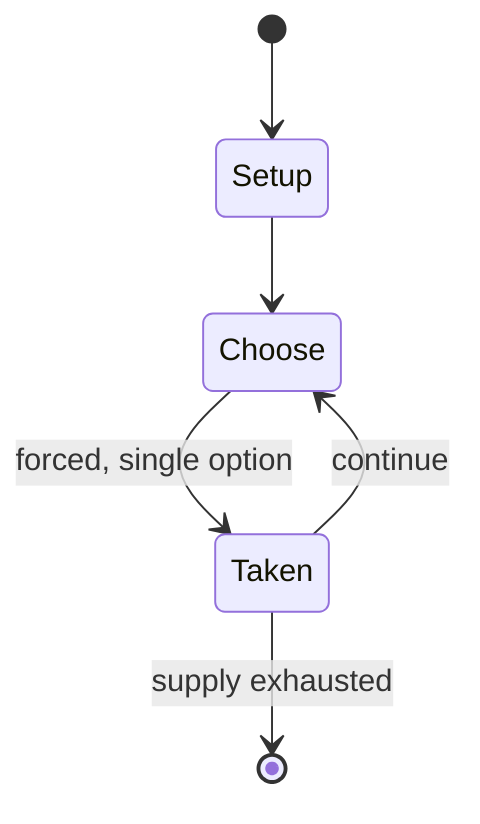

# Finnish skittles

*Finnish game*

`finnish_skittles` &nbsp; state: **DEEPENED** &nbsp; method: **heuristic**

## Found layer (recorded, not trusted)

| field | value |
| --- | --- |
| wikidata | Q5450874 |
| wikipedia | Finnish skittles |
| genres (source) | -- |
| instance of (source) | game, outdoor game |
| country of origin | Finland |

## Declared layer (orders bench work)

| field | value |
| --- | --- |
| year created | -- |
| epoch | -- |
| region | EUROPE_NORTH |
| media | SPORT |
| players | -- |
| age band | -- |
| exogenous process | NONE |
| loss shape | OPPORTUNITY_ONLY |
| live axes | - |
| horizon | -- |
| scoring shape | SET_COLLECTION_CONVEX |
| information | PERFECT |
| interaction | COMPETITIVE |
| turn structure | -- |
| tractability | SAMPLING_ONLY |
| randomness | NONE |
| luck factor | 0.02 |
| rules complexity | 2.27 |
| strategic depth | 2.65 |
| novelty | 0.6389 |
| solved status | -- |
| strategies | spatial_packing |
| algorithms | -- |

## Object model

```
Episode
  players      : ?
  turn_structure: ?
  horizon       : ?
  scoring       : SET_COLLECTION_CONVEX

Pitch          -- bounded physical region
Player         -- embodied agent with a foul count
Clock          -- counts down; stoppages are rule events
Official       -- detects infractions and applies penalties
```

## State transition diagram



## Research item -- turn trace

```
# Finnish skittles -- simulated turn events
# generated from the DECLARED vector, not from a rulebook.
# structure: exo=NONE loss=OPPORTUNITY_ONLY horizon=None scoring=SET_COLLECTION_CONVEX axes=-

t=0    SETUP        players=2  pot=0  capacity=8
t=1    FORCED       p1 single legal option taken (pot_gain=+0.6)
t=2    FORCED       p1 single legal option taken (pot_gain=+1.5)
t=3    FORCED       p1 single legal option taken (pot_gain=+1.7)
t=4    FORCED       p1 single legal option taken (pot_gain=+0.5)
t=5    FORCED       p1 single legal option taken (pot_gain=+0.6)
t=6    FORCED       p1 single legal option taken (pot_gain=+1.4)
t=7    ENDTURN      turn passes to p2
t=8    FORCED       p2 single legal option taken (pot_gain=+1.0)
t=9    ENDTURN      turn passes to p1
t=10   FORCED       p1 single legal option taken (pot_gain=+0.6)
t=11   FORCED       p1 single legal option taken (pot_gain=+1.5)
t=12   FORCED       p1 single legal option taken (pot_gain=+1.9)
t=13   FORCED       p1 single legal option taken (pot_gain=+1.5)
t=14   FORCED       p1 single legal option taken (pot_gain=+1.9)
t=15   FORCED       p1 single legal option taken (pot_gain=+1.8)
t=16   FORCED       p1 single legal option taken (pot_gain=+1.2)
t=17   FORCED       p1 single legal option taken (pot_gain=+1.0)
t=18   FORCED       p1 single legal option taken (pot_gain=+1.6)
t=19   FORCED       p1 single legal option taken (pot_gain=+1.1)
t=20   FORCED       p1 single legal option taken (pot_gain=+0.6)
t=21   FORCED       p1 single legal option taken (pot_gain=+1.7)
t=22   ENDTURN      turn passes to p2
t=23   FORCED       p2 single legal option taken (pot_gain=+2.0)
t=24   FORCED       p2 single legal option taken (pot_gain=+1.8)
t=25   FORCED       p2 single legal option taken (pot_gain=+0.8)
t=26   FORCED       p2 single legal option taken (pot_gain=+1.4)

terminal: VARIABLE
```

## Conditions

| kind | threshold | effect | trigger |
| --- | --- | --- | --- |
| TERMINATE | 1 point | -- | When the play ends in a tie, both teams receive one point. |
| WIN | -- | -- | The team with the highest total score is the winner. |
| TERMINATE | -- | -- | The first half ends when either team or pair clears its playing square from skittles. |
| BOUNDARY | -- | -- | In order to be able to compete on the top level for Finnish Championship medals, players need to achieve at least two championship scores during the previous season (+22 for men, +15 for women). |
| BOUNDARY | -- | -- | The maximum length of the bat is 850 millimetres (33 in) and its maximum thickness is 80 millimetres (3.1 in). |

## Source extract

Finnish skittles, also known as Karelian skittles, outdoor skittles or kyykkä, is a centuries-
old game of Karelian origin. The aim in Finnish skittles is to throw wooden skittle bats at
skittles, trying to remove them from the play square using as few throws as possible. Skittles
can be played with four-person teams, in pairs or as an individual game. Finnish skittles is one
of the three skittles games played in the World Championships of Gorodki Sport. The other games
include Classic Gorodki and Euro Gorodki.   == History == In 1894, a Finnish author and
photographer I. K. Inha wrote in his diaries concerning his journey to White Karelia, that the
game he had discovered was almost extinct and it was only played in remote villages. In Karelia
around lake Ladoga people knew about the game in Suojarvi and Salmi, but even there it was only
played in remote villages. The game was also known in Karelian Isthmus and Ingria areas. After
the kinship wars the people that had migrated into Finland played skittles during their Karelian
summer festivals. In 1951 there was a movement to revitalise Finnish skittles with the approval
of President Urho Kekkonen. A set of rules and a scoring system

<sub>Wikipedia, CC BY-SA. Retained as evidence for the structural
classification above. Every rule inferred from it is HYPOTHESIZED
until audited against a rulebook.</sub>
