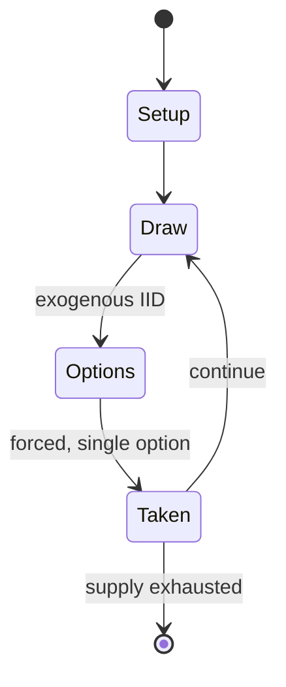

# Fire in the East

*board wargame*

`fire_in_the_east` &nbsp; state: **DEEPENED** &nbsp; method: **heuristic**

## Found layer (recorded, not trusted)

| field | value |
| --- | --- |
| wikidata | Q109570605 |
| wikipedia | Fire in the East |
| genres (source) | -- |
| instance of (source) | board wargame |
| country of origin | -- |

## Declared layer (orders bench work)

| field | value |
| --- | --- |
| year created | 1984 |
| epoch | DIGITAL |
| region | -- |
| media | DICE, WARGAME |
| players | 2-4 |
| age band | -- |
| exogenous process | IID |
| loss shape | -- |
| live axes | - |
| horizon | -- |
| scoring shape | -- |
| information | -- |
| interaction | -- |
| turn structure | -- |
| tractability | EXACT_WITH_CUT |
| randomness | DICE |
| luck factor | 0.58 |
| rules complexity | 2.95 |
| strategic depth | 1.87 |
| novelty | 0.6736 |
| solved status | -- |
| strategies | -- |
| algorithms | -- |

## Object model

```
Episode
  players      : 2-4
  turn_structure: ?
  horizon       : ?
  scoring       : ?

DicePool       -- n dice, each an iid categorical draw
Roll           -- realised outcome of a pool
```

## State transition diagram



## Research item -- turn trace

```
# Fire in the East -- simulated turn events
# generated from the DECLARED vector, not from a rulebook.
# structure: exo=IID loss=None horizon=None scoring=None axes=-

t=0    SETUP        players=2  pot=0  capacity=3
t=1    DRAW         p1 roll from d6 pool -> outcome #3  (p=0.220)
t=2    FORCED       p1 single legal option taken (pot_gain=+0.8)
t=3    DRAW         p1 roll from d6 pool -> outcome #5  (p=0.282)
t=4    FORCED       p1 single legal option taken (pot_gain=+1.5)
t=5    DRAW         p1 roll from d6 pool -> outcome #3  (p=0.053)
t=6    FORCED       p1 single legal option taken (pot_gain=+1.1)
t=7    DRAW         p1 roll from d6 pool -> outcome #1  (p=0.131)
t=8    FORCED       p1 single legal option taken (pot_gain=+0.7)
t=9    DRAW         p1 roll from d6 pool -> outcome #3  (p=0.035)
t=10   FORCED       p1 single legal option taken (pot_gain=+1.2)
t=11   DRAW         p1 roll from d6 pool -> outcome #3  (p=0.221)
t=12   FORCED       p1 single legal option taken (pot_gain=+1.1)
t=13   ENDTURN      turn passes to p2
t=14   DRAW         p2 roll from d6 pool -> outcome #2  (p=0.018)
t=15   FORCED       p2 single legal option taken (pot_gain=+1.9)
t=16   DRAW         p2 roll from d6 pool -> outcome #3  (p=0.090)
t=17   FORCED       p2 single legal option taken (pot_gain=+0.8)
t=18   DRAW         p2 roll from d6 pool -> outcome #1  (p=0.011)
t=19   FORCED       p2 single legal option taken (pot_gain=+1.2)
t=20   DRAW         p2 roll from d6 pool -> outcome #1  (p=0.140)
t=21   FORCED       p2 single legal option taken (pot_gain=+1.9)
t=22   DRAW         p2 roll from d6 pool -> outcome #3  (p=0.042)
t=23   FORCED       p2 single legal option taken (pot_gain=+0.7)
t=24   ENDTURN      turn passes to p1
t=25   DRAW         p1 roll from d6 pool -> outcome #2  (p=0.096)
t=26   FORCED       p1 single legal option taken (pot_gain=+1.1)

terminal: VARIABLE
```

## Source extract

Fire in the East is a monster board wargame  published in 1984 by Game Designers' Workshop (GDW)
that simulates Operation Barbarossa, the German invasion of the Soviet Union in 1941.   ==
Description == Fire in the East, characterized as a "monster game' because it has more than 1000
counters, is a two-player (or two-team) game that covers Operation Barbarossa along World War
II's Eastern Front between 22 June 1941 and 30 April 1942. The game, part of GDW's Europa
series, uses a set of rules common to the series.   === Components === The game box contains:
Six 21" x 27" maps that, when put together, cover the Eastern Front from Warsaw in the west to
Stalingrad in the east, and from Murmansk in the north to Sevastopol in the south. The map scale
used in the entire Europa series is 25 km (16 mi) per hex. More than 2500 die-cut counters
40-page rulebook player charts two six-sided dice   === Gameplay === Each turn represents 2
weeks of game time — characterized as first half of the month and last half of the month.
Movement is modified by both terrain and weather. Combat results are determined by the ratio of
attackers to defenders. Supplies are dependent upon home cities that act as

<sub>Wikipedia, CC BY-SA. Retained as evidence for the structural
classification above. Every rule inferred from it is HYPOTHESIZED
until audited against a rulebook.</sub>
