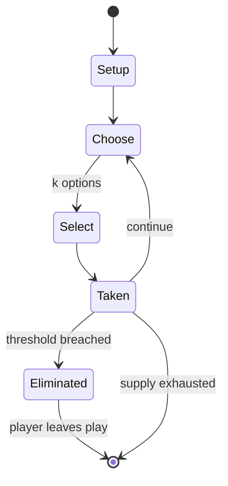

# Fire on the Mountain (game)

`fire_on_the_mountain_game` &nbsp; state: **DEEPENED** &nbsp; method: **heuristic**

## Found layer (recorded, not trusted)

| field | value |
| --- | --- |
| wikidata | Q5451635 |
| wikipedia | Fire on the Mountain (game) |
| genres (source) | -- |
| instance of (source) | -- |
| country of origin | -- |

## Declared layer (orders bench work)

| field | value |
| --- | --- |
| year created | -- |
| epoch | -- |
| region | -- |
| media | - |
| players | -- |
| age band | CHILD |
| exogenous process | -- |
| loss shape | ELIMINATION |
| live axes | SELECT |
| horizon | -- |
| scoring shape | -- |
| information | -- |
| interaction | -- |
| turn structure | -- |
| tractability | SAMPLING_ONLY |
| randomness | -- |
| luck factor | 0.35 |
| rules complexity | 2.0 |
| strategic depth | 2.0 |
| novelty | 0.4545 |
| solved status | -- |
| strategies | -- |
| algorithms | -- |

## Object model

```
Episode
  players      : ?
  turn_structure: ?
  horizon       : ?
  scoring       : ?

OptionSet      -- the choices available after an exogenous draw
```

## State transition diagram



## Research item -- turn trace

```
# Fire on the Mountain (game) -- simulated turn events
# generated from the DECLARED vector, not from a rulebook.
# structure: exo=None loss=ELIMINATION horizon=None scoring=None axes=SELECT

t=0    SETUP        players=2  pot=0  capacity=5
t=1    SELECT       p1 4 options; take #4  (pot_gain=+2.2, capacity=-1)
t=2    SELECT       p1 2 options; take #2  (pot_gain=+0.8, capacity=-1)
t=3    SELECT       p1 4 options; take #2  (pot_gain=+2.7, capacity=-2)
t=4    SELECT       p1 1 options; take #1  (pot_gain=+3.4, capacity=-2)
t=5    SELECT       p1 3 options; take #3  (pot_gain=+2.4, capacity=-1)
t=6    ENDTURN      turn passes to p2
t=7    SELECT       p2 2 options; take #2  (pot_gain=+0.7, capacity=-0)
t=8    SELECT       p2 1 options; take #1  (pot_gain=+1.1, capacity=-2)
t=9    SELECT       p2 1 options; take #1  (pot_gain=+1.7, capacity=-0)
t=10   SELECT       p2 1 options; take #1  (pot_gain=+2.7, capacity=-0)
t=11   SELECT       p2 2 options; take #2  (pot_gain=+1.4, capacity=-2)
t=12   ENDTURN      turn passes to p1
t=13   SELECT       p1 4 options; take #1  (pot_gain=+1.5, capacity=-0)
t=14   SELECT       p1 4 options; take #4  (pot_gain=+1.4, capacity=-0)
t=15   ENDTURN      turn passes to p2
t=16   SELECT       p2 4 options; take #1  (pot_gain=+2.5, capacity=-1)
t=17   ENDTURN      turn passes to p1
t=18   SELECT       p1 2 options; take #2  (pot_gain=+2.9, capacity=-1)
t=19   SELECT       p1 2 options; take #2  (pot_gain=+2.3, capacity=-1)
t=20   ENDTURN      turn passes to p2
t=21   SELECT       p2 4 options; take #2  (pot_gain=+3.3, capacity=-2)
t=22   SELECT       p2 2 options; take #2  (pot_gain=+2.6, capacity=-2)
t=23   SELECT       p2 4 options; take #2  (pot_gain=+3.5, capacity=-0)
t=24   SELECT       p2 1 options; take #1  (pot_gain=+1.0, capacity=-1)
t=25   ENDTURN      turn passes to p1
t=26   SELECT       p1 4 options; take #3  (pot_gain=+2.3, capacity=-0)

terminal: VARIABLE
```

## Conditions

| kind | threshold | effect | trigger |
| --- | --- | --- | --- |
| BOUNDARY | 5 players | -- | You need at least 5 players for this game to work. |
| ELIMINATE | -- | out of the game | The last one to jump up is out of the game. |

## Source extract

Fire on the Mountain is a game played by children in Tanzania. This game can be played about
people of all ages. You need at least 5 players for this game to work. The aim of the game is to
be the player who stays in the game the longest..  To start the game, first choose a player to
be the leader. Players think of a 'key word'. It can be any word or a name. For example,
'cheese'. All players lie on their backs. The leader shouts out "Fire on the mountain!" All the
players respond with "Fire!" but stay lying down. Then the leader shouts out "Fire on the
river!" Again the players reply with "Fire" but do not jump up. This continues on with the
leader changing the last word of the phrase. He tries to think of as many different places for
the fire. The leader is able to shout out the key word at any time, as part of the phrases or in
between them. When he shouts it out the players must all jump up. The last one to jump up is out
of the game. The winner is the player who stays in the game the longest.   == See also == Simon
Says   == References ==

<sub>Wikipedia, CC BY-SA. Retained as evidence for the structural
classification above. Every rule inferred from it is HYPOTHESIZED
until audited against a rulebook.</sub>
