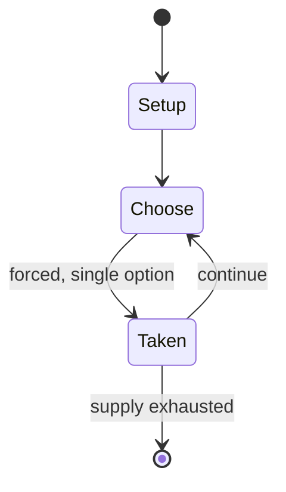

# Fish Fillets NG

*1997 video game*

`fish_fillets_ng` &nbsp; state: **DEEPENED** &nbsp; method: **heuristic**

## Found layer (recorded, not trusted)

| field | value |
| --- | --- |
| wikidata | Q1014621 |
| wikipedia | Fish Fillets NG |
| genres (source) | puzzle video game |
| instance of (source) | video game |
| country of origin | -- |

## Declared layer (orders bench work)

| field | value |
| --- | --- |
| year created | 1998 |
| epoch | DIGITAL |
| region | -- |
| media | PUZZLE, VIDEO |
| players | -- |
| age band | -- |
| exogenous process | -- |
| loss shape | -- |
| live axes | - |
| horizon | -- |
| scoring shape | -- |
| information | -- |
| interaction | -- |
| turn structure | -- |
| tractability | SAMPLING_ONLY |
| randomness | -- |
| luck factor | 0.35 |
| rules complexity | 1.72 |
| strategic depth | 2.0 |
| novelty | 0.0896 |
| solved status | -- |
| strategies | -- |
| algorithms | -- |

## Object model

```
Episode
  players      : ?
  turn_structure: ?
  horizon       : ?
  scoring       : ?

Configuration  -- the arrangement to be resolved
Constraint     -- predicate a legal configuration must satisfy
WorldState     -- simulation state advanced by the engine
Avatar         -- player-controlled agent
Clock          -- frame or tick counter
```

## State transition diagram



## Research item -- turn trace

```
# Fish Fillets NG -- simulated turn events
# generated from the DECLARED vector, not from a rulebook.
# structure: exo=None loss=None horizon=None scoring=None axes=-

t=0    SETUP        players=2  pot=0  capacity=8
t=1    FORCED       p1 single legal option taken (pot_gain=+1.6)
t=2    FORCED       p1 single legal option taken (pot_gain=+1.1)
t=3    FORCED       p1 single legal option taken (pot_gain=+1.9)
t=4    ENDTURN      turn passes to p2
t=5    FORCED       p2 single legal option taken (pot_gain=+0.9)
t=6    ENDTURN      turn passes to p1
t=7    FORCED       p1 single legal option taken (pot_gain=+1.2)
t=8    ENDTURN      turn passes to p2
t=9    FORCED       p2 single legal option taken (pot_gain=+0.8)
t=10   FORCED       p2 single legal option taken (pot_gain=+2.0)
t=11   FORCED       p2 single legal option taken (pot_gain=+0.7)
t=12   FORCED       p2 single legal option taken (pot_gain=+1.2)
t=13   ENDTURN      turn passes to p1
t=14   FORCED       p1 single legal option taken (pot_gain=+1.4)
t=15   FORCED       p1 single legal option taken (pot_gain=+2.0)
t=16   ENDTURN      turn passes to p2
t=17   FORCED       p2 single legal option taken (pot_gain=+1.8)
t=18   FORCED       p2 single legal option taken (pot_gain=+0.7)
t=19   ENDTURN      turn passes to p1
t=20   FORCED       p1 single legal option taken (pot_gain=+1.7)
t=21   FORCED       p1 single legal option taken (pot_gain=+0.7)
t=22   ENDTURN      turn passes to p2
t=23   FORCED       p2 single legal option taken (pot_gain=+1.1)
t=24   ENDTURN      turn passes to p1
t=25   FORCED       p1 single legal option taken (pot_gain=+0.6)
t=26   FORCED       p1 single legal option taken (pot_gain=+0.6)
t=27   ENDTURN      turn passes to p2

terminal: VARIABLE
```

## Source extract

Fish Fillets NG, originally known as Fish Fillets, is a puzzle video game developed and released
by Altar Games in 1998. The objective of the game is to find a safe exit for both fish in each
level. Similar to other sliding puzzle games like Sokoban and Klotski, Fish Fillets includes
several unique elements and rules.   == Gameplay ==  The game features two fish, both controlled
by the player, who must navigate through levels by moving objects and overcoming obstacles to
reach a safe exit together. Unlike traditional sliding puzzle games, Fish Fillets NG
incorporates gravity, causing unsupported objects to fall until they land on another surface. If
an object falls on either fish, it results in the fish's death, and the level must be restarted
to continue. One fish is larger and capable of lifting or pushing specific objects (such as
steel items), adding an extra layer of complexity to the puzzles. Additionally, players cannot
slide objects over the fish's back, as this is equivalent to an object landing on the fish.
However, if a fish is supporting an object, it can move back and forth underneath, and objects
can be carefully slid off the fish's back if they are moving onto solid

<sub>Wikipedia, CC BY-SA. Retained as evidence for the structural
classification above. Every rule inferred from it is HYPOTHESIZED
until audited against a rulebook.</sub>
