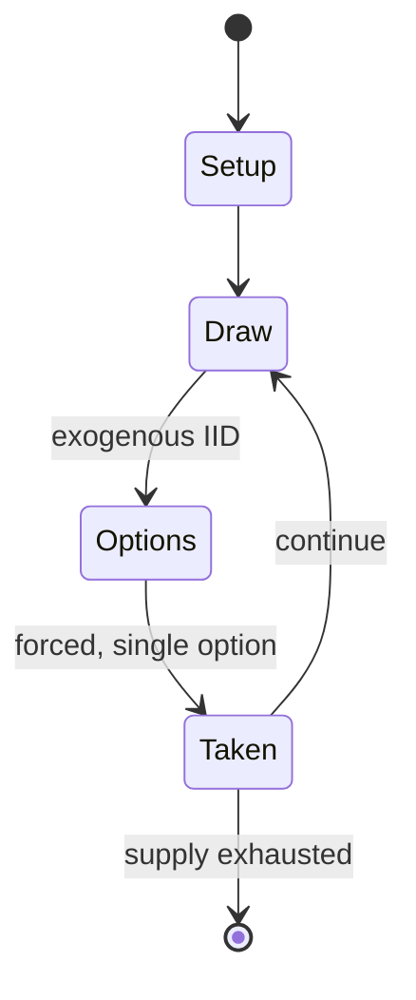

# Five Lines

*ancient Greek board game*

`five_lines` &nbsp; state: **DEEPENED** &nbsp; method: **heuristic**

## Found layer (recorded, not trusted)

| field | value |
| --- | --- |
| wikidata | Q111168475 |
| wikipedia | Five Lines |
| genres (source) | -- |
| instance of (source) | board game |
| country of origin | Ancient Greece |

## Declared layer (orders bench work)

| field | value |
| --- | --- |
| year created | -500 |
| epoch | ANCIENT |
| region | EUROPE_SOUTH |
| media | BOARD, DICE |
| players | -- |
| age band | -- |
| exogenous process | IID |
| loss shape | -- |
| live axes | - |
| horizon | -- |
| scoring shape | RACE_POSITION |
| information | -- |
| interaction | COMPETITIVE |
| turn structure | -- |
| tractability | EXACT_WITH_CUT |
| randomness | DICE |
| luck factor | 0.58 |
| rules complexity | 1.75 |
| strategic depth | 1.87 |
| novelty | 0.6972 |
| solved status | -- |
| strategies | -- |
| algorithms | -- |

## Object model

```
Episode
  players      : ?
  turn_structure: ?
  horizon       : ?
  scoring       : RACE_POSITION

Board          -- spatial substrate; cells carry position and occupancy
Piece          -- movable token owned by a player
DicePool       -- n dice, each an iid categorical draw
Roll           -- realised outcome of a pool
```

## State transition diagram



## Research item -- turn trace

```
# Five Lines -- simulated turn events
# generated from the DECLARED vector, not from a rulebook.
# structure: exo=IID loss=None horizon=None scoring=RACE_POSITION axes=-

t=0    SETUP        players=2  pot=0  capacity=5
t=1    DRAW         p1 roll from d6 pool -> outcome #2  (p=0.291)
t=2    FORCED       p1 single legal option taken (pot_gain=+1.1)
t=3    DRAW         p1 roll from d6 pool -> outcome #6  (p=0.165)
t=4    FORCED       p1 single legal option taken (pot_gain=+1.9)
t=5    DRAW         p1 roll from d6 pool -> outcome #4  (p=0.121)
t=6    FORCED       p1 single legal option taken (pot_gain=+0.8)
t=7    DRAW         p1 roll from d6 pool -> outcome #2  (p=0.219)
t=8    FORCED       p1 single legal option taken (pot_gain=+1.6)
t=9    DRAW         p1 roll from d6 pool -> outcome #5  (p=0.093)
t=10   FORCED       p1 single legal option taken (pot_gain=+1.9)
t=11   DRAW         p1 roll from d6 pool -> outcome #4  (p=0.219)
t=12   FORCED       p1 single legal option taken (pot_gain=+0.8)
t=13   ENDTURN      turn passes to p2
t=14   DRAW         p2 roll from d6 pool -> outcome #6  (p=0.276)
t=15   FORCED       p2 single legal option taken (pot_gain=+1.8)
t=16   ENDTURN      turn passes to p1
t=17   DRAW         p1 roll from d6 pool -> outcome #3  (p=0.045)
t=18   FORCED       p1 single legal option taken (pot_gain=+1.5)
t=19   DRAW         p1 roll from d6 pool -> outcome #3  (p=0.008)
t=20   FORCED       p1 single legal option taken (pot_gain=+1.4)
t=21   DRAW         p1 roll from d6 pool -> outcome #5  (p=0.068)
t=22   FORCED       p1 single legal option taken (pot_gain=+1.5)
t=23   DRAW         p1 roll from d6 pool -> outcome #3  (p=0.024)
t=24   FORCED       p1 single legal option taken (pot_gain=+0.8)
t=25   ENDTURN      turn passes to p2
t=26   DRAW         p2 roll from d6 pool -> outcome #1  (p=0.170)
t=27   FORCED       p2 single legal option taken (pot_gain=+1.2)

terminal: VARIABLE
```

## Source extract

Five Lines (Greek: πέντε γραμμαί, romanized: pente grammai) is the modern name of an ancient
Greek tables game. Two players each move five counters on a board with five lines, with moves
likely determined by the roll of a die. The winner may have been the first one to place their
pieces on the central "sacred line". No complete description of the game exists, but there have
been several scholarly reconstructions, including Schädler's and Kidd's.   == History ==
Gameboards, consisting of five parallel lines with circles at the ends, have been found at many
sites in ancient Greece, sometimes carved right into the floors of temples. The earliest known
examples were found in Anagyros, Attica, and date to the 7th century BCE. Attic vases dated to
around 500 BCE show Ajax and Achilles playing the game, with over 160 extant. (Some sources
describe the game played in this art as polis, but this is likely a mistake). The first written
mention is by Alcaeus of Mytilene, around 600 BCE. Later, Julius Pollux describes the game in
Onomasticon (9.97-98). Pollux writes: "on the five lines from either side there was a middle one
called the sacred line. And moving a piece already arrived there gav

<sub>Wikipedia, CC BY-SA. Retained as evidence for the structural
classification above. Every rule inferred from it is HYPOTHESIZED
until audited against a rulebook.</sub>
