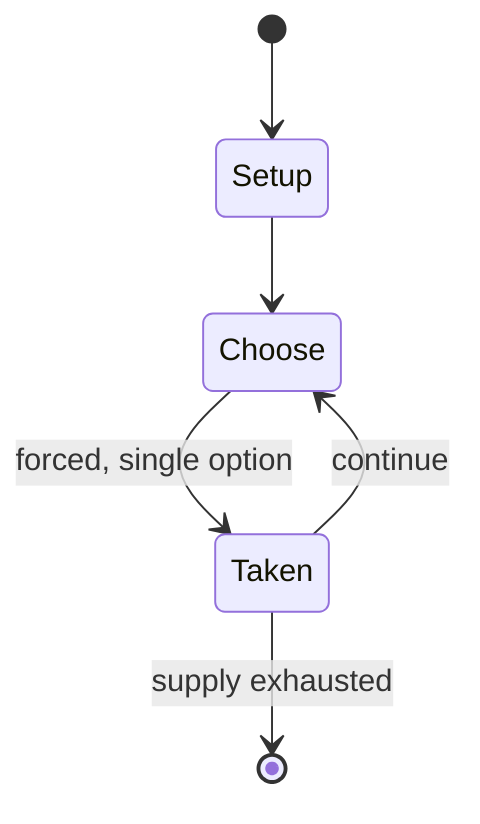

# five-player chess

*family of chess variants played with five people*

`five_player_chess` &nbsp; state: **DEEPENED** &nbsp; method: **heuristic**

## Found layer (recorded, not trusted)

| field | value |
| --- | --- |
| wikidata | Q108570277 |
| wikipedia | Five-player chess |
| genres (source) | -- |
| instance of (source) | chess variant |
| country of origin | -- |

## Declared layer (orders bench work)

| field | value |
| --- | --- |
| year created | -- |
| epoch | -- |
| region | -- |
| media | - |
| players | 5 |
| age band | -- |
| exogenous process | -- |
| loss shape | -- |
| live axes | - |
| horizon | -- |
| scoring shape | -- |
| information | -- |
| interaction | -- |
| turn structure | -- |
| tractability | SAMPLING_ONLY |
| randomness | -- |
| luck factor | 0.35 |
| rules complexity | 1.63 |
| strategic depth | 2.0 |
| novelty | 0.0866 |
| solved status | -- |
| strategies | -- |
| algorithms | -- |

## Object model

```
Episode
  players      : 5
  turn_structure: ?
  horizon       : ?
  scoring       : ?

State          -- opaque; no medium or axis evidence was found
Player         -- an agent that selects among legal successors
```

## State transition diagram



## Research item -- turn trace

```
# five-player chess -- simulated turn events
# generated from the DECLARED vector, not from a rulebook.
# structure: exo=None loss=None horizon=None scoring=None axes=-

t=0    SETUP        players=4  pot=0  capacity=5
t=1    FORCED       p1 single legal option taken (pot_gain=+2.0)
t=2    ENDTURN      turn passes to p2
t=3    FORCED       p2 single legal option taken (pot_gain=+1.2)
t=4    FORCED       p2 single legal option taken (pot_gain=+1.6)
t=5    FORCED       p2 single legal option taken (pot_gain=+1.6)
t=6    FORCED       p2 single legal option taken (pot_gain=+0.9)
t=7    FORCED       p2 single legal option taken (pot_gain=+2.0)
t=8    FORCED       p2 single legal option taken (pot_gain=+1.2)
t=9    ENDTURN      turn passes to p3
t=10   FORCED       p3 single legal option taken (pot_gain=+1.9)
t=11   ENDTURN      turn passes to p4
t=12   FORCED       p4 single legal option taken (pot_gain=+1.6)
t=13   FORCED       p4 single legal option taken (pot_gain=+0.6)
t=14   FORCED       p4 single legal option taken (pot_gain=+1.5)
t=15   ENDTURN      turn passes to p1
t=16   FORCED       p1 single legal option taken (pot_gain=+1.7)
t=17   ENDTURN      turn passes to p2
t=18   FORCED       p2 single legal option taken (pot_gain=+1.9)
t=19   FORCED       p2 single legal option taken (pot_gain=+0.9)
t=20   FORCED       p2 single legal option taken (pot_gain=+1.8)
t=21   FORCED       p2 single legal option taken (pot_gain=+1.5)
t=22   FORCED       p2 single legal option taken (pot_gain=+1.4)
t=23   FORCED       p2 single legal option taken (pot_gain=+1.8)
t=24   FORCED       p2 single legal option taken (pot_gain=+0.9)
t=25   ENDTURN      turn passes to p3
t=26   FORCED       p3 single legal option taken (pot_gain=+1.8)

terminal: VARIABLE
```

## Conditions

| kind | threshold | effect | trigger |
| --- | --- | --- | --- |
| ELIMINATE | -- | -- | Apocalypse: On a 5×5 board, each side has two knights and five pawns, win by eliminating all enemy pawns. |
| WIN | -- | -- | Check is not enforced, and victory is by capturing the enemy king. |
| WIN | -- | -- | The first to occupy square e5, and then leave it, wins the game. |
| WIN | -- | -- | King of the Hill: In addition to checkmate, any legal move that moves one's own king to one of the center squares (d4, d5, e4, or e5) automatically wins the game. |
| TERMINATE | -- | -- | Play ends with capture of king. |
| BOUNDARY | -- | -- | Chad: Kings are limited to 3×3 "castles" on a 12×12 board dominated by eight rooks per side which can promote to queens. |
| BOUNDARY | -- | -- | Congo: Kings (lions) are limited to 3×3 "castles" on a 7×7 board. |
| BOUNDARY | -- | -- | For a move to be legal, it must cross at least one of these lines. |
| BOUNDARY | -- | -- | The game is won if at least one king from any time and timeline is in checkmate. |

## Source extract

This page is a list of chess variants. Many thousands of variants exist. The 2007 catalogue The
Encyclopedia of Chess Variants estimates that there are well over 2,000, and many more were
considered too trivial for inclusion in the catalogue.    == Contemporary chess variants ==  The
chess variants listed below are derived from chess by changing one or more of the many rules of
the game. The rules can be grouped into categories, from the most innocuous (starting position)
to the most dramatic (adding chance/randomness to the gameplay after the initial piece
placement). If a variant changes rules from multiple categories, it belongs to the sub-section
below corresponding to the later-listed category.  Starting position and armies Piece types
Midgame rules and end-of-game rules Board shape Number of players Use of hidden information or
chance Names that represent a set of variants are annotated with "[multivariant]" after their
name. All variants use an 8x8 board unless otherwise specified.   === Variant starting position
(rectangular board, standard piece types and rules) === Many variants employ standard chess
rules and mechanics, but vary the number of pieces, or their starting po

<sub>Wikipedia, CC BY-SA. Retained as evidence for the structural
classification above. Every rule inferred from it is HYPOTHESIZED
until audited against a rulebook.</sub>
