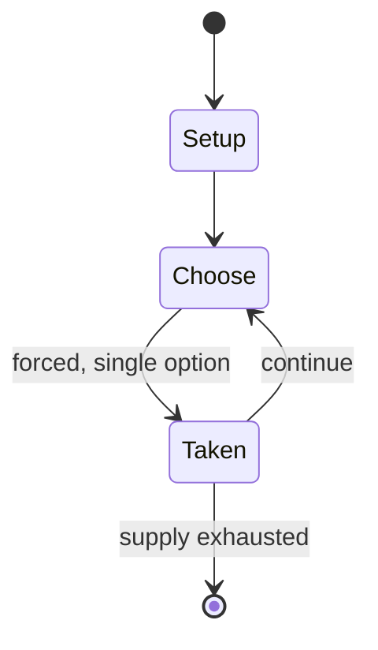

# Flesh & Blood

*Trading card game by Legend Story Studios*

`flesh_blood` &nbsp; state: **DEEPENED** &nbsp; method: **heuristic**

## Found layer (recorded, not trusted)

| field | value |
| --- | --- |
| wikidata | Q109657155 |
| wikipedia | Flesh and Blood (card game) |
| genres (source) | -- |
| instance of (source) | collectible card game, deck-building game, fictional universe, game |
| country of origin | New Zealand |

## Declared layer (orders bench work)

| field | value |
| --- | --- |
| year created | -- |
| epoch | -- |
| region | OCEANIA |
| media | CARD, COLLECTIBLE |
| players | -- |
| age band | -- |
| exogenous process | -- |
| loss shape | -- |
| live axes | TRADE |
| horizon | -- |
| scoring shape | SET_COLLECTION_CONVEX |
| information | -- |
| interaction | COMPETITIVE |
| turn structure | -- |
| tractability | SAMPLING_ONLY |
| randomness | -- |
| luck factor | 0.35 |
| rules complexity | 2.21 |
| strategic depth | 2.25 |
| novelty | 0.4797 |
| solved status | -- |
| strategies | set_collection |
| algorithms | -- |

## Object model

```
Episode
  players      : ?
  turn_structure: ?
  horizon       : ?
  scoring       : SET_COLLECTION_CONVEX

Deck           -- ordered multiset, drawn without replacement
Hand           -- private multiset held by one player
DiscardPile    -- public accumulation of spent cards
Offer          -- proposed exchange between two agents
```

## State transition diagram



## Research item -- turn trace

```
# Flesh & Blood -- simulated turn events
# generated from the DECLARED vector, not from a rulebook.
# structure: exo=None loss=None horizon=None scoring=SET_COLLECTION_CONVEX axes=TRADE

t=0    SETUP        players=2  pot=0  capacity=6
t=1    FORCED       p1 single legal option taken (pot_gain=+1.1)
t=2    FORCED       p1 single legal option taken (pot_gain=+0.8)
t=3    ENDTURN      turn passes to p2
t=4    FORCED       p2 single legal option taken (pot_gain=+0.6)
t=5    FORCED       p2 single legal option taken (pot_gain=+0.9)
t=6    ENDTURN      turn passes to p1
t=7    FORCED       p1 single legal option taken (pot_gain=+0.9)
t=8    FORCED       p1 single legal option taken (pot_gain=+0.7)
t=9    TRADE        p1 offers 2:1 exchange to p2
t=10   ENDTURN      turn passes to p2
t=11   FORCED       p2 single legal option taken (pot_gain=+0.7)
t=12   TRADE        p2 offers 2:1 exchange to p1
t=13   ENDTURN      turn passes to p1
t=14   FORCED       p1 single legal option taken (pot_gain=+2.0)
t=15   ENDTURN      turn passes to p2
t=16   FORCED       p2 single legal option taken (pot_gain=+1.5)
t=17   TRADE        p2 offers 2:1 exchange to p1
t=18   FORCED       p2 single legal option taken (pot_gain=+0.6)
t=19   ENDTURN      turn passes to p1
t=20   FORCED       p1 single legal option taken (pot_gain=+0.8)
t=21   TRADE        p1 offers 2:1 exchange to p2
t=22   FORCED       p1 single legal option taken (pot_gain=+1.2)
t=23   TRADE        p1 offers 2:1 exchange to p2
t=24   ENDTURN      turn passes to p2
t=25   FORCED       p2 single legal option taken (pot_gain=+0.6)
t=26   FORCED       p2 single legal option taken (pot_gain=+1.9)
t=27   ENDTURN      turn passes to p1

terminal: VARIABLE
```

## Conditions

| kind | threshold | effect | trigger |
| --- | --- | --- | --- |
| BOUNDARY | 80 cards | -- | Players build a deck of 60 to 80 cards, with no more than three copies of cards having the same name in one deck. |
| LOSE | -- | -- | If a hero's life points reaches zero, the player controlling the hero loses the game. |

## Source extract

Flesh and Blood is a trading card game published by Legend Story Studios (LSS), an independent
design studio based in Auckland, New Zealand. Gameplay focuses on two players who each control a
single hero who battle one versus one to the death. It was designed by James White, who had
previously played Magic: The Gathering professionally. The game is based on elements of fantasy
and, to some extent, science fiction. The name of the game is meant to imply that the game was
designed to be played in person instead of as an online game.   == Organized play == James White
and Legend Story Studios based their game design on an organized play framework supporting play
across four competitive tiers with a diversity of prize pools. The Flesh and Blood World Tour
draws players from all over the globe to compete for cash prizes and prestige. The prize pool
for the 2026 World Tour is US$2,000,000. Learn to Play events, which are Tier 0, and Armory
Events, which are Tier 1, are usually weekly events organized by local game stores. They are run
at a Casual rules enforcement level (REL). Skirmish Seasons, also in Tier 1, are held throughout
the year, with competitive play but run at a Casual REL. T

<sub>Wikipedia, CC BY-SA. Retained as evidence for the structural
classification above. Every rule inferred from it is HYPOTHESIZED
until audited against a rulebook.</sub>
