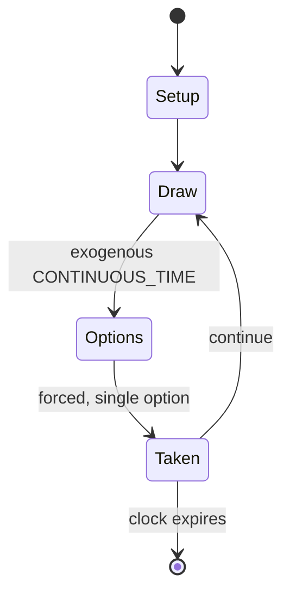

# Force of Will Trading Card Game

*Trading Card Game Japanese the 2012*

`force_of_will_trading_card_game` &nbsp; state: **DEEPENED** &nbsp; method: **heuristic**

## Found layer (recorded, not trusted)

| field | value |
| --- | --- |
| wikidata | Q19931434 |
| wikipedia | Force of Will |
| genres (source) | -- |
| instance of (source) | collectible card game |
| country of origin | -- |

## Declared layer (orders bench work)

| field | value |
| --- | --- |
| year created | 2012 |
| epoch | CONTEMPORARY |
| region | -- |
| media | CARD, COLLECTIBLE |
| players | -- |
| age band | -- |
| exogenous process | CONTINUOUS_TIME |
| loss shape | -- |
| live axes | TRADE |
| horizon | CLOCK_LIMITED |
| scoring shape | SET_COLLECTION_CONVEX |
| information | -- |
| interaction | COMPETITIVE |
| turn structure | PHASE_STRUCTURED |
| tractability | SAMPLING_ONLY |
| randomness | REAL_TIME_PHYSICAL |
| luck factor | 0.3 |
| rules complexity | 3.65 |
| strategic depth | 2.25 |
| novelty | 0.7022 |
| solved status | -- |
| strategies | spatial_packing |
| algorithms | -- |

## Object model

```
Episode
  players      : ?
  turn_structure: PHASE_STRUCTURED
  horizon       : CLOCK_LIMITED
  scoring       : SET_COLLECTION_CONVEX

Deck           -- ordered multiset, drawn without replacement
Hand           -- private multiset held by one player
DiscardPile    -- public accumulation of spent cards
Offer          -- proposed exchange between two agents
```

## State transition diagram



## Research item -- turn trace

```
# Force of Will Trading Card Game -- simulated turn events
# generated from the DECLARED vector, not from a rulebook.
# structure: exo=CONTINUOUS_TIME loss=None horizon=CLOCK_LIMITED scoring=SET_COLLECTION_CONVEX axes=TRADE

t=0    SETUP        players=2  pot=0  capacity=8
t=1    DRAW         p1 tick from clock -> outcome #1  (p=0.038)
t=2    FORCED       p1 single legal option taken (pot_gain=+0.6)
t=3    DRAW         p1 tick from clock -> outcome #5  (p=0.294)
t=4    FORCED       p1 single legal option taken (pot_gain=+1.9)
t=5    TRADE        p1 offers 2:1 exchange to p2
t=6    DRAW         p1 tick from clock -> outcome #1  (p=0.071)
t=7    FORCED       p1 single legal option taken (pot_gain=+2.0)
t=8    ENDTURN      turn passes to p2
t=9    DRAW         p2 tick from clock -> outcome #3  (p=0.287)
t=10   FORCED       p2 single legal option taken (pot_gain=+1.3)
t=11   DRAW         p2 tick from clock -> outcome #1  (p=0.140)
t=12   FORCED       p2 single legal option taken (pot_gain=+1.2)
t=13   DRAW         p2 tick from clock -> outcome #5  (p=0.097)
t=14   FORCED       p2 single legal option taken (pot_gain=+1.7)
t=15   ENDTURN      turn passes to p1
t=16   DRAW         p1 tick from clock -> outcome #4  (p=0.215)
t=17   FORCED       p1 single legal option taken (pot_gain=+1.2)
t=18   DRAW         p1 tick from clock -> outcome #2  (p=0.039)
t=19   FORCED       p1 single legal option taken (pot_gain=+0.8)
t=20   TRADE        p1 offers 2:1 exchange to p2
t=21   DRAW         p1 tick from clock -> outcome #6  (p=0.068)
t=22   FORCED       p1 single legal option taken (pot_gain=+1.3)
t=23   DRAW         p1 tick from clock -> outcome #5  (p=0.011)
t=24   FORCED       p1 single legal option taken (pot_gain=+0.7)
t=25   TRADE        p1 offers 2:1 exchange to p2
t=26   DRAW         p1 tick from clock -> outcome #3  (p=0.175)
t=27   FORCED       p1 single legal option taken (pot_gain=+0.6)

terminal: CLOCK_LIMITED
```

## Conditions

| kind | threshold | effect | trigger |
| --- | --- | --- | --- |
| BOUNDARY | 60 cards | -- | The gameplay set consists of a Ruler, a main deck (ranging from 40 to 60 cards in main deck except Typhon which allow player can have up to 200 cards), a side deck consist of maximum 15 cards, a stone deck consist of 10  |
| WIN | -- | -- | A player wins the game by reducing their opponents' life points to zero, or by the opponent attempting to draw from an empty deck during their draw phase. |
| WIN | -- | -- | A player has reached 0 life point and the player who makes the opponent reach 0 life point win the game. |

## Source extract

Force of Will (フォースオブウィル) is a trading card game. It was originally released in Japan in
December 2012 by Force of Will Co., Ltd. and later released to English speaking countries in
2013. Since 2019, the game has been developed by TCG Co., Ltd. and released by Eye Spy
Productions. It has game mechanics similar to Magic: The Gathering. The game has a tournament
circuit called Grand Prix.   == Game overview == Each player starts the game with a main deck of
40–60 cards, composed of resonators ("summon spell"), chants ("normal spell"), additions, and
regalia. In addition to the main deck, each player has a "Magic Stone Deck," a deck of 10-20
Magic Stone cards, which are used to produce the game's titular resource, "Will." The game is
designed around "Ruler" cards. A Ruler is a special card that remains in a player's Ruler Zone,
and often has additional abilities that inform deck building. A player may "perform Judgment" of
a Ruler they control by paying a cost, flipping the Ruler card to its "J-Ruler" side, and
putting it into the field as a J-Ruler. J-Rulers are similar to Rulers, but most also have
attack and defense stats, and may participate in battle as though they were resonator

<sub>Wikipedia, CC BY-SA. Retained as evidence for the structural
classification above. Every rule inferred from it is HYPOTHESIZED
until audited against a rulebook.</sub>
