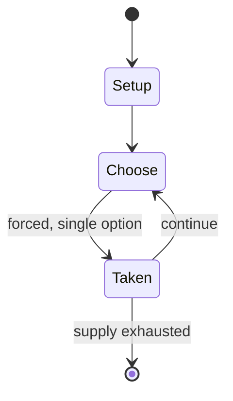

# Forchess

*four-player chess variant*

`forchess` &nbsp; state: **DEEPENED** &nbsp; method: **heuristic**

## Found layer (recorded, not trusted)

| field | value |
| --- | --- |
| wikidata | Q1112824 |
| wikipedia | Forchess |
| genres (source) | -- |
| instance of (source) | chess variant, four-player chess |
| country of origin | -- |

## Declared layer (orders bench work)

| field | value |
| --- | --- |
| year created | -- |
| epoch | -- |
| region | -- |
| media | BOARD |
| players | 4 |
| age band | -- |
| exogenous process | -- |
| loss shape | -- |
| live axes | - |
| horizon | VARIABLE |
| scoring shape | SET_COLLECTION_CONVEX |
| information | -- |
| interaction | SOLITAIRE |
| turn structure | -- |
| tractability | SAMPLING_ONLY |
| randomness | HIDDEN_INFO |
| luck factor | 0.35 |
| rules complexity | 1.76 |
| strategic depth | 2.75 |
| novelty | 0.5689 |
| solved status | -- |
| strategies | coalition_forming, set_collection, signalling |
| algorithms | -- |

## Object model

```
Episode
  players      : 4
  turn_structure: ?
  horizon       : VARIABLE
  scoring       : SET_COLLECTION_CONVEX

Board          -- spatial substrate; cells carry position and occupancy
Piece          -- movable token owned by a player
```

## State transition diagram



## Research item -- turn trace

```
# Forchess -- simulated turn events
# generated from the DECLARED vector, not from a rulebook.
# structure: exo=None loss=None horizon=VARIABLE scoring=SET_COLLECTION_CONVEX axes=-

t=0    SETUP        players=4  pot=0  capacity=3
t=1    FORCED       p1 single legal option taken (pot_gain=+0.8)
t=2    FORCED       p1 single legal option taken (pot_gain=+1.3)
t=3    FORCED       p1 single legal option taken (pot_gain=+0.6)
t=4    FORCED       p1 single legal option taken (pot_gain=+1.6)
t=5    FORCED       p1 single legal option taken (pot_gain=+1.2)
t=6    FORCED       p1 single legal option taken (pot_gain=+1.2)
t=7    ENDTURN      turn passes to p2
t=8    FORCED       p2 single legal option taken (pot_gain=+1.9)
t=9    FORCED       p2 single legal option taken (pot_gain=+1.3)
t=10   ENDTURN      turn passes to p3
t=11   FORCED       p3 single legal option taken (pot_gain=+1.0)
t=12   ENDTURN      turn passes to p4
t=13   FORCED       p4 single legal option taken (pot_gain=+0.8)
t=14   FORCED       p4 single legal option taken (pot_gain=+0.7)
t=15   ENDTURN      turn passes to p1
t=16   FORCED       p1 single legal option taken (pot_gain=+1.5)
t=17   FORCED       p1 single legal option taken (pot_gain=+1.4)
t=18   FORCED       p1 single legal option taken (pot_gain=+0.6)
t=19   FORCED       p1 single legal option taken (pot_gain=+1.3)
t=20   FORCED       p1 single legal option taken (pot_gain=+0.9)
t=21   FORCED       p1 single legal option taken (pot_gain=+1.1)
t=22   ENDTURN      turn passes to p2
t=23   FORCED       p2 single legal option taken (pot_gain=+1.4)
t=24   FORCED       p2 single legal option taken (pot_gain=+2.0)
t=25   FORCED       p2 single legal option taken (pot_gain=+0.6)
t=26   FORCED       p2 single legal option taken (pot_gain=+0.8)

terminal: VARIABLE
```

## Conditions

| kind | threshold | effect | trigger |
| --- | --- | --- | --- |
| TERMINATE | -- | -- | The game ends when one team has lost both kings or chooses to concede. |

## Source extract

Forchess is a four-player chess variant developed by T. K. Rogers, an American engineer. It uses
one standard chessboard and two sets of standard pieces.   == History and motivation == Forchess
was developed around the year 1975. Its inventor T. K. Rogers wanted to create a pure strategy
game with the social dynamic of card games like Bridge.  Rogers believed in the educational
merits of chess and felt that making the game a more popular social activity would benefit
society. Rogers wanted the game to use only standard pieces and a standard board so that
everything necessary to play would be readily available.  He also did not want to severely limit
the number of pieces each player had. In 1992, Rogers published the instruction set as a 64-page
booklet Forchess: The Ultimate Social Game, designed to fit in a shirt pocket.  The booklet also
contained strategies for playing the game and a new technique invented by Rogers for analyzing
both chess and Forchess games.  He called it influence indicator. In 1996, Rogers posted a free
instruction set on the then newly founded Intuitor website.  He simultaneously began
distributing thousands of free instruction brochures to schools and coll

<sub>Wikipedia, CC BY-SA. Retained as evidence for the structural
classification above. Every rule inferred from it is HYPOTHESIZED
until audited against a rulebook.</sub>
