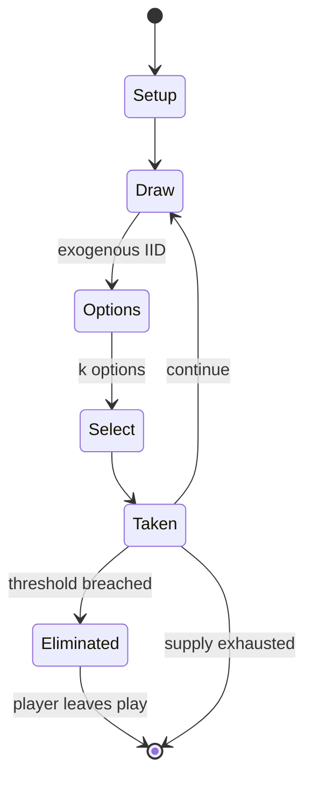

# Formula Dé

`formula_d` &nbsp; state: **DEEPENED** &nbsp; method: **heuristic**

## Found layer (recorded, not trusted)

| field | value |
| --- | --- |
| wikidata | -- |
| wikipedia | Formula Dé |
| genres (source) | -- |
| instance of (source) | -- |
| country of origin | -- |

## Declared layer (orders bench work)

| field | value |
| --- | --- |
| year created | -- |
| epoch | -- |
| region | -- |
| media | BOARD, DICE |
| players | -- |
| age band | -- |
| exogenous process | IID |
| loss shape | ELIMINATION |
| live axes | SELECT |
| horizon | -- |
| scoring shape | RACE_POSITION |
| information | -- |
| interaction | -- |
| turn structure | STRICT_TURN |
| tractability | EXACT_WITH_CUT |
| randomness | DICE |
| luck factor | 0.58 |
| rules complexity | 2.67 |
| strategic depth | 1.87 |
| novelty | 0.7373 |
| solved status | -- |
| strategies | -- |
| algorithms | -- |

## Object model

```
Episode
  players      : ?
  turn_structure: STRICT_TURN
  horizon       : ?
  scoring       : RACE_POSITION

Board          -- spatial substrate; cells carry position and occupancy
Piece          -- movable token owned by a player
DicePool       -- n dice, each an iid categorical draw
Roll           -- realised outcome of a pool
OptionSet      -- the choices available after an exogenous draw
```

## State transition diagram



## Research item -- turn trace

```
# Formula Dé -- simulated turn events
# generated from the DECLARED vector, not from a rulebook.
# structure: exo=IID loss=ELIMINATION horizon=None scoring=RACE_POSITION axes=SELECT

t=0    SETUP        players=2  pot=0  capacity=7
t=1    DRAW         p1 roll from d6 pool -> outcome #5  (p=0.069)
t=2    SELECT       p1 1 options; take #1  (pot_gain=+0.9, capacity=-0)
t=3    DRAW         p1 roll from d6 pool -> outcome #5  (p=0.035)
t=4    SELECT       p1 4 options; take #2  (pot_gain=+1.6, capacity=-2)
t=5    DRAW         p1 roll from d6 pool -> outcome #5  (p=0.169)
t=6    SELECT       p1 2 options; take #1  (pot_gain=+3.5, capacity=-2)
t=7    DRAW         p1 roll from d6 pool -> outcome #5  (p=0.282)
t=8    SELECT       p1 4 options; take #3  (pot_gain=+0.7, capacity=-1)
t=9    DRAW         p1 roll from d6 pool -> outcome #2  (p=0.090)
t=10   SELECT       p1 1 options; take #1  (pot_gain=+3.2, capacity=-2)
t=11   DRAW         p1 roll from d6 pool -> outcome #6  (p=0.036)
t=12   SELECT       p1 1 options; take #1  (pot_gain=+1.4, capacity=-2)
t=13   DRAW         p1 roll from d6 pool -> outcome #6  (p=0.258)
t=14   SELECT       p1 3 options; take #2  (pot_gain=+2.1, capacity=-1)
t=15   DRAW         p1 roll from d6 pool -> outcome #2  (p=0.043)
t=16   SELECT       p1 4 options; take #1  (pot_gain=+1.6, capacity=-0)
t=17   DRAW         p1 roll from d6 pool -> outcome #4  (p=0.002)
t=18   SELECT       p1 4 options; take #4  (pot_gain=+1.9, capacity=-2)
t=19   DRAW         p1 roll from d6 pool -> outcome #1  (p=0.276)
t=20   SELECT       p1 2 options; take #2  (pot_gain=+2.9, capacity=-2)
t=21   DRAW         p1 roll from d6 pool -> outcome #3  (p=0.209)
t=22   SELECT       p1 1 options; take #1  (pot_gain=+0.7, capacity=-0)
t=23   ENDTURN      turn passes to p2
t=24   DRAW         p2 roll from d6 pool -> outcome #5  (p=0.030)
t=25   SELECT       p2 1 options; take #1  (pot_gain=+1.8, capacity=-2)
t=26   DRAW         p2 roll from d6 pool -> outcome #5  (p=0.039)
t=27   SELECT       p2 4 options; take #1  (pot_gain=+2.7, capacity=-1)

terminal: VARIABLE
```

## Conditions

| kind | threshold | effect | trigger |
| --- | --- | --- | --- |
| ELIMINATE | 1 turn | -- | If a player fails to end the required number of turns inside the coloured area, they suffer a penalty, which may range from damage to the car's tires and/or brakes to immediate elimination of the car in the case where mo |
| ELIMINATE | -- | eliminated | If any system is damaged too far, their car is eliminated from the race and they are out of the game. |
| PENALTY | -- | -- | The chosen gear may be only one higher than the previous turn's gear, or may be one lower with no penalty; the player may also select a gear two, three, or four lower but this "gear crashing" causes damage to several car |

## Source extract

Formula D (originally published and still also known as Formula Dé) is a board game that
recreates formula racing (F1, CART, IRL). It was designed by Eric Randall and Laurent Lavaur and
was originally published by Ludodélire. The rights to the game passed to EuroGames (owned by
Descartes Editeur) with the collapse of Ludodélire, and were in turn acquired by Asmodée
Éditions. When Asmodée released their new edition, the game's name was shortened to Formula D
and its rules updated to include street and import racing.   == Object of the Game == The game
is about automobile racing, formerly with an emphasis on Formula 1. The object of the game is to
cross the finish line first and win the race. Races can be anywhere from one to three laps long.
Formula D comes with a game board measuring 100 × 70 cm (39 × 28 inches), seven specialized
dice, twenty plastic race cars, and ten "dashboard" indicators that track the cars current gear
and condition throughout the one, two, or three lap races. The game has seven dice. There are
six colored dice (d4, d6, d8, d12, d20, and d30) that are used to simulate specific gears, and a
black d20 used for collisions, and other course events. Each of the di

<sub>Wikipedia, CC BY-SA. Retained as evidence for the structural
classification above. Every rule inferred from it is HYPOTHESIZED
until audited against a rulebook.</sub>
