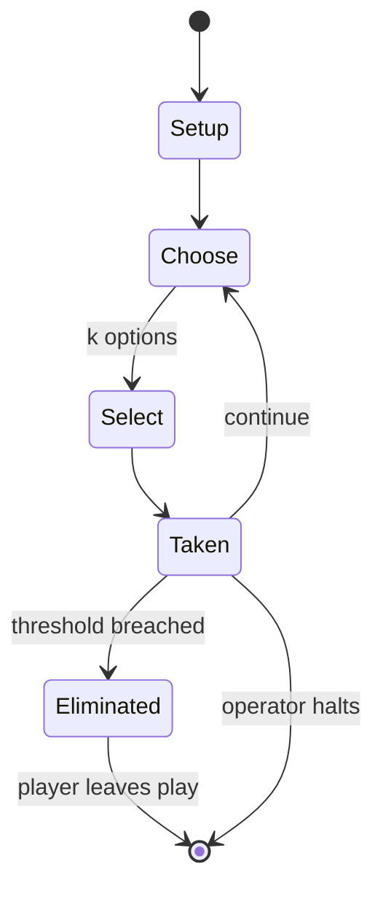

# Fortnite Battle Royale

`fortnite_battle_royale` &nbsp; state: **DEEPENED** &nbsp; method: **heuristic**

## Found layer (recorded, not trusted)

| field | value |
| --- | --- |
| wikidata | Q50822580 |
| wikipedia | Fortnite Battle Royale |
| genres (source) | -- |
| instance of (source) | -- |
| country of origin | -- |

## Declared layer (orders bench work)

| field | value |
| --- | --- |
| year created | 2020 |
| epoch | CONTEMPORARY |
| region | -- |
| media | DEXTERITY, PLAYGROUND, VIDEO |
| players | -- |
| age band | -- |
| exogenous process | -- |
| loss shape | ELIMINATION |
| live axes | COMMIT_BLIND, SELECT, TIMING, TRADE |
| horizon | OPEN_ENDED |
| scoring shape | SET_COLLECTION_CONVEX |
| information | SIMULTANEOUS |
| interaction | TEAM |
| turn structure | PHASE_STRUCTURED |
| tractability | SAMPLING_ONLY |
| randomness | PROCEDURAL_GENERATION, SIMULTANEOUS_CHOICE |
| luck factor | 0.3 |
| rules complexity | 4.7 |
| strategic depth | 2.5 |
| novelty | 0.7314 |
| solved status | -- |
| strategies | set_collection, tempo |
| algorithms | -- |

## Object model

```
Episode
  players      : ?
  turn_structure: PHASE_STRUCTURED
  horizon       : OPEN_ENDED
  scoring       : SET_COLLECTION_CONVEX

WorldState     -- simulation state advanced by the engine
Avatar         -- player-controlled agent
Clock          -- frame or tick counter
SealedChoice   -- irrevocable choice made without observation
OptionSet      -- the choices available after an exogenous draw
Initiative     -- who acts, and when, relative to others
Offer          -- proposed exchange between two agents
```

## State transition diagram



## Research item -- turn trace

```
# Fortnite Battle Royale -- simulated turn events
# generated from the DECLARED vector, not from a rulebook.
# structure: exo=None loss=ELIMINATION horizon=OPEN_ENDED scoring=SET_COLLECTION_CONVEX axes=COMMIT_BLIND,SELECT,TIMING,TRADE

t=0    SETUP        players=2  pot=0  capacity=3
t=1    SELECT       p1 2 options; take #1  (pot_gain=+2.6, capacity=-1)
t=2    SELECT       p1 1 options; take #1  (pot_gain=+2.1, capacity=-0)
t=3    SELECT       p1 3 options; take #3  (pot_gain=+1.0, capacity=-2)
t=4    TRADE        p1 offers 2:1 exchange to p2
t=5    ENDTURN      turn passes to p2
t=6    SELECT       p2 4 options; take #2  (pot_gain=+1.5, capacity=-2)
t=7    ENDTURN      turn passes to p1
t=8    SELECT       p1 4 options; take #1  (pot_gain=+2.0, capacity=-0)
t=9    SELECT       p1 4 options; take #2  (pot_gain=+2.4, capacity=-0)
t=10   TRADE        p1 offers 2:1 exchange to p2
t=11   SELECT       p1 1 options; take #1  (pot_gain=+1.3, capacity=-0)
t=12   TRADE        p1 offers 2:1 exchange to p2
t=13   SELECT       p1 4 options; take #2  (pot_gain=+3.1, capacity=-0)
t=14   TRADE        p1 offers 2:1 exchange to p2
t=15   SELECT       p1 1 options; take #1  (pot_gain=+2.4, capacity=-0)
t=16   TRADE        p1 offers 2:1 exchange to p2
t=17   SELECT       p1 1 options; take #1  (pot_gain=+2.5, capacity=-1)
t=18   TRADE        p1 offers 2:1 exchange to p2
t=19   SELECT       p1 3 options; take #2  (pot_gain=+0.9, capacity=-0)
t=20   SELECT       p1 3 options; take #3  (pot_gain=+2.5, capacity=-2)
t=21   ENDTURN      turn passes to p2
t=22   SELECT       p2 2 options; take #1  (pot_gain=+1.3, capacity=-1)
t=23   TRADE        p2 offers 2:1 exchange to p1
t=24   ENDTURN      turn passes to p1
t=25   SELECT       p1 4 options; take #4  (pot_gain=+0.6, capacity=-1)
t=26   SELECT       p1 3 options; take #3  (pot_gain=+2.9, capacity=-1)
t=27   TRADE        p1 offers 2:1 exchange to p2

terminal: OPEN_ENDED
```

## Conditions

| kind | threshold | effect | trigger |
| --- | --- | --- | --- |
| ELIMINATE | -- | -- | The primary objective is to be the last player or team remaining, achieved by either eliminating opponents or avoiding them. |
| ELIMINATE | -- | -- | In solo play, players are immediately eliminated once their health is fully depleted, but in squad modes, they become incapacitated and may be revived by teammates. |
| ELIMINATE | -- | -- | Originally, eliminated players were removed from the match entirely, but an update in April 2019 introduced "Reboot Vans" that allow teammates to revive a fallen player. |
| ELIMINATE | -- | -- | Items may also be cycled out of the game in a process known as "vaulting" if they are unbalanced or unpopular. |
| BOUNDARY | -- | -- | Within a month of launch, at least 32 clones of Fortnite's installer appeared on the Google Play Store, with approximately half containing malware. |
| PENALTY | -- | -- | The technical performance across platforms was generally seen as stable, with caveats. |

## Source extract

Fortnite Battle Royale is a 2017 battle royale video game produced by Epic Games. Part of the
overall Fortnite platform, the game follows up to 100 players competing to be the last player or
team remaining. Matches begin with players descending onto a large island, where they gather
weapons, items, and resources from scattered locations while attempting to avoid damage from
other players and a continuously shrinking safe zone. A building system allows players to use
gathered resources—wood, stone, and metal—to create temporary structures that can be used for
movement, defense, or combat. The game is played from a third-person perspective, with the
camera positioned behind the player character's shoulder. The game features a live background
narrative divided into chapters and seasons, each bringing changes to the island, gameplay, and
cosmetic content. Players may purchase an in-game currency, V-Bucks, through the in-game Item
Shop, to buy cosmetic items such as outfits and emotes. A seasonal "Battle Pass", also purchased
with V-Bucks, features tiers—levels that players unlock by earning XP through gameplay, each
rewarding their own cosmetic item. New modes have been introduced sinc

<sub>Wikipedia, CC BY-SA. Retained as evidence for the structural
classification above. Every rule inferred from it is HYPOTHESIZED
until audited against a rulebook.</sub>
