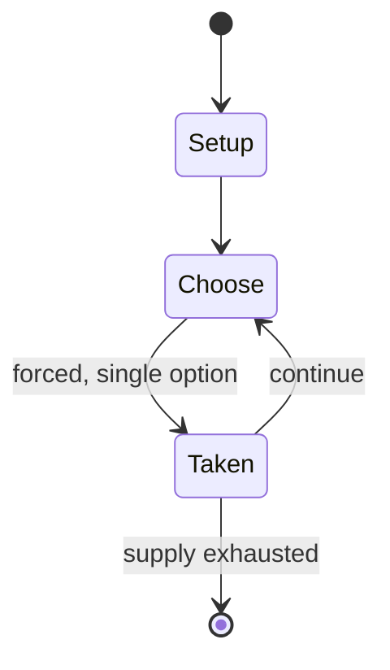

# Forty forty

`forty_forty` &nbsp; state: **DEEPENED** &nbsp; method: **heuristic**

## Found layer (recorded, not trusted)

| field | value |
| --- | --- |
| wikidata | Q17014499 |
| wikipedia | Forty forty |
| genres (source) | -- |
| instance of (source) | -- |
| country of origin | -- |

## Declared layer (orders bench work)

| field | value |
| --- | --- |
| year created | -- |
| epoch | -- |
| region | -- |
| media | - |
| players | -- |
| age band | CHILD |
| exogenous process | -- |
| loss shape | -- |
| live axes | - |
| horizon | -- |
| scoring shape | -- |
| information | -- |
| interaction | SOLITAIRE |
| turn structure | -- |
| tractability | SAMPLING_ONLY |
| randomness | -- |
| luck factor | 0.35 |
| rules complexity | 1.77 |
| strategic depth | 2.0 |
| novelty | 0.3843 |
| solved status | -- |
| strategies | -- |
| algorithms | -- |

## Object model

```
Episode
  players      : ?
  turn_structure: ?
  horizon       : ?
  scoring       : ?

State          -- opaque; no medium or axis evidence was found
Player         -- an agent that selects among legal successors
```

## State transition diagram



## Research item -- turn trace

```
# Forty forty -- simulated turn events
# generated from the DECLARED vector, not from a rulebook.
# structure: exo=None loss=None horizon=None scoring=None axes=-

t=0    SETUP        players=2  pot=0  capacity=3
t=1    FORCED       p1 single legal option taken (pot_gain=+1.3)
t=2    FORCED       p1 single legal option taken (pot_gain=+1.3)
t=3    ENDTURN      turn passes to p2
t=4    FORCED       p2 single legal option taken (pot_gain=+1.0)
t=5    FORCED       p2 single legal option taken (pot_gain=+1.6)
t=6    FORCED       p2 single legal option taken (pot_gain=+0.6)
t=7    FORCED       p2 single legal option taken (pot_gain=+1.4)
t=8    FORCED       p2 single legal option taken (pot_gain=+1.7)
t=9    FORCED       p2 single legal option taken (pot_gain=+0.6)
t=10   FORCED       p2 single legal option taken (pot_gain=+0.6)
t=11   ENDTURN      turn passes to p1
t=12   FORCED       p1 single legal option taken (pot_gain=+1.7)
t=13   FORCED       p1 single legal option taken (pot_gain=+1.7)
t=14   ENDTURN      turn passes to p2
t=15   FORCED       p2 single legal option taken (pot_gain=+1.1)
t=16   FORCED       p2 single legal option taken (pot_gain=+1.9)
t=17   FORCED       p2 single legal option taken (pot_gain=+1.8)
t=18   FORCED       p2 single legal option taken (pot_gain=+0.7)
t=19   FORCED       p2 single legal option taken (pot_gain=+1.0)
t=20   FORCED       p2 single legal option taken (pot_gain=+1.5)
t=21   FORCED       p2 single legal option taken (pot_gain=+0.7)
t=22   FORCED       p2 single legal option taken (pot_gain=+0.8)
t=23   ENDTURN      turn passes to p1
t=24   FORCED       p1 single legal option taken (pot_gain=+1.1)
t=25   FORCED       p1 single legal option taken (pot_gain=+1.6)
t=26   FORCED       p1 single legal option taken (pot_gain=+1.3)

terminal: VARIABLE
```

## Conditions

| kind | threshold | effect | trigger |
| --- | --- | --- | --- |
| PENALTY | -- | -- | However, if someone wrongfully breaks prematurely, i.e. before "Pong" is said, then the forfeit is that they are "It". |

## Source extract

Forty Forty (also known as 123 Home, Forty Forty In, Mob Mob, Mob and other names) is a
children's game combining elements of the games "It" and Hide and seek. One player is "on", or
"It", and they must capture the other players by 'spying' them rather than by tagging as there
is no physical contact with another player.   == Rules == A player is chosen as "It" and a
landmark such as a tree or lamppost is chosen as the base, this is sometimes called “the mob
post”. Players who are not "It" run and hide, while "It" counts to a certain number depending on
the version of the game; usually 40, 44 or 100. "It" looks for the other players, while the
players try to get to base without being seen. If a player gets to base without being seen, they
shout "forty forty I'm free", "forty forty home", "forty forty save myself", "forty forty in",
“save myself 123” and are then safe, waiting at base for the remainder of the game and do not
help “It” in the search for other players. In order to catch someone, "It" must see the person,
run back, touch the base and say "forty forty I see [name]" or “mob mob [name] 123”. If the
"seen" player is behind or in an object, it must be specified; e.g. "forty

<sub>Wikipedia, CC BY-SA. Retained as evidence for the structural
classification above. Every rule inferred from it is HYPOTHESIZED
until audited against a rulebook.</sub>
