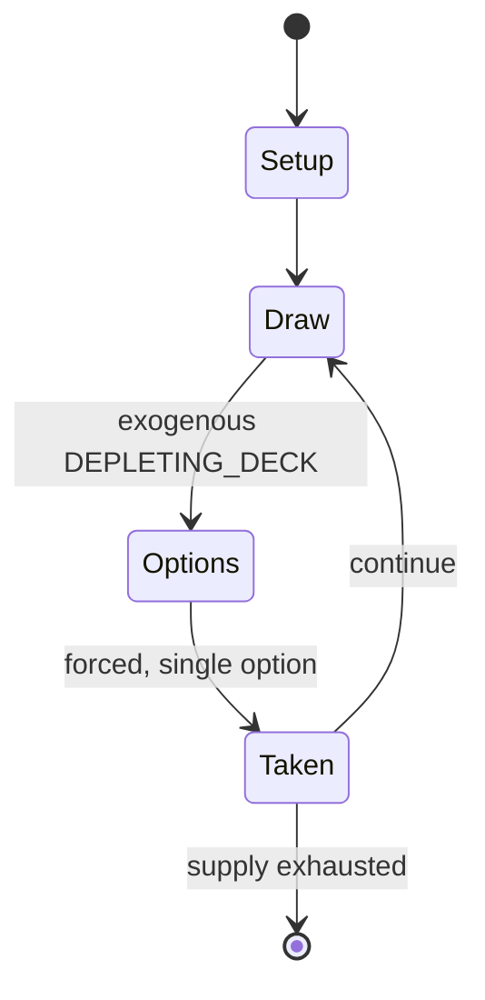

# Four Color Cards

*East Asian card game*

`four_color_cards` &nbsp; state: **DEEPENED** &nbsp; method: **heuristic**

## Found layer (recorded, not trusted)

| field | value |
| --- | --- |
| wikidata | Q2929227 |
| wikipedia | Four color cards |
| genres (source) | -- |
| instance of (source) | card game |
| country of origin | People's Republic of China |

## Declared layer (orders bench work)

| field | value |
| --- | --- |
| year created | -- |
| epoch | -- |
| region | EAST_ASIA |
| media | CARD, GAMBLING, TILE |
| players | 5 |
| age band | -- |
| exogenous process | DEPLETING_DECK |
| loss shape | -- |
| live axes | DISCARD, ORDER |
| horizon | -- |
| scoring shape | SET_COLLECTION_CONVEX |
| information | -- |
| interaction | SOLITAIRE |
| turn structure | PRIORITY_QUEUE |
| tractability | EXACT_WITH_CUT |
| randomness | DECK_DEPLETING, DECK_SHUFFLE, HIDDEN_INFO |
| luck factor | 0.53 |
| rules complexity | 4.1 |
| strategic depth | 2.45 |
| novelty | 0.8034 |
| solved status | -- |
| strategies | set_collection, signalling |
| algorithms | -- |

## Object model

```
Episode
  players      : 5
  turn_structure: PRIORITY_QUEUE
  horizon       : ?
  scoring       : SET_COLLECTION_CONVEX

Deck           -- ordered multiset, drawn without replacement
Hand           -- private multiset held by one player
DiscardPile    -- public accumulation of spent cards
TileBag        -- unordered draw source
Layout         -- placed tiles and their adjacencies
DiscardChoice  -- what is given up to satisfy a limit
Sequence       -- the permutation under the player's control
```

## State transition diagram



## Research item -- turn trace

```
# Four Color Cards -- simulated turn events
# generated from the DECLARED vector, not from a rulebook.
# structure: exo=DEPLETING_DECK loss=None horizon=None scoring=SET_COLLECTION_CONVEX axes=DISCARD,ORDER

t=0    SETUP        players=4  pot=0  capacity=3
t=1    DRAW         p1 draw from deck -> outcome #4  (p=0.236)
t=2    FORCED       p1 single legal option taken (pot_gain=+1.5)
t=3    DISCARD      p1 discards to hand limit
t=4    DRAW         p1 draw from deck -> outcome #5  (p=0.184)
t=5    FORCED       p1 single legal option taken (pot_gain=+1.7)
t=6    DISCARD      p1 discards to hand limit
t=7    DRAW         p1 draw from deck -> outcome #4  (p=0.206)
t=8    FORCED       p1 single legal option taken (pot_gain=+1.3)
t=9    ENDTURN      turn passes to p2
t=10   DRAW         p2 draw from deck -> outcome #3  (p=0.174)
t=11   FORCED       p2 single legal option taken (pot_gain=+1.8)
t=12   DRAW         p2 draw from deck -> outcome #5  (p=0.073)
t=13   FORCED       p2 single legal option taken (pot_gain=+1.6)
t=14   DRAW         p2 draw from deck -> outcome #5  (p=0.192)
t=15   FORCED       p2 single legal option taken (pot_gain=+1.2)
t=16   DRAW         p2 draw from deck -> outcome #5  (p=0.023)
t=17   FORCED       p2 single legal option taken (pot_gain=+0.9)
t=18   DRAW         p2 draw from deck -> outcome #3  (p=0.133)
t=19   FORCED       p2 single legal option taken (pot_gain=+1.9)
t=20   DISCARD      p2 discards to hand limit
t=21   ENDTURN      turn passes to p3
t=22   DRAW         p3 draw from deck -> outcome #3  (p=0.099)
t=23   FORCED       p3 single legal option taken (pot_gain=+0.8)
t=24   DISCARD      p3 discards to hand limit
t=25   DRAW         p3 draw from deck -> outcome #5  (p=0.280)
t=26   FORCED       p3 single legal option taken (pot_gain=+1.3)
t=27   DISCARD      p3 discards to hand limit

terminal: VARIABLE
```

## Conditions

| kind | threshold | effect | trigger |
| --- | --- | --- | --- |
| TERMINATE | 1 card | -- | Most turns consist of taking a card, then melding (if possible), then discarding one card so that each player maintains 20 cards in their hand, unless they have taken the card they need to win, in which case the round en |
| BOUNDARY | -- | -- | A player who does not have at least one of the following melds is deemed to have a very weak hand. |

## Source extract

Four color cards (Chinese: 四色牌; pinyin: Sì Sè Pái) is a game of the rummy family of card games,
with a relatively long history in southern China. In Vietnam the equivalent game is known as tứ
sắc (Sino-Vietnamese pronunciation of 四色).   == History == The game is similar to various
Chinese draw-and-discard card games played since the 18th century. The deck for this particular
game originated in the 19th century based on Xiangqi pieces on which the names of said pieces
are printed on the cards.  Chess cards clearly are more recent than money-suited and domino
Chinese playing cards. Classical Chinese encyclopedias seem to ignore them. Stewart Culin
observes: “These [cards derived from Tseung k'i=Xiangqi] seem to be peculiar to the Southern and
Southeastern provinces, notably Fuhkien [Fujian] and Kwangtung [Guangdong].” It was also
confirmed by the German sinologist Karl Himly, who said these chess cards were specific to
Fujian. Indeed, all recorded games come from southeastern China, and chess cards seem
particularly linked to Hokkien speakers. The cards were typically used by the lower class to
play gambling games, and were intended to be easy and cheap to make because, as gambling w

<sub>Wikipedia, CC BY-SA. Retained as evidence for the structural
classification above. Every rule inferred from it is HYPOTHESIZED
until audited against a rulebook.</sub>
