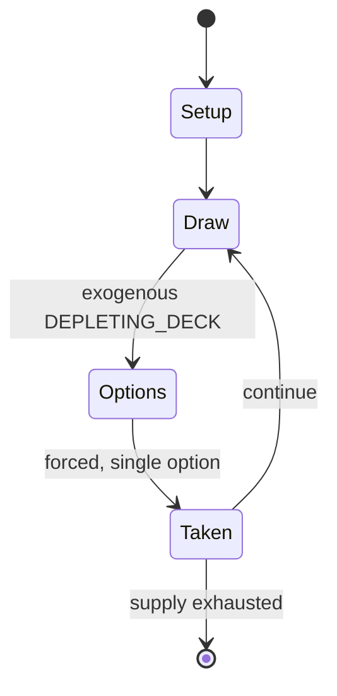

# FreeCell

*card game type - solitaire*

`freecell` &nbsp; state: **DEEPENED** &nbsp; method: **heuristic**

## Found layer (recorded, not trusted)

| field | value |
| --- | --- |
| wikidata | Q1050614 |
| wikipedia | FreeCell |
| genres (source) | card game, card video game |
| instance of (source) | card game, card game type, video game |
| country of origin | Italy |

## Declared layer (orders bench work)

| field | value |
| --- | --- |
| year created | -- |
| epoch | -- |
| region | EUROPE_SOUTH |
| media | CARD, SOLITAIRE, VIDEO |
| players | -- |
| age band | -- |
| exogenous process | DEPLETING_DECK |
| loss shape | -- |
| live axes | ORDER |
| horizon | -- |
| scoring shape | SET_COLLECTION_CONVEX |
| information | -- |
| interaction | SOLITAIRE |
| turn structure | -- |
| tractability | SAMPLING_ONLY |
| randomness | DECK_SHUFFLE |
| luck factor | 0.48 |
| rules complexity | 2.28 |
| strategic depth | 2.25 |
| novelty | 0.6343 |
| solved status | -- |
| strategies | tableau_building |
| algorithms | -- |

## Object model

```
Episode
  players      : ?
  turn_structure: ?
  horizon       : ?
  scoring       : SET_COLLECTION_CONVEX

Deck           -- ordered multiset, drawn without replacement
Hand           -- private multiset held by one player
DiscardPile    -- public accumulation of spent cards
WorldState     -- simulation state advanced by the engine
Avatar         -- player-controlled agent
Clock          -- frame or tick counter
Sequence       -- the permutation under the player's control
```

## State transition diagram



## Research item -- turn trace

```
# FreeCell -- simulated turn events
# generated from the DECLARED vector, not from a rulebook.
# structure: exo=DEPLETING_DECK loss=None horizon=None scoring=SET_COLLECTION_CONVEX axes=ORDER

t=0    SETUP        players=2  pot=0  capacity=8
t=1    DRAW         p1 draw from deck -> outcome #5  (p=0.011)
t=2    FORCED       p1 single legal option taken (pot_gain=+1.2)
t=3    ENDTURN      turn passes to p2
t=4    DRAW         p2 draw from deck -> outcome #1  (p=0.293)
t=5    FORCED       p2 single legal option taken (pot_gain=+1.2)
t=6    DRAW         p2 draw from deck -> outcome #5  (p=0.278)
t=7    FORCED       p2 single legal option taken (pot_gain=+1.3)
t=8    ENDTURN      turn passes to p1
t=9    DRAW         p1 draw from deck -> outcome #3  (p=0.118)
t=10   FORCED       p1 single legal option taken (pot_gain=+1.2)
t=11   DRAW         p1 draw from deck -> outcome #6  (p=0.060)
t=12   FORCED       p1 single legal option taken (pot_gain=+1.8)
t=13   DRAW         p1 draw from deck -> outcome #4  (p=0.156)
t=14   FORCED       p1 single legal option taken (pot_gain=+0.7)
t=15   DRAW         p1 draw from deck -> outcome #3  (p=0.255)
t=16   FORCED       p1 single legal option taken (pot_gain=+1.4)
t=17   ENDTURN      turn passes to p2
t=18   DRAW         p2 draw from deck -> outcome #1  (p=0.030)
t=19   FORCED       p2 single legal option taken (pot_gain=+1.6)
t=20   ENDTURN      turn passes to p1
t=21   DRAW         p1 draw from deck -> outcome #4  (p=0.283)
t=22   FORCED       p1 single legal option taken (pot_gain=+0.9)
t=23   DRAW         p1 draw from deck -> outcome #2  (p=0.221)
t=24   FORCED       p1 single legal option taken (pot_gain=+1.8)
t=25   DRAW         p1 draw from deck -> outcome #6  (p=0.045)
t=26   FORCED       p1 single legal option taken (pot_gain=+0.8)

terminal: VARIABLE
```

## Source extract

FreeCell is a solitaire card game played using the standard 52-card deck. It is fundamentally
different from most solitaire games in that very few deals are unsolvable, and all cards are
dealt face-up from the beginning of the game. It was originally created as a computer game by
Paul Alfille. Microsoft has included an implementation of FreeCell in every release of the
Windows operating system since 1995, which has greatly contributed to the game's popularity.
== Rules == One standard 52-card deck is used. There are four open cells and four open
foundations. Cards are dealt face-up into eight cascades, four of which comprise seven cards
each and four of which comprise six cards each.  The top card of each cascade begins a sequence.
Tableaus must be built down by alternating colors. Foundations are built up by suit. The
foundations begin with Ace and are built up to King. Any cell card or top card of any cascade
may be moved to build on a tableau, or moved to an empty cell, an empty cascade, or its
foundation. The game is won after all cards are moved to their foundation piles.    ===
Supermoves === In FreeCell, unlike many solitaire card games, only one card may be moved at a
tim

<sub>Wikipedia, CC BY-SA. Retained as evidence for the structural
classification above. Every rule inferred from it is HYPOTHESIZED
until audited against a rulebook.</sub>
