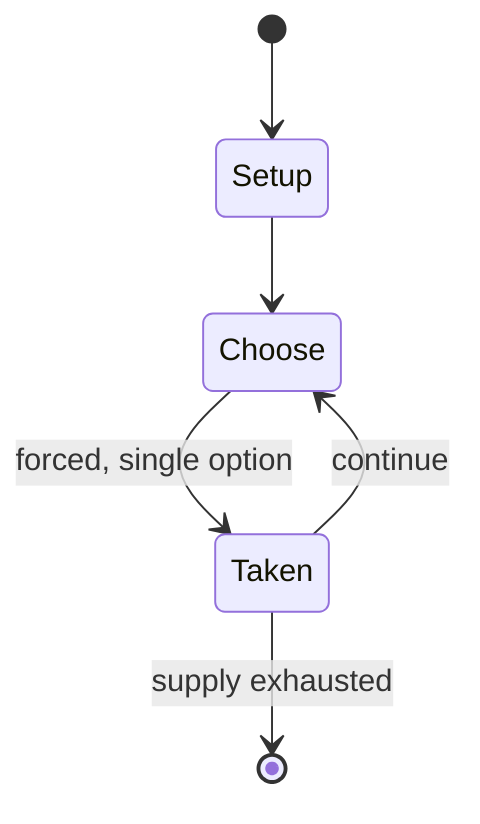

# FreeCol

*2009 video game*

`freecol` &nbsp; state: **DEEPENED** &nbsp; method: **heuristic**

## Found layer (recorded, not trusted)

| field | value |
| --- | --- |
| wikidata | Q162028 |
| wikipedia | FreeCol |
| genres (source) | turn-based strategy video game |
| instance of (source) | video game |
| country of origin | -- |

## Declared layer (orders bench work)

| field | value |
| --- | --- |
| year created | 2003 |
| epoch | CONTEMPORARY |
| region | -- |
| media | VIDEO |
| players | -- |
| age band | -- |
| exogenous process | -- |
| loss shape | -- |
| live axes | TRADE |
| horizon | -- |
| scoring shape | -- |
| information | -- |
| interaction | NEGOTIATION |
| turn structure | -- |
| tractability | SAMPLING_ONLY |
| randomness | -- |
| luck factor | 0.35 |
| rules complexity | 2.64 |
| strategic depth | 2.0 |
| novelty | 0.5114 |
| solved status | -- |
| strategies | -- |
| algorithms | -- |

## Object model

```
Episode
  players      : ?
  turn_structure: ?
  horizon       : ?
  scoring       : ?

WorldState     -- simulation state advanced by the engine
Avatar         -- player-controlled agent
Clock          -- frame or tick counter
Offer          -- proposed exchange between two agents
```

## State transition diagram



## Research item -- turn trace

```
# FreeCol -- simulated turn events
# generated from the DECLARED vector, not from a rulebook.
# structure: exo=None loss=None horizon=None scoring=None axes=TRADE

t=0    SETUP        players=2  pot=0  capacity=4
t=1    FORCED       p1 single legal option taken (pot_gain=+1.7)
t=2    FORCED       p1 single legal option taken (pot_gain=+2.0)
t=3    FORCED       p1 single legal option taken (pot_gain=+1.8)
t=4    TRADE        p1 offers 2:1 exchange to p2
t=5    FORCED       p1 single legal option taken (pot_gain=+0.9)
t=6    TRADE        p1 offers 2:1 exchange to p2
t=7    FORCED       p1 single legal option taken (pot_gain=+1.6)
t=8    FORCED       p1 single legal option taken (pot_gain=+1.6)
t=9    ENDTURN      turn passes to p2
t=10   FORCED       p2 single legal option taken (pot_gain=+1.4)
t=11   ENDTURN      turn passes to p1
t=12   FORCED       p1 single legal option taken (pot_gain=+0.9)
t=13   FORCED       p1 single legal option taken (pot_gain=+0.6)
t=14   TRADE        p1 offers 2:1 exchange to p2
t=15   FORCED       p1 single legal option taken (pot_gain=+1.8)
t=16   FORCED       p1 single legal option taken (pot_gain=+1.2)
t=17   FORCED       p1 single legal option taken (pot_gain=+1.7)
t=18   FORCED       p1 single legal option taken (pot_gain=+1.8)
t=19   FORCED       p1 single legal option taken (pot_gain=+1.9)
t=20   FORCED       p1 single legal option taken (pot_gain=+1.2)
t=21   FORCED       p1 single legal option taken (pot_gain=+0.7)
t=22   ENDTURN      turn passes to p2
t=23   FORCED       p2 single legal option taken (pot_gain=+0.9)
t=24   FORCED       p2 single legal option taken (pot_gain=+0.9)
t=25   TRADE        p2 offers 2:1 exchange to p1
t=26   FORCED       p2 single legal option taken (pot_gain=+1.9)

terminal: VARIABLE
```

## Conditions

| kind | threshold | effect | trigger |
| --- | --- | --- | --- |
| BOUNDARY | -- | -- | To be allowed to declare independence, at least 50% of the player's colonists must support independence. |

## Source extract

FreeCol is a 4X video game, a clone of Sid Meier's Colonization. FreeCol is free and open source
software released under the GNU GPL-2.0-or-later. In 2023, the FreeCol project reached its 1.0
release, after twenty years of development. FreeCol is mostly programmed in Java and should thus
be platform-independent. In practice, it is known to run on Linux and Windows, as well as Mac OS
X (with some limitations). While remaining faithful to the original in terms of mechanics and
gameplay, FreeCol features redesigned graphics. Moreover, in addition to the classical
Colonization rules, it features an additional ruleset that incorporates ideas that didn't make
it to the final version of Meier's game, requests by fans and original concepts like new
European players with new national bonuses.   == Gameplay ==  In FreeCol the player leads the
colony of a European power from the arrival on the shore of the New World into the future,
achieving victory by one of two possible victory conditions: either gaining independence by
declaring independence and subsequently defeating the dispatched royal expeditionary force or by
defeating the colonies of all the competing European powers by the year 160

<sub>Wikipedia, CC BY-SA. Retained as evidence for the structural
classification above. Every rule inferred from it is HYPOTHESIZED
until audited against a rulebook.</sub>
