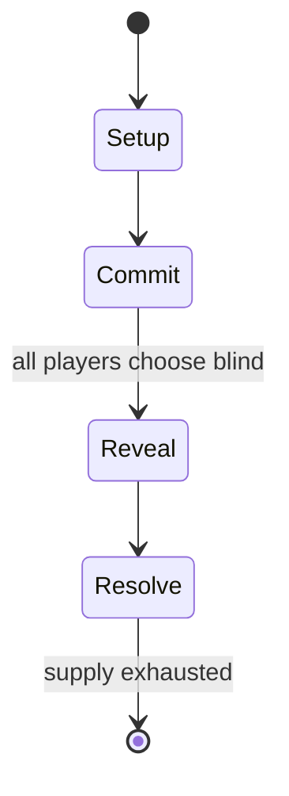

# FreeSO

*2017 Video Game mod*

`freeso` &nbsp; state: **DEEPENED** &nbsp; method: **heuristic**

## Found layer (recorded, not trusted)

| field | value |
| --- | --- |
| wikidata | Q135898064 |
| wikipedia | Freeso |
| genres (source) | massively multiplayer online game, virtual world |
| instance of (source) | source-available software, video game |
| country of origin | United Kingdom |

## Declared layer (orders bench work)

| field | value |
| --- | --- |
| year created | 2017 |
| epoch | CONTEMPORARY |
| region | EUROPE_WEST |
| media | VIDEO |
| players | -- |
| age band | -- |
| exogenous process | -- |
| loss shape | -- |
| live axes | SELECT, SPATIAL |
| horizon | -- |
| scoring shape | -- |
| information | -- |
| interaction | -- |
| turn structure | SIMULTANEOUS |
| tractability | SAMPLING_ONLY |
| randomness | SIMULTANEOUS_CHOICE |
| luck factor | 0.3 |
| rules complexity | 2.51 |
| strategic depth | 2.0 |
| novelty | 0.4987 |
| solved status | -- |
| strategies | -- |
| algorithms | -- |

## Object model

```
Episode
  players      : ?
  turn_structure: SIMULTANEOUS
  horizon       : ?
  scoring       : ?

WorldState     -- simulation state advanced by the engine
Avatar         -- player-controlled agent
Clock          -- frame or tick counter
OptionSet      -- the choices available after an exogenous draw
Placement      -- position subject to geometric legality
```

## State transition diagram



## Research item -- turn trace

```
# FreeSO -- simulated turn events
# generated from the DECLARED vector, not from a rulebook.
# structure: exo=None loss=None horizon=None scoring=None axes=SELECT,SPATIAL

t=0    SETUP        players=2  pot=0  capacity=7
t=1    SELECT       p1 4 options; take #1  (pot_gain=+1.2, capacity=-0)
t=2    SELECT       p1 4 options; take #1  (pot_gain=+2.8, capacity=-2)
t=3    SPATIAL      p1 places at (7,1); adjacency legal
t=4    SELECT       p1 2 options; take #1  (pot_gain=+0.7, capacity=-1)
t=5    SELECT       p1 2 options; take #1  (pot_gain=+2.7, capacity=-2)
t=6    SELECT       p1 1 options; take #1  (pot_gain=+0.8, capacity=-2)
t=7    SELECT       p1 4 options; take #2  (pot_gain=+1.7, capacity=-0)
t=8    SELECT       p1 3 options; take #3  (pot_gain=+3.1, capacity=-1)
t=9    SPATIAL      p1 places at (6,1); adjacency legal
t=10   SELECT       p1 1 options; take #1  (pot_gain=+1.6, capacity=-0)
t=11   SPATIAL      p1 places at (0,2); adjacency legal
t=12   SELECT       p1 4 options; take #3  (pot_gain=+1.5, capacity=-2)
t=13   SPATIAL      p1 places at (0,0); adjacency legal
t=14   SELECT       p1 3 options; take #2  (pot_gain=+2.9, capacity=-0)
t=15   SPATIAL      p1 places at (5,7); adjacency legal
t=16   SELECT       p1 3 options; take #3  (pot_gain=+2.3, capacity=-1)
t=17   SELECT       p1 3 options; take #2  (pot_gain=+2.5, capacity=-2)
t=18   SPATIAL      p1 places at (3,2); adjacency legal
t=19   SELECT       p1 1 options; take #1  (pot_gain=+1.4, capacity=-2)
t=20   SELECT       p1 4 options; take #4  (pot_gain=+2.8, capacity=-0)
t=21   SPATIAL      p1 places at (3,4); adjacency legal
t=22   SELECT       p1 4 options; take #3  (pot_gain=+0.9, capacity=-0)
t=23   ENDTURN      turn passes to p2
t=24   SELECT       p2 2 options; take #2  (pot_gain=+3.4, capacity=-1)
t=25   SELECT       p2 2 options; take #1  (pot_gain=+1.9, capacity=-1)
t=26   SELECT       p2 3 options; take #1  (pot_gain=+2.6, capacity=-0)
t=27   SPATIAL      p2 places at (6,4); adjacency legal

terminal: VARIABLE
```

## Conditions

| kind | threshold | effect | trigger |
| --- | --- | --- | --- |
| ELIMINATE | -- | -- | Describing money as the "downfall of the game", Scott Steinberg of PC Zone noted the job objects to dominant player participation and interaction, stating "the emphasis on cash and beauty leaves the game unbalanced, offe |

## Source extract

The Sims Online was a 2002 massively multiplayer online game (MMO) developed by Maxis and
published by Electronic Arts (EA) for Microsoft Windows. The game was a subscription-based
online multiplayer version of the 2000 Maxis game The Sims, in which players could interact with
others on virtual user-made lots, buy and customise properties, and make in-game money by taking
on jobs. The Sims Online was the project of Maxis founder and Sims creator Will Wright, who
sought to create an open-ended online game based on social interaction, with ambitions for the
game to be a platform for emergent gameplay and the creation of virtual societies and politics.
In line with these ambitions and the prior commercial success of The Sims, The Sims Online
received considerable pre-release coverage, with expectations that it would be successful and
break new ground for online multiplayer games. Released following a two-month public beta, The
Sims Online was met with mixed reviews from critics. Reviewers generally praised the game's
social features, but found the game to lack the depth and appeal of The Sims, with many
describing it as similar to a chat room. The overemphasis of jobs and money-making

<sub>Wikipedia, CC BY-SA. Retained as evidence for the structural
classification above. Every rule inferred from it is HYPOTHESIZED
until audited against a rulebook.</sub>
