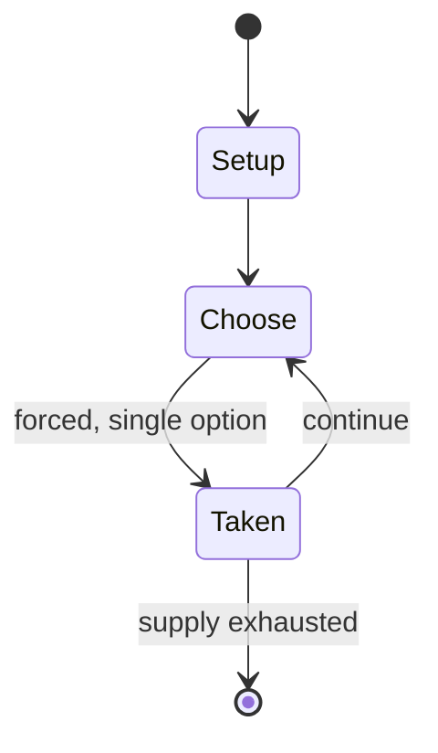

# Fulda Gap

*1977 Cold War board wargame*

`fulda_gap` &nbsp; state: **DEEPENED** &nbsp; method: **heuristic**

## Found layer (recorded, not trusted)

| field | value |
| --- | --- |
| wikidata | Q112119090 |
| wikipedia | Fulda Gap (game) |
| genres (source) | -- |
| instance of (source) | board wargame |
| country of origin | -- |

## Declared layer (orders bench work)

| field | value |
| --- | --- |
| year created | -- |
| epoch | -- |
| region | -- |
| media | WARGAME |
| players | -- |
| age band | -- |
| exogenous process | -- |
| loss shape | -- |
| live axes | ALLOCATE, COMMIT_BLIND, SPATIAL |
| horizon | -- |
| scoring shape | LINEAR_ACCUMULATION |
| information | SIMULTANEOUS |
| interaction | -- |
| turn structure | PHASE_STRUCTURED |
| tractability | SAMPLING_ONLY |
| randomness | DICE |
| luck factor | 0.58 |
| rules complexity | 4.51 |
| strategic depth | 1.87 |
| novelty | 0.7067 |
| solved status | -- |
| strategies | -- |
| algorithms | -- |

## Object model

```
Episode
  players      : ?
  turn_structure: PHASE_STRUCTURED
  horizon       : ?
  scoring       : LINEAR_ACCUMULATION

ResourcePool   -- divisible capacity committed across slots
SealedChoice   -- irrevocable choice made without observation
Placement      -- position subject to geometric legality
```

## State transition diagram



## Research item -- turn trace

```
# Fulda Gap -- simulated turn events
# generated from the DECLARED vector, not from a rulebook.
# structure: exo=None loss=None horizon=None scoring=LINEAR_ACCUMULATION axes=ALLOCATE,COMMIT_BLIND,SPATIAL

t=0    SETUP        players=2  pot=0  capacity=4
t=1    FORCED       p1 single legal option taken (pot_gain=+0.9)
t=2    ALLOCATE     p1 commits 2 of 5 capacity across 4 slots
t=3    SPATIAL      p1 places at (5,0); adjacency legal
t=4    FORCED       p1 single legal option taken (pot_gain=+1.0)
t=5    ALLOCATE     p1 commits 3 of 5 capacity across 2 slots
t=6    FORCED       p1 single legal option taken (pot_gain=+1.2)
t=7    SPATIAL      p1 places at (3,5); adjacency legal
t=8    FORCED       p1 single legal option taken (pot_gain=+1.1)
t=9    SPATIAL      p1 places at (0,4); adjacency legal
t=10   FORCED       p1 single legal option taken (pot_gain=+1.1)
t=11   FORCED       p1 single legal option taken (pot_gain=+0.7)
t=12   ALLOCATE     p1 commits 3 of 5 capacity across 2 slots
t=13   ENDTURN      turn passes to p2
t=14   FORCED       p2 single legal option taken (pot_gain=+1.6)
t=15   FORCED       p2 single legal option taken (pot_gain=+0.5)
t=16   ALLOCATE     p2 commits 1 of 5 capacity across 3 slots
t=17   ENDTURN      turn passes to p1
t=18   FORCED       p1 single legal option taken (pot_gain=+1.3)
t=19   FORCED       p1 single legal option taken (pot_gain=+1.7)
t=20   SPATIAL      p1 places at (6,1); adjacency legal
t=21   FORCED       p1 single legal option taken (pot_gain=+1.8)
t=22   ALLOCATE     p1 commits 1 of 5 capacity across 4 slots
t=23   FORCED       p1 single legal option taken (pot_gain=+1.4)
t=24   SPATIAL      p1 places at (0,1); adjacency legal
t=25   FORCED       p1 single legal option taken (pot_gain=+0.5)
t=26   ALLOCATE     p1 commits 1 of 5 capacity across 3 slots
t=27   SPATIAL      p1 places at (2,7); adjacency legal
t=28   ENDTURN      turn passes to p2

terminal: VARIABLE
```

## Source extract

Fulda Gap, subtitled "The First Battle of the Next War", is a board wargame published by
Simulations Publications Inc. (SPI) in 1977 that simulates a hypothetical attack by Warsaw Pact
forces against NATO defenders in West Germany using technology and tactics of the mid-1970s   ==
Description == Fulda Gap is a two-player game in which one player controls invading Warsaw Pact
forces, and the other player controls the NATO defenders. The rules system is based upon
Panzergruppe Guderian, published by SPI the previous year, and comes with Basic rules, for new
players, and Advanced rules, to be used once both players are familiar with the game. The game
references technology and tactics from the 1970s, with rules for field fortifications, attack
helicopters, air power, airmobile operations, paratroops, electronic countermeasures (ECM),
chemical warfare, and nuclear weapons.   === Components === The game includes:  22" x 34" paper
hex grid map scaled at 10 km (6 mi) per hex 400 double-sided die-cut counters 16-page rules
booklet player charts and aids small six-sided die   === Gameplay === The game uses an
alternating "I Go, You Go" system. First the Warsaw Pact player completes the foll

<sub>Wikipedia, CC BY-SA. Retained as evidence for the structural
classification above. Every rule inferred from it is HYPOTHESIZED
until audited against a rulebook.</sub>
