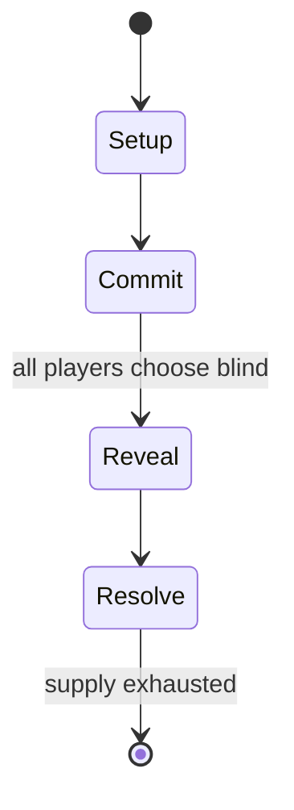

# Future Card Buddyfight

*Japanese anime television series*

`future_card_buddyfight` &nbsp; state: **DEEPENED** &nbsp; method: **heuristic**

## Found layer (recorded, not trusted)

| field | value |
| --- | --- |
| wikidata | Q15502589 |
| wikipedia | Future Card Buddyfight |
| genres (source) | action anime and manga |
| instance of (source) | anime television series, collectible card game, conflation, manga series |
| country of origin | Japan |

## Declared layer (orders bench work)

| field | value |
| --- | --- |
| year created | 2019 |
| epoch | CONTEMPORARY |
| region | EAST_ASIA |
| media | CARD, COLLECTIBLE |
| players | -- |
| age band | -- |
| exogenous process | -- |
| loss shape | -- |
| live axes | COMMIT_BLIND |
| horizon | -- |
| scoring shape | -- |
| information | SIMULTANEOUS |
| interaction | -- |
| turn structure | SIMULTANEOUS |
| tractability | SAMPLING_ONLY |
| randomness | SIMULTANEOUS_CHOICE |
| luck factor | 0.3 |
| rules complexity | 2.33 |
| strategic depth | 2.25 |
| novelty | 0.6171 |
| solved status | -- |
| strategies | coalition_forming |
| algorithms | -- |

## Object model

```
Episode
  players      : ?
  turn_structure: SIMULTANEOUS
  horizon       : ?
  scoring       : ?

Deck           -- ordered multiset, drawn without replacement
Hand           -- private multiset held by one player
DiscardPile    -- public accumulation of spent cards
SealedChoice   -- irrevocable choice made without observation
```

## State transition diagram



## Research item -- turn trace

```
# Future Card Buddyfight -- simulated turn events
# generated from the DECLARED vector, not from a rulebook.
# structure: exo=None loss=None horizon=None scoring=None axes=COMMIT_BLIND

t=0    SETUP        players=2  pot=0  capacity=5
t=1    FORCED       p1 single legal option taken (pot_gain=+1.2)
t=2    FORCED       p1 single legal option taken (pot_gain=+0.9)
t=3    FORCED       p1 single legal option taken (pot_gain=+1.8)
t=4    FORCED       p1 single legal option taken (pot_gain=+1.6)
t=5    ENDTURN      turn passes to p2
t=6    FORCED       p2 single legal option taken (pot_gain=+0.6)
t=7    FORCED       p2 single legal option taken (pot_gain=+1.0)
t=8    ENDTURN      turn passes to p1
t=9    FORCED       p1 single legal option taken (pot_gain=+1.7)
t=10   ENDTURN      turn passes to p2
t=11   FORCED       p2 single legal option taken (pot_gain=+0.8)
t=12   FORCED       p2 single legal option taken (pot_gain=+1.7)
t=13   FORCED       p2 single legal option taken (pot_gain=+1.3)
t=14   ENDTURN      turn passes to p1
t=15   FORCED       p1 single legal option taken (pot_gain=+1.5)
t=16   FORCED       p1 single legal option taken (pot_gain=+1.8)
t=17   FORCED       p1 single legal option taken (pot_gain=+1.0)
t=18   ENDTURN      turn passes to p2
t=19   FORCED       p2 single legal option taken (pot_gain=+1.3)
t=20   FORCED       p2 single legal option taken (pot_gain=+1.4)
t=21   FORCED       p2 single legal option taken (pot_gain=+1.0)
t=22   ENDTURN      turn passes to p1
t=23   FORCED       p1 single legal option taken (pot_gain=+1.7)
t=24   FORCED       p1 single legal option taken (pot_gain=+1.5)
t=25   FORCED       p1 single legal option taken (pot_gain=+1.6)
t=26   ENDTURN      turn passes to p2

terminal: VARIABLE
```

## Source extract

Future Card Buddyfight (Japanese: フューチャーカード バディファイト, Hepburn: Fyūchā Kādo Badifaito) was a
Japanese collectible card game created by Bushiroad. The first products began releasing
simultaneously worldwide from January 24, 2014. On June 15, 2020, Bushiroad announced it would
end production of the card game, with the final new product release occurring on September 25,
2020, and official tournaments continuing through June 2021. An anime television series
adaptation by OLM, Inc. and Dentsu began airing from January 4, 2014. An English version
produced by Bushiroad and Ocean Productions is airing in Singapore as well as being streamed
worldwide via YouTube. A manga adaptation was serialized in Shogakukan's CoroCoro Comic from
November 2013 to April 2018. It was followed by a manga series Shin Future Card Buddyfight from
May 2018 to February 2019. It is published in English by Shogakukan Asia. The English dub
formerly aired in Canada. The first season ended on April 4, 2015, and was followed by a sequel
series, Future Card Buddyfight Hundred, which ran from April 11, 2015, to March 26, 2016. Future
Card Buddyfight Hundred was followed by Future Card Buddyfight Triple D which ran from Ap

<sub>Wikipedia, CC BY-SA. Retained as evidence for the structural
classification above. Every rule inferred from it is HYPOTHESIZED
until audited against a rulebook.</sub>
