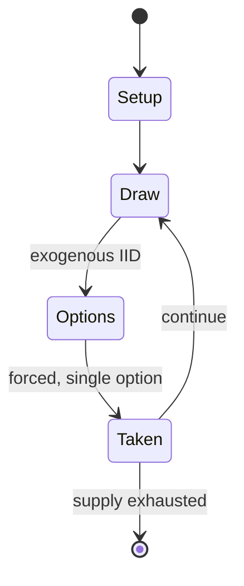

# Game of Seven (Glückshaus)

*late medieval / early modern European gambling game*

`game_of_seven_gl_ckshaus` &nbsp; state: **DEEPENED** &nbsp; method: **heuristic**

## Found layer (recorded, not trusted)

| field | value |
| --- | --- |
| wikidata | Q1532792 |
| wikipedia | Glückshaus |
| genres (source) | -- |
| instance of (source) | dice game, game of chance, social game |
| country of origin | -- |

## Declared layer (orders bench work)

| field | value |
| --- | --- |
| year created | -- |
| epoch | -- |
| region | -- |
| media | DICE, GAMBLING |
| players | -- |
| age band | -- |
| exogenous process | IID |
| loss shape | -- |
| live axes | - |
| horizon | VARIABLE |
| scoring shape | -- |
| information | -- |
| interaction | SOLITAIRE |
| turn structure | -- |
| tractability | EXACT_WITH_CUT |
| randomness | DICE |
| luck factor | 0.58 |
| rules complexity | 1.74 |
| strategic depth | 1.87 |
| novelty | 0.7113 |
| solved status | -- |
| strategies | -- |
| algorithms | -- |

## Object model

```
Episode
  players      : ?
  turn_structure: ?
  horizon       : VARIABLE
  scoring       : ?

DicePool       -- n dice, each an iid categorical draw
Roll           -- realised outcome of a pool
```

## State transition diagram



## Research item -- turn trace

```
# Game of Seven (Glückshaus) -- simulated turn events
# generated from the DECLARED vector, not from a rulebook.
# structure: exo=IID loss=None horizon=VARIABLE scoring=None axes=-

t=0    SETUP        players=2  pot=0  capacity=4
t=1    DRAW         p1 roll from d6 pool -> outcome #5  (p=0.238)
t=2    FORCED       p1 single legal option taken (pot_gain=+0.6)
t=3    DRAW         p1 roll from d6 pool -> outcome #2  (p=0.046)
t=4    FORCED       p1 single legal option taken (pot_gain=+0.8)
t=5    DRAW         p1 roll from d6 pool -> outcome #4  (p=0.050)
t=6    FORCED       p1 single legal option taken (pot_gain=+1.4)
t=7    ENDTURN      turn passes to p2
t=8    DRAW         p2 roll from d6 pool -> outcome #1  (p=0.160)
t=9    FORCED       p2 single legal option taken (pot_gain=+1.0)
t=10   DRAW         p2 roll from d6 pool -> outcome #6  (p=0.084)
t=11   FORCED       p2 single legal option taken (pot_gain=+0.6)
t=12   DRAW         p2 roll from d6 pool -> outcome #4  (p=0.009)
t=13   FORCED       p2 single legal option taken (pot_gain=+1.0)
t=14   DRAW         p2 roll from d6 pool -> outcome #2  (p=0.295)
t=15   FORCED       p2 single legal option taken (pot_gain=+1.1)
t=16   ENDTURN      turn passes to p1
t=17   DRAW         p1 roll from d6 pool -> outcome #4  (p=0.278)
t=18   FORCED       p1 single legal option taken (pot_gain=+1.4)
t=19   DRAW         p1 roll from d6 pool -> outcome #4  (p=0.129)
t=20   FORCED       p1 single legal option taken (pot_gain=+1.9)
t=21   DRAW         p1 roll from d6 pool -> outcome #3  (p=0.148)
t=22   FORCED       p1 single legal option taken (pot_gain=+1.1)
t=23   DRAW         p1 roll from d6 pool -> outcome #1  (p=0.256)
t=24   FORCED       p1 single legal option taken (pot_gain=+1.2)
t=25   DRAW         p1 roll from d6 pool -> outcome #4  (p=0.195)
t=26   FORCED       p1 single legal option taken (pot_gain=+0.6)

terminal: VARIABLE
```

## Conditions

| kind | threshold | effect | trigger |
| --- | --- | --- | --- |
| TERMINATE | 1 player | -- | The game ends when one player has won all the coins. |

## Source extract

Glückshaus (House of Fortune) is a gambling dice game for multiple players. It is played with
two dice on a numbered board. The name was coined in the 1960s by Erwin Glonnegger who also
created the modern design of the board by merging older dice games with a staking board for a
card game.   == Rules == The board is divided in fields numbered from 2 to 12 (with 4 often left
out), arranged in the form of the rooms of a house. Each player rolls two dice.  On a roll of 3,
5, 6, 8, 9, 10 or 11, the player places a coin on the board if that room is empty, or takes the
coin if it is occupied. If the player rolls snake eyes, he has rolled a "Lucky Pig" and collects
all the coins on the board, except for what lies in room seven. If the player rolls a 12, he is
"king" (König) and wins all the coins on the board. If the player rolls a 7, there is a
"wedding" (Hochzeit) going on in the room, and one has to put a coin on there no matter what (a
dowry). This builds up a jackpot until the "king" (12) is rolled. If playing on a board without
a 4, either nothing happens on rolling a 4, or a rule defined before starting the game comes
into play (for example a coin is given to the board owner). The

<sub>Wikipedia, CC BY-SA. Retained as evidence for the structural
classification above. Every rule inferred from it is HYPOTHESIZED
until audited against a rulebook.</sub>
