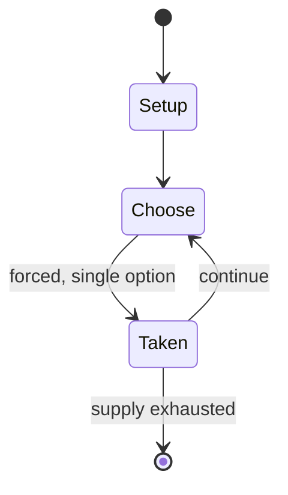

# Game of the Amazons

`game_of_the_amazons` &nbsp; state: **DEEPENED** &nbsp; method: **heuristic**

## Found layer (recorded, not trusted)

| field | value |
| --- | --- |
| wikidata | Q456463 |
| wikipedia | Game of the Amazons |
| genres (source) | -- |
| instance of (source) | -- |
| country of origin | -- |

## Declared layer (orders bench work)

| field | value |
| --- | --- |
| year created | 1988 |
| epoch | DIGITAL |
| region | -- |
| media | ABSTRACT |
| players | -- |
| age band | -- |
| exogenous process | NONE |
| loss shape | OPPORTUNITY_ONLY |
| live axes | SPATIAL |
| horizon | -- |
| scoring shape | -- |
| information | PERFECT |
| interaction | COMPETITIVE |
| turn structure | -- |
| tractability | EXACT_WITH_CUT |
| randomness | NONE |
| luck factor | 0.02 |
| rules complexity | 2.17 |
| strategic depth | 2.65 |
| novelty | 0.7343 |
| solved status | -- |
| strategies | blocking |
| algorithms | -- |

## Object model

```
Episode
  players      : ?
  turn_structure: ?
  horizon       : ?
  scoring       : ?

Placement      -- position subject to geometric legality
```

## State transition diagram



## Research item -- turn trace

```
# Game of the Amazons -- simulated turn events
# generated from the DECLARED vector, not from a rulebook.
# structure: exo=NONE loss=OPPORTUNITY_ONLY horizon=None scoring=None axes=SPATIAL

t=0    SETUP        players=2  pot=0  capacity=5
t=1    FORCED       p1 single legal option taken (pot_gain=+1.8)
t=2    FORCED       p1 single legal option taken (pot_gain=+1.8)
t=3    ENDTURN      turn passes to p2
t=4    FORCED       p2 single legal option taken (pot_gain=+1.0)
t=5    FORCED       p2 single legal option taken (pot_gain=+1.1)
t=6    ENDTURN      turn passes to p1
t=7    FORCED       p1 single legal option taken (pot_gain=+1.5)
t=8    FORCED       p1 single legal option taken (pot_gain=+0.9)
t=9    SPATIAL      p1 places at (3,6); adjacency legal
t=10   FORCED       p1 single legal option taken (pot_gain=+2.0)
t=11   SPATIAL      p1 places at (1,3); adjacency legal
t=12   FORCED       p1 single legal option taken (pot_gain=+1.7)
t=13   ENDTURN      turn passes to p2
t=14   FORCED       p2 single legal option taken (pot_gain=+1.6)
t=15   ENDTURN      turn passes to p1
t=16   FORCED       p1 single legal option taken (pot_gain=+1.0)
t=17   FORCED       p1 single legal option taken (pot_gain=+0.8)
t=18   SPATIAL      p1 places at (1,6); adjacency legal
t=19   FORCED       p1 single legal option taken (pot_gain=+1.6)
t=20   SPATIAL      p1 places at (0,0); adjacency legal
t=21   FORCED       p1 single legal option taken (pot_gain=+1.9)
t=22   FORCED       p1 single legal option taken (pot_gain=+1.6)
t=23   FORCED       p1 single legal option taken (pot_gain=+1.9)
t=24   SPATIAL      p1 places at (1,1); adjacency legal
t=25   FORCED       p1 single legal option taken (pot_gain=+1.7)
t=26   FORCED       p1 single legal option taken (pot_gain=+1.1)

terminal: VARIABLE
```

## Conditions

| kind | threshold | effect | trigger |
| --- | --- | --- | --- |
| WIN | -- | -- | The game is played by moving pieces and blocking the opponents from squares, and the last player able to move is the winner. |
| TERMINATE | -- | -- | Since it would be tedious to actually play out all these moves, in practice the game usually ends when all of the amazons are in separate territories. |
| BOUNDARY | -- | -- | We define simple Amazons endgames to be endgames where each chamber has at most one queen. |

## Source extract

The Game of the Amazons (in Spanish, El Juego de las Amazonas; often called Amazons for short)
is a two-player abstract strategy game invented in 1988 by Walter Zamkauskas of Argentina. The
game is played by moving pieces and blocking the opponents from squares, and the last player
able to move is the winner. It is a member of the territorial game family, a distant relative of
Go and chess.  The Game of the Amazons is played on a 10x10 chessboard (or an international
checkerboard). Some players prefer to use a monochromatic board. The two players are White and
Black; each player has four amazons (not to be confused with the amazon fairy chess piece),
which start on the board in the configuration shown at right. A supply of markers (checkers,
poker chips, etc.) is also required.   == Rules == White moves first, and the players alternate
moves thereafter. Each move consists of two parts. First, one moves one of one's own amazons one
or more empty squares in a straight line (orthogonally or diagonally), exactly as a queen moves
in chess; it may not cross or enter a square occupied by an amazon of either color or an arrow.
Second, after moving, the amazon shoots an arrow from its landi

<sub>Wikipedia, CC BY-SA. Retained as evidence for the structural
classification above. Every rule inferred from it is HYPOTHESIZED
until audited against a rulebook.</sub>
