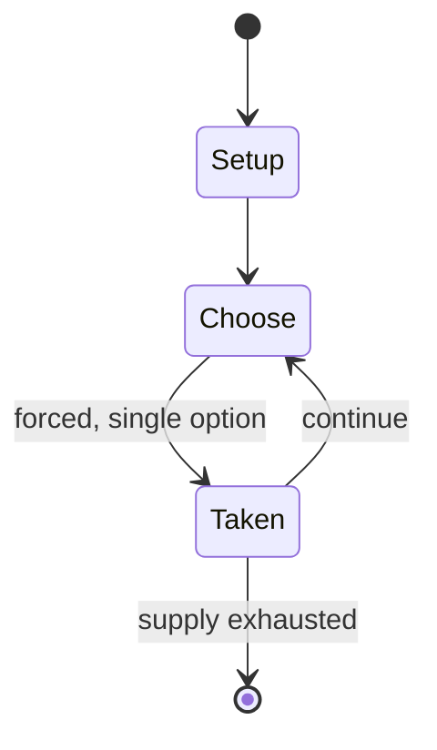

# Game of the Seven Kingdoms

*a seven-player variant of the game xiangqi*

`game_of_the_seven_kingdoms` &nbsp; state: **DEEPENED** &nbsp; method: **heuristic**

## Found layer (recorded, not trusted)

| field | value |
| --- | --- |
| wikidata | Q10864537 |
| wikipedia | Game of the Seven Kingdoms |
| genres (source) | -- |
| instance of (source) | Xiangqi variant, seven-player chess |
| country of origin | -- |

## Declared layer (orders bench work)

| field | value |
| --- | --- |
| year created | -- |
| epoch | -- |
| region | -- |
| media | - |
| players | 7 |
| age band | -- |
| exogenous process | -- |
| loss shape | -- |
| live axes | - |
| horizon | -- |
| scoring shape | -- |
| information | -- |
| interaction | -- |
| turn structure | -- |
| tractability | SAMPLING_ONLY |
| randomness | -- |
| luck factor | 0.35 |
| rules complexity | 1.81 |
| strategic depth | 2.0 |
| novelty | 0.0866 |
| solved status | -- |
| strategies | -- |
| algorithms | -- |

## Object model

```
Episode
  players      : 7
  turn_structure: ?
  horizon       : ?
  scoring       : ?

State          -- opaque; no medium or axis evidence was found
Player         -- an agent that selects among legal successors
```

## State transition diagram



## Research item -- turn trace

```
# Game of the Seven Kingdoms -- simulated turn events
# generated from the DECLARED vector, not from a rulebook.
# structure: exo=None loss=None horizon=None scoring=None axes=-

t=0    SETUP        players=4  pot=0  capacity=4
t=1    FORCED       p1 single legal option taken (pot_gain=+2.0)
t=2    ENDTURN      turn passes to p2
t=3    FORCED       p2 single legal option taken (pot_gain=+1.5)
t=4    FORCED       p2 single legal option taken (pot_gain=+1.9)
t=5    FORCED       p2 single legal option taken (pot_gain=+1.8)
t=6    FORCED       p2 single legal option taken (pot_gain=+1.2)
t=7    FORCED       p2 single legal option taken (pot_gain=+0.5)
t=8    FORCED       p2 single legal option taken (pot_gain=+1.7)
t=9    FORCED       p2 single legal option taken (pot_gain=+0.9)
t=10   FORCED       p2 single legal option taken (pot_gain=+0.8)
t=11   ENDTURN      turn passes to p3
t=12   FORCED       p3 single legal option taken (pot_gain=+0.7)
t=13   FORCED       p3 single legal option taken (pot_gain=+1.0)
t=14   FORCED       p3 single legal option taken (pot_gain=+1.0)
t=15   FORCED       p3 single legal option taken (pot_gain=+2.0)
t=16   FORCED       p3 single legal option taken (pot_gain=+1.3)
t=17   ENDTURN      turn passes to p4
t=18   FORCED       p4 single legal option taken (pot_gain=+0.9)
t=19   FORCED       p4 single legal option taken (pot_gain=+1.5)
t=20   FORCED       p4 single legal option taken (pot_gain=+0.7)
t=21   ENDTURN      turn passes to p1
t=22   FORCED       p1 single legal option taken (pot_gain=+1.2)
t=23   FORCED       p1 single legal option taken (pot_gain=+1.6)
t=24   ENDTURN      turn passes to p2
t=25   FORCED       p2 single legal option taken (pot_gain=+1.3)
t=26   FORCED       p2 single legal option taken (pot_gain=+0.7)

terminal: VARIABLE
```

## Conditions

| kind | threshold | effect | trigger |
| --- | --- | --- | --- |
| WIN | 30 pieces | -- | The final victory goes to the first player who wins two kingdoms or captures more than 30 pieces. |

## Source extract

Game of the Seven Kingdoms (Chinese: 七國象棋, p qī-guó-xiàng-qí ;) is a seven-player variant of the
game xiangqi ("Chinese chess"). It is traditionally ascribed to Sima Guang, although he died
well before the 13th century, to which this game is traditionally dated. The rules of the game
can be found in his book, 古局象棋圖. There is skepticism regarding the game's 13th-century
formulation.   == Game rules ==   === Players === The game is normally played by seven players.
If there are fewer players, the extra kingdoms can be removed, or some players can own more than
one kingdom. Players are allowed to team up, but may not discuss with their teammates during the
game.   === Equipment and setup === The board is the same as a Go board. Each side has 17
pieces: a general (將), a chancellor (偏), a diplomat (裨), a cannon (砲), a go-between (行人), an
archer (弓), a crossbowman (弩), two dagger soldiers (刀), four swordsmen (劍), and four knights
(騎). The name of the general varies according to the kingdom it represents. The seven kingdoms
are:  Qin (秦), the white army, in the west Chu (楚), the red army, in the south Han (韓), the
orange army, in the south Qi (齊), the blue army, in the east Wei (魏), the g

<sub>Wikipedia, CC BY-SA. Retained as evidence for the structural
classification above. Every rule inferred from it is HYPOTHESIZED
until audited against a rulebook.</sub>
