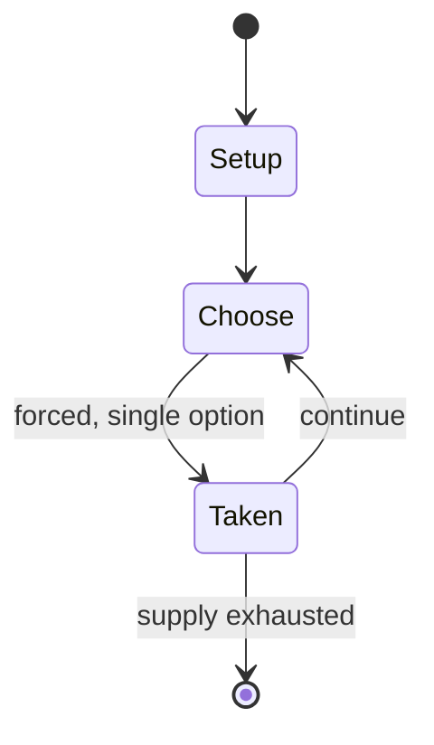

# Gasing pangkah

*competitive Malay game of spinning tops*

`gasing_pangkah` &nbsp; state: **DEEPENED** &nbsp; method: **heuristic**

## Found layer (recorded, not trusted)

| field | value |
| --- | --- |
| wikidata | Q12686816 |
| wikipedia | Gasing pangkah |
| genres (source) | -- |
| instance of (source) | traditional game |
| country of origin | -- |

## Declared layer (orders bench work)

| field | value |
| --- | --- |
| year created | -- |
| epoch | -- |
| region | -- |
| media | - |
| players | -- |
| age band | -- |
| exogenous process | -- |
| loss shape | -- |
| live axes | - |
| horizon | -- |
| scoring shape | -- |
| information | -- |
| interaction | COMPETITIVE |
| turn structure | -- |
| tractability | SAMPLING_ONLY |
| randomness | SPINNER |
| luck factor | 0.42 |
| rules complexity | 1.65 |
| strategic depth | 2.0 |
| novelty | 0.3499 |
| solved status | -- |
| strategies | -- |
| algorithms | -- |

## Object model

```
Episode
  players      : ?
  turn_structure: ?
  horizon       : ?
  scoring       : ?

State          -- opaque; no medium or axis evidence was found
Player         -- an agent that selects among legal successors
```

## State transition diagram



## Research item -- turn trace

```
# Gasing pangkah -- simulated turn events
# generated from the DECLARED vector, not from a rulebook.
# structure: exo=None loss=None horizon=None scoring=None axes=-

t=0    SETUP        players=2  pot=0  capacity=4
t=1    FORCED       p1 single legal option taken (pot_gain=+1.5)
t=2    FORCED       p1 single legal option taken (pot_gain=+1.5)
t=3    FORCED       p1 single legal option taken (pot_gain=+0.5)
t=4    FORCED       p1 single legal option taken (pot_gain=+1.0)
t=5    ENDTURN      turn passes to p2
t=6    FORCED       p2 single legal option taken (pot_gain=+0.5)
t=7    FORCED       p2 single legal option taken (pot_gain=+0.6)
t=8    FORCED       p2 single legal option taken (pot_gain=+1.4)
t=9    ENDTURN      turn passes to p1
t=10   FORCED       p1 single legal option taken (pot_gain=+1.5)
t=11   ENDTURN      turn passes to p2
t=12   FORCED       p2 single legal option taken (pot_gain=+0.8)
t=13   FORCED       p2 single legal option taken (pot_gain=+1.6)
t=14   FORCED       p2 single legal option taken (pot_gain=+0.8)
t=15   ENDTURN      turn passes to p1
t=16   FORCED       p1 single legal option taken (pot_gain=+0.5)
t=17   ENDTURN      turn passes to p2
t=18   FORCED       p2 single legal option taken (pot_gain=+1.1)
t=19   FORCED       p2 single legal option taken (pot_gain=+1.4)
t=20   FORCED       p2 single legal option taken (pot_gain=+1.8)
t=21   FORCED       p2 single legal option taken (pot_gain=+0.8)
t=22   FORCED       p2 single legal option taken (pot_gain=+1.8)
t=23   FORCED       p2 single legal option taken (pot_gain=+1.5)
t=24   FORCED       p2 single legal option taken (pot_gain=+1.9)
t=25   ENDTURN      turn passes to p1
t=26   FORCED       p1 single legal option taken (pot_gain=+1.8)

terminal: VARIABLE
```

## Source extract

Gasing pangkah is a competitive Malay game of spinning tops in which two or more players compete
to strike each other's top out of a circle or to make it fall over and stop spinning. Considered
part of the Malay state heritage, official tournaments are held, with a declared goal of
exposing the younger generation to the game. The game is also popular in neighboring Brunei, and
in 2013, a gasing pangkah tournament was held as part of the celebrations of the 67th birthday
of the Sultan of Brunei.   == See also == Pambaram   == External links == Video from a Gasing
Pangkah Tournament, Brunei   == References ==

<sub>Wikipedia, CC BY-SA. Retained as evidence for the structural
classification above. Every rule inferred from it is HYPOTHESIZED
until audited against a rulebook.</sub>
