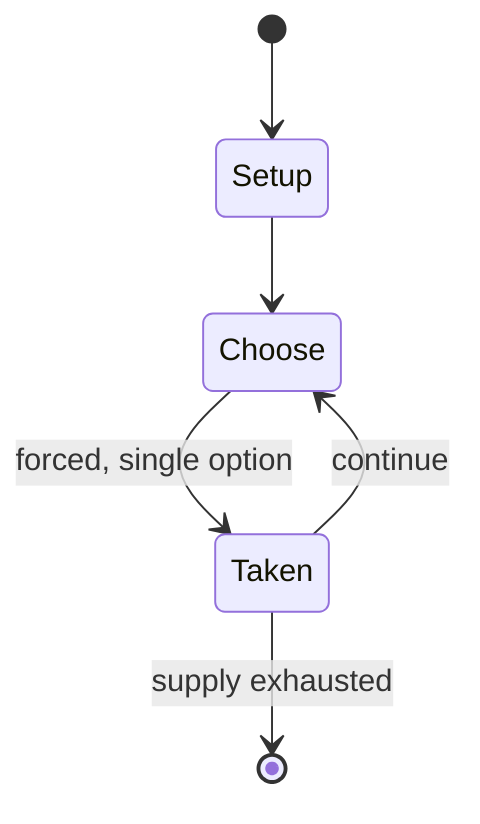

# gay chicken

*party game where ostensively heterosexual participants engage in escalating same-sex intimacy*

`gay_chicken` &nbsp; state: **DEEPENED** &nbsp; method: **heuristic**

## Found layer (recorded, not trusted)

| field | value |
| --- | --- |
| wikidata | Q138900888 |
| wikipedia | Gay chicken |
| genres (source) | -- |
| instance of (source) | party game |
| country of origin | -- |

## Declared layer (orders bench work)

| field | value |
| --- | --- |
| year created | -- |
| epoch | -- |
| region | -- |
| media | PARTY |
| players | -- |
| age band | -- |
| exogenous process | -- |
| loss shape | -- |
| live axes | - |
| horizon | -- |
| scoring shape | -- |
| information | -- |
| interaction | COMPETITIVE |
| turn structure | -- |
| tractability | SAMPLING_ONLY |
| randomness | -- |
| luck factor | 0.35 |
| rules complexity | 1.67 |
| strategic depth | 2.0 |
| novelty | 0.3528 |
| solved status | -- |
| strategies | -- |
| algorithms | -- |

## Object model

```
Episode
  players      : ?
  turn_structure: ?
  horizon       : ?
  scoring       : ?

State          -- opaque; no medium or axis evidence was found
Player         -- an agent that selects among legal successors
```

## State transition diagram



## Research item -- turn trace

```
# gay chicken -- simulated turn events
# generated from the DECLARED vector, not from a rulebook.
# structure: exo=None loss=None horizon=None scoring=None axes=-

t=0    SETUP        players=2  pot=0  capacity=3
t=1    FORCED       p1 single legal option taken (pot_gain=+0.7)
t=2    ENDTURN      turn passes to p2
t=3    FORCED       p2 single legal option taken (pot_gain=+1.0)
t=4    ENDTURN      turn passes to p1
t=5    FORCED       p1 single legal option taken (pot_gain=+1.2)
t=6    FORCED       p1 single legal option taken (pot_gain=+1.0)
t=7    ENDTURN      turn passes to p2
t=8    FORCED       p2 single legal option taken (pot_gain=+1.3)
t=9    ENDTURN      turn passes to p1
t=10   FORCED       p1 single legal option taken (pot_gain=+1.3)
t=11   FORCED       p1 single legal option taken (pot_gain=+1.8)
t=12   ENDTURN      turn passes to p2
t=13   FORCED       p2 single legal option taken (pot_gain=+0.7)
t=14   FORCED       p2 single legal option taken (pot_gain=+1.6)
t=15   ENDTURN      turn passes to p1
t=16   FORCED       p1 single legal option taken (pot_gain=+0.9)
t=17   FORCED       p1 single legal option taken (pot_gain=+0.7)
t=18   FORCED       p1 single legal option taken (pot_gain=+2.0)
t=19   ENDTURN      turn passes to p2
t=20   FORCED       p2 single legal option taken (pot_gain=+1.2)
t=21   FORCED       p2 single legal option taken (pot_gain=+1.2)
t=22   FORCED       p2 single legal option taken (pot_gain=+2.0)
t=23   FORCED       p2 single legal option taken (pot_gain=+1.6)
t=24   FORCED       p2 single legal option taken (pot_gain=+0.8)
t=25   FORCED       p2 single legal option taken (pot_gain=+1.9)
t=26   FORCED       p2 single legal option taken (pot_gain=+0.6)

terminal: VARIABLE
```

## Source extract

Gay chicken is a party game where two or more ostensively heterosexual participants engage in
escalating same-sex intimacy until one backs out of the competition, with the winner being the
participant who dares to go the furthest with the sexual activity. The game makes use of the
discomfort, awkwardness, or embarrassment the heterosexual players feel towards engaging in
same-sex sexual behaviour to provoke laughter from onlookers or participants. The game has been
observed to have been used as a form of hazing or initiation rite in the military and at
universities or clubs, where new recruits are forced to participate in the game to degrade them,
although this has been decreasing over time due to the destigmatization of homosexuality.   ==
References ==

<sub>Wikipedia, CC BY-SA. Retained as evidence for the structural
classification above. Every rule inferred from it is HYPOTHESIZED
until audited against a rulebook.</sub>
