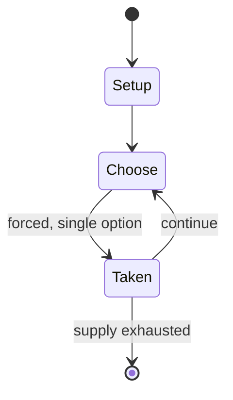

# GCompris

*Educational entertainment software suite for children aged 2-10*

`gcompris` &nbsp; state: **DEEPENED** &nbsp; method: **heuristic**

## Found layer (recorded, not trusted)

| field | value |
| --- | --- |
| wikidata | Q1147042 |
| wikipedia | GCompris |
| genres (source) | educational video game |
| instance of (source) | GNU package, educational software suite, free software |
| country of origin | France |

## Declared layer (orders bench work)

| field | value |
| --- | --- |
| year created | 2000 |
| epoch | CONTEMPORARY |
| region | EUROPE_WEST |
| media | PUZZLE, VIDEO |
| players | -- |
| age band | -- |
| exogenous process | -- |
| loss shape | -- |
| live axes | - |
| horizon | -- |
| scoring shape | -- |
| information | -- |
| interaction | -- |
| turn structure | -- |
| tractability | SAMPLING_ONLY |
| randomness | -- |
| luck factor | 0.35 |
| rules complexity | 1.72 |
| strategic depth | 2.5 |
| novelty | 0.0896 |
| solved status | -- |
| strategies | opponent_modelling, spatial_packing |
| algorithms | -- |

## Object model

```
Episode
  players      : ?
  turn_structure: ?
  horizon       : ?
  scoring       : ?

Configuration  -- the arrangement to be resolved
Constraint     -- predicate a legal configuration must satisfy
WorldState     -- simulation state advanced by the engine
Avatar         -- player-controlled agent
Clock          -- frame or tick counter
```

## State transition diagram



## Research item -- turn trace

```
# GCompris -- simulated turn events
# generated from the DECLARED vector, not from a rulebook.
# structure: exo=None loss=None horizon=None scoring=None axes=-

t=0    SETUP        players=2  pot=0  capacity=5
t=1    FORCED       p1 single legal option taken (pot_gain=+2.0)
t=2    FORCED       p1 single legal option taken (pot_gain=+1.9)
t=3    FORCED       p1 single legal option taken (pot_gain=+1.9)
t=4    FORCED       p1 single legal option taken (pot_gain=+1.9)
t=5    FORCED       p1 single legal option taken (pot_gain=+1.9)
t=6    ENDTURN      turn passes to p2
t=7    FORCED       p2 single legal option taken (pot_gain=+1.9)
t=8    FORCED       p2 single legal option taken (pot_gain=+1.2)
t=9    FORCED       p2 single legal option taken (pot_gain=+1.2)
t=10   FORCED       p2 single legal option taken (pot_gain=+1.0)
t=11   FORCED       p2 single legal option taken (pot_gain=+0.7)
t=12   FORCED       p2 single legal option taken (pot_gain=+0.8)
t=13   FORCED       p2 single legal option taken (pot_gain=+1.4)
t=14   ENDTURN      turn passes to p1
t=15   FORCED       p1 single legal option taken (pot_gain=+0.6)
t=16   FORCED       p1 single legal option taken (pot_gain=+1.5)
t=17   FORCED       p1 single legal option taken (pot_gain=+1.5)
t=18   FORCED       p1 single legal option taken (pot_gain=+1.5)
t=19   FORCED       p1 single legal option taken (pot_gain=+0.5)
t=20   FORCED       p1 single legal option taken (pot_gain=+1.5)
t=21   ENDTURN      turn passes to p2
t=22   FORCED       p2 single legal option taken (pot_gain=+0.6)
t=23   FORCED       p2 single legal option taken (pot_gain=+1.5)
t=24   FORCED       p2 single legal option taken (pot_gain=+1.8)
t=25   ENDTURN      turn passes to p1
t=26   FORCED       p1 single legal option taken (pot_gain=+1.1)
t=27   ENDTURN      turn passes to p2

terminal: VARIABLE
```

## Source extract

GCompris is a software suite comprising educational entertainment software for children aged 2
to 10. GCompris was originally written in C and Python using the GTK+ widget toolkit, but a
rewrite in C++ and QML using the Qt widget toolkit has been undertaken since early 2014.
GCompris is free and open-source software and the current version is subject to the requirements
of the AGPL-3.0-only license. It has been part of the GNU project. The name GCompris is a pun,
in the French language is pronounced the same as the phrase "I have understood", J'ai compris
[ʒekɔ̃ˈpʁi]. It is available for Linux, BSD, macOS, Windows and Android. While binaries compiled
for Microsoft Windows and macOS were initially distributed with a restricted number of
activities and a small fee was required to unlock all the activities, since February 2020 the
full version is entirely free for all platforms.   == Extent == In 2024 GCompris comprised 190
games, called "activities". These are bundled into the following groups:  Computer discovery:
keyboard, mouse, different mouse gestures Numeracy: table memory, enumeration, double entry
table, mirror images Science: the canal lock, the water cycle, the submarine, e

<sub>Wikipedia, CC BY-SA. Retained as evidence for the structural
classification above. Every rule inferred from it is HYPOTHESIZED
until audited against a rulebook.</sub>
