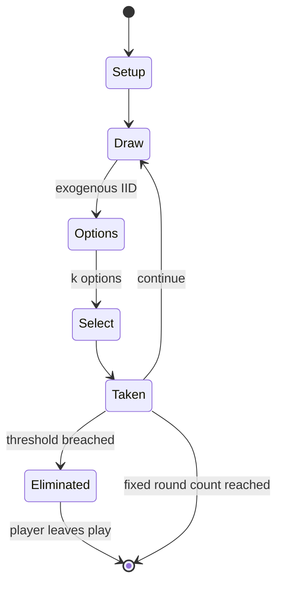

# Generala

*Latin American game*

`generala` &nbsp; state: **DEEPENED** &nbsp; method: **heuristic**

## Found layer (recorded, not trusted)

| field | value |
| --- | --- |
| wikidata | Q15928294 |
| wikipedia | Generala |
| genres (source) | -- |
| instance of (source) | dice game, tabletop game |
| country of origin | -- |

## Declared layer (orders bench work)

| field | value |
| --- | --- |
| year created | -- |
| epoch | -- |
| region | -- |
| media | DICE |
| players | -- |
| age band | -- |
| exogenous process | IID |
| loss shape | ELIMINATION |
| live axes | SELECT |
| horizon | FIXED |
| scoring shape | SET_COLLECTION_CONVEX |
| information | -- |
| interaction | -- |
| turn structure | STRICT_TURN |
| tractability | EXACT_WITH_CUT |
| randomness | DICE |
| luck factor | 0.58 |
| rules complexity | 2.21 |
| strategic depth | 2.12 |
| novelty | 0.704 |
| solved status | -- |
| strategies | set_collection |
| algorithms | -- |

## Object model

```
Episode
  players      : ?
  turn_structure: STRICT_TURN
  horizon       : FIXED
  scoring       : SET_COLLECTION_CONVEX

DicePool       -- n dice, each an iid categorical draw
Roll           -- realised outcome of a pool
OptionSet      -- the choices available after an exogenous draw
```

## State transition diagram



## Research item -- turn trace

```
# Generala -- simulated turn events
# generated from the DECLARED vector, not from a rulebook.
# structure: exo=IID loss=ELIMINATION horizon=FIXED scoring=SET_COLLECTION_CONVEX axes=SELECT

t=0    SETUP        players=2  pot=0  capacity=8
t=1    DRAW         p1 roll from d6 pool -> outcome #5  (p=0.038)
t=2    SELECT       p1 2 options; take #1  (pot_gain=+1.6, capacity=-1)
t=3    DRAW         p1 roll from d6 pool -> outcome #2  (p=0.049)
t=4    SELECT       p1 3 options; take #2  (pot_gain=+1.4, capacity=-2)
t=5    DRAW         p1 roll from d6 pool -> outcome #2  (p=0.161)
t=6    SELECT       p1 1 options; take #1  (pot_gain=+2.0, capacity=-0)
t=7    DRAW         p1 roll from d6 pool -> outcome #1  (p=0.143)
t=8    SELECT       p1 2 options; take #2  (pot_gain=+1.7, capacity=-0)
t=9    DRAW         p1 roll from d6 pool -> outcome #3  (p=0.269)
t=10   SELECT       p1 4 options; take #4  (pot_gain=+0.7, capacity=-0)
t=11   DRAW         p1 roll from d6 pool -> outcome #6  (p=0.130)
t=12   SELECT       p1 4 options; take #2  (pot_gain=+1.4, capacity=-2)
t=13   ENDTURN      turn passes to p2
t=14   DRAW         p2 roll from d6 pool -> outcome #4  (p=0.264)
t=15   SELECT       p2 1 options; take #1  (pot_gain=+1.3, capacity=-2)
t=16   ENDTURN      turn passes to p1
t=17   DRAW         p1 roll from d6 pool -> outcome #4  (p=0.183)
t=18   SELECT       p1 1 options; take #1  (pot_gain=+1.7, capacity=-1)
t=19   ENDTURN      turn passes to p2
t=20   DRAW         p2 roll from d6 pool -> outcome #1  (p=0.167)
t=21   SELECT       p2 1 options; take #1  (pot_gain=+2.7, capacity=-1)
t=22   DRAW         p2 roll from d6 pool -> outcome #5  (p=0.230)
t=23   SELECT       p2 4 options; take #3  (pot_gain=+3.3, capacity=-1)
t=24   DRAW         p2 roll from d6 pool -> outcome #1  (p=0.133)
t=25   SELECT       p2 4 options; take #4  (pot_gain=+1.8, capacity=-2)
t=26   DRAW         p2 roll from d6 pool -> outcome #3  (p=0.245)
t=27   SELECT       p2 2 options; take #1  (pot_gain=+3.1, capacity=-2)
t=28   ENDTURN      turn passes to p1

terminal: FIXED
```

## Conditions

| kind | threshold | effect | trigger |
| --- | --- | --- | --- |
| ELIMINATE | -- | -- | A player who fails to make any valid score, or chooses not to take any other score, may scratch (eliminate) a category, such as Generala or Twos. |
| ELIMINATE | -- | -- | At each round, the player must mark a score against one of the 10 categories, or "strike" (i.e. scratch or eliminate) a category. |
| WIN | -- | -- | If a player achieves a Generala on the first roll of a turn, the player immediately wins the game. |
| WIN | -- | -- | The player who finishes the game with the most points wins the game, unless a player has achieved a Generala on the first roll of a turn. |
| WIN | -- | -- | In that case, the lucky player instantly wins the game (an automatic win). |
| BOUNDARY | -- | -- | A player may reroll some or all of the dice up to two times on a turn, making a maximum of three rolls each turn. |
| BOUNDARY | -- | -- | Rolling 5-of-a-kind scores the maximum "golden" score of 50, hence the name. |

## Source extract

Generala is a dice game similar to the English game of poker dice, the German game Kniffel, and
the Polish game Jacy-Tacy (yahtzee-tahtzee). The American variant of Generala, Yahtzee, is the
most popular variant.  Although it is sometimes played in Europe and the United States, Generala
is most popular in Ibero-America.   == Rules == Generala is a game played by two or more
players.  Players take turns rolling five dice.  After each roll, the player chooses which dice
(if any) to keep, and which to reroll.  A player may reroll some or all of the dice up to two
times on a turn, making a maximum of three rolls each turn.   === Scoring === The following
combinations earn points:  Ones, Twos, Threes, Fours, Fives or Sixes. A player may add the
numbers on any combination of dice showing the same number.  For example, a combination of four,
four, four, two, and six, would score 4 + 4 + 4 = 12 points in  Fours or 2 points in Twos, or
even 6 points in Sixes. Once a player has taken points on a specific combination, they may not
take points for that combination again during the game. Straight, 20 points. A straight is a
combination of five consecutive numbers (a combination of one, two, thr

<sub>Wikipedia, CC BY-SA. Retained as evidence for the structural
classification above. Every rule inferred from it is HYPOTHESIZED
until audited against a rulebook.</sub>
