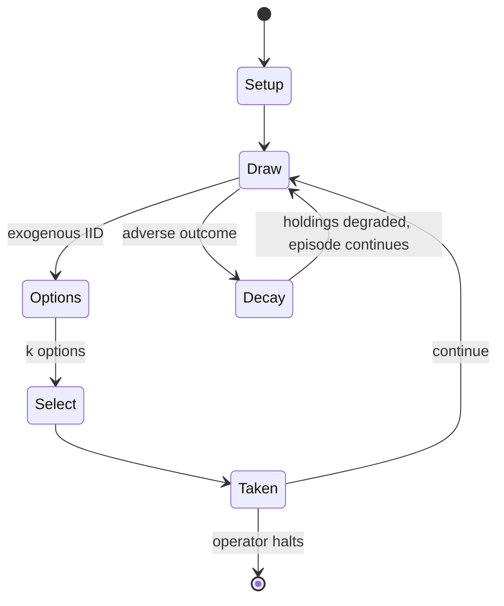

# Generic Universal Role Playing System

*tabletop role-playing game system*

`generic_universal_role_playing_system` &nbsp; state: **DEEPENED** &nbsp; method: **heuristic**

## Found layer (recorded, not trusted)

| field | value |
| --- | --- |
| wikidata | Q1047814 |
| wikipedia | GURPS |
| genres (source) | tabletop role-playing game |
| instance of (source) | role-playing game system, tabletop role-playing game |
| country of origin | United States |

## Declared layer (orders bench work)

| field | value |
| --- | --- |
| year created | 1986 |
| epoch | DIGITAL |
| region | NORTH_AMERICA |
| media | RPG |
| players | 2-99 |
| age band | -- |
| exogenous process | IID |
| loss shape | PARTIAL_DECAY |
| live axes | SELECT |
| horizon | OPEN_ENDED |
| scoring shape | SET_COLLECTION_CONVEX |
| information | IMPERFECT |
| interaction | -- |
| turn structure | -- |
| tractability | SAMPLING_ONLY |
| randomness | DICE |
| luck factor | 0.58 |
| rules complexity | 3.64 |
| strategic depth | 1.87 |
| novelty | 0.3704 |
| solved status | -- |
| strategies | deduction, set_collection, spatial_packing, tempo |
| algorithms | -- |

## Object model

```
Episode
  players      : 2-99
  turn_structure: ?
  horizon       : OPEN_ENDED
  scoring       : SET_COLLECTION_CONVEX

Character      -- persistent stat block owned by a player
GameMaster     -- adjudicating agent outside the scoring loop
Scenario       -- authored state the players traverse
OptionSet      -- the choices available after an exogenous draw
```

## State transition diagram



## Research item -- turn trace

```
# Generic Universal Role Playing System -- simulated turn events
# generated from the DECLARED vector, not from a rulebook.
# structure: exo=IID loss=PARTIAL_DECAY horizon=OPEN_ENDED scoring=SET_COLLECTION_CONVEX axes=SELECT

t=0    SETUP        players=2  pot=0  capacity=7
t=1    DRAW         p1 roll from d6 pool -> outcome #1  (p=0.032)
t=2    SELECT       p1 4 options; take #3  (pot_gain=+1.6, capacity=-1)
t=3    DRAW         p1 roll from d6 pool -> outcome #6  (p=0.224)
t=4    SELECT       p1 4 options; take #4  (pot_gain=+2.1, capacity=-1)
t=5    ENDTURN      turn passes to p2
t=6    DRAW         p2 roll from d6 pool -> outcome #2  (p=0.045)
t=7    SELECT       p2 2 options; take #2  (pot_gain=+1.3, capacity=-1)
t=8    ENDTURN      turn passes to p1
t=9    DRAW         p1 roll from d6 pool -> outcome #1  (p=0.076)
t=10   SELECT       p1 3 options; take #2  (pot_gain=+3.1, capacity=-1)
t=11   ENDTURN      turn passes to p2
t=12   DRAW         p2 roll from d6 pool -> outcome #4  (p=0.097)
t=13   SELECT       p2 3 options; take #3  (pot_gain=+1.6, capacity=-1)
t=14   DRAW         p2 roll from d6 pool -> outcome #2  (p=0.196)
t=15   SELECT       p2 2 options; take #1  (pot_gain=+1.5, capacity=-1)
t=16   DRAW         p2 roll from d6 pool -> outcome #5  (p=0.183)
t=17   SELECT       p2 3 options; take #1  (pot_gain=+0.8, capacity=-0)
t=18   DRAW         p2 roll from d6 pool -> outcome #6  (p=0.028)
t=19   SELECT       p2 3 options; take #2  (pot_gain=+1.1, capacity=-1)
t=20   DRAW         p2 roll from d6 pool -> outcome #6  (p=0.126)
t=21   SELECT       p2 3 options; take #3  (pot_gain=+0.7, capacity=-2)
t=22   DRAW         p2 roll from d6 pool -> outcome #2  (p=0.197)
t=23   SELECT       p2 4 options; take #3  (pot_gain=+1.6, capacity=-1)
t=24   DRAW         p2 roll from d6 pool -> outcome #2  (p=0.259)
t=25   SELECT       p2 2 options; take #1  (pot_gain=+3.5, capacity=-1)
t=26   DRAW         p2 roll from d6 pool -> outcome #4  (p=0.282)
t=27   SELECT       p2 4 options; take #1  (pot_gain=+3.3, capacity=-0)

terminal: OPEN_ENDED
```

## Conditions

| kind | threshold | effect | trigger |
| --- | --- | --- | --- |
| ELIMINATE | 4 penalty | -- | the Ambidextrous advantage or the Off-Hand Weapon Training Technique eliminates the -4 penalty for the weapon in the "off" hand. |
| BOUNDARY | 5 seconds | -- | If the gunslinger lacked these advantages, skills, and techniques, then readying, aiming, firing, aiming again, and firing again would take at least 5 seconds. |
| PENALTY | 4 penalties | -- | the Dual-Weapon Attack(Pistol) technique allows the gunslinger to fire both his guns at once without the -4 penalties. |
| PENALTY | 4 penalty | -- | the right hand pistol would be fired with a -4 penalty |
| PENALTY | 8 penalty | -- | the "off" hand pistol would be fired with a -8 penalty |
| BOUNDARY | -- | -- | Each skill is tied to at least one attribute, and the characters' abilities in that skill is a function of their base attributes + or - a certain amount. |
| PENALTY | -- | -- | GURPS calculates shock penalties when someone is hit, representing the impact it causes and the rush of pain that interferes with concentration. |

## Source extract

The Generic Universal Role Playing System, or GURPS, is a tabletop role-playing game system
published by Steve Jackson Games. The system is designed to run any genre using the same core
mechanics. The core rules were first written by Steve Jackson and published in 1986, at a time
when most such systems were story- or genre-specific. Since then, four editions have been
published. The current line editor is Sean Punch. Sessions are run by a game master (GM), who
controls the world and adjudicates the rules, with any number of players controlling the actions
of a character. Most actions are resolved by rolling three six-sided dice (3d6), trying to roll
below a certain number, usually a skill. GURPS uses a point-based character creation system;
characters are represented by four basic stats (Strength, Dexterity, IQ and Health), and players
can buy any number of advantages, disadvantages, perks, quirks and skills. GURPS consists of a
GURPS Basic Set, which contains the core rules required to run most games. In addition, more
than a hundred supplemental books provide optional rules and details about different settings
and genres (GURPS Martial Arts, for example). By adapting the various

<sub>Wikipedia, CC BY-SA. Retained as evidence for the structural
classification above. Every rule inferred from it is HYPOTHESIZED
until audited against a rulebook.</sub>
