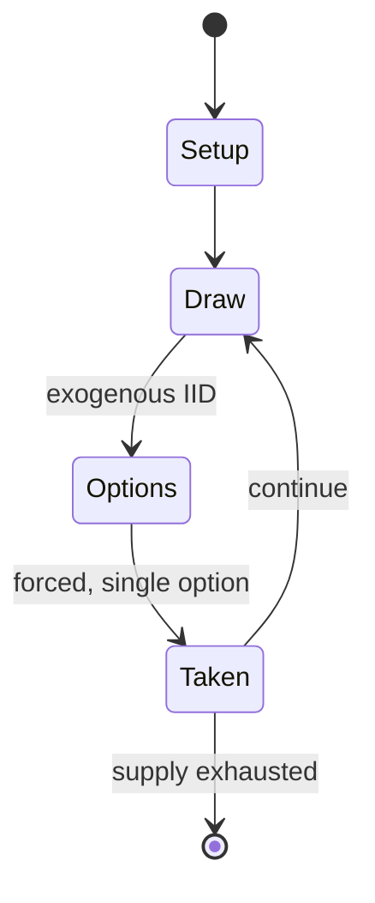

# Genie

*Pinball machine*

`genie` &nbsp; state: **DEEPENED** &nbsp; method: **heuristic**

## Found layer (recorded, not trusted)

| field | value |
| --- | --- |
| wikidata | Q20874606 |
| wikipedia | Genie (pinball) |
| genres (source) | -- |
| instance of (source) | video game |
| country of origin | -- |

## Declared layer (orders bench work)

| field | value |
| --- | --- |
| year created | 1979 |
| epoch | DIGITAL |
| region | -- |
| media | VIDEO |
| players | -- |
| age band | -- |
| exogenous process | IID |
| loss shape | -- |
| live axes | - |
| horizon | -- |
| scoring shape | SET_COLLECTION_CONVEX |
| information | -- |
| interaction | COMPETITIVE |
| turn structure | -- |
| tractability | SAMPLING_ONLY |
| randomness | SPINNER |
| luck factor | 0.42 |
| rules complexity | 1.75 |
| strategic depth | 2.25 |
| novelty | 0.5318 |
| solved status | -- |
| strategies | set_collection |
| algorithms | -- |

## Object model

```
Episode
  players      : ?
  turn_structure: ?
  horizon       : ?
  scoring       : SET_COLLECTION_CONVEX

WorldState     -- simulation state advanced by the engine
Avatar         -- player-controlled agent
Clock          -- frame or tick counter
```

## State transition diagram



## Research item -- turn trace

```
# Genie -- simulated turn events
# generated from the DECLARED vector, not from a rulebook.
# structure: exo=IID loss=None horizon=None scoring=SET_COLLECTION_CONVEX axes=-

t=0    SETUP        players=2  pot=0  capacity=6
t=1    DRAW         p1 roll from d6 pool -> outcome #3  (p=0.082)
t=2    FORCED       p1 single legal option taken (pot_gain=+1.2)
t=3    DRAW         p1 roll from d6 pool -> outcome #2  (p=0.063)
t=4    FORCED       p1 single legal option taken (pot_gain=+1.8)
t=5    ENDTURN      turn passes to p2
t=6    DRAW         p2 roll from d6 pool -> outcome #5  (p=0.126)
t=7    FORCED       p2 single legal option taken (pot_gain=+1.8)
t=8    DRAW         p2 roll from d6 pool -> outcome #3  (p=0.018)
t=9    FORCED       p2 single legal option taken (pot_gain=+2.0)
t=10   DRAW         p2 roll from d6 pool -> outcome #6  (p=0.181)
t=11   FORCED       p2 single legal option taken (pot_gain=+1.3)
t=12   DRAW         p2 roll from d6 pool -> outcome #3  (p=0.183)
t=13   FORCED       p2 single legal option taken (pot_gain=+1.3)
t=14   DRAW         p2 roll from d6 pool -> outcome #6  (p=0.300)
t=15   FORCED       p2 single legal option taken (pot_gain=+0.9)
t=16   ENDTURN      turn passes to p1
t=17   DRAW         p1 roll from d6 pool -> outcome #1  (p=0.183)
t=18   FORCED       p1 single legal option taken (pot_gain=+0.8)
t=19   DRAW         p1 roll from d6 pool -> outcome #5  (p=0.091)
t=20   FORCED       p1 single legal option taken (pot_gain=+0.7)
t=21   ENDTURN      turn passes to p2
t=22   DRAW         p2 roll from d6 pool -> outcome #5  (p=0.072)
t=23   FORCED       p2 single legal option taken (pot_gain=+1.2)
t=24   DRAW         p2 roll from d6 pool -> outcome #1  (p=0.096)
t=25   FORCED       p2 single legal option taken (pot_gain=+0.7)
t=26   ENDTURN      turn passes to p1

terminal: VARIABLE
```

## Source extract

Genie is a widebody pinball machine designed by Ed Krynski and released in 1979 by Gottlieb. It
features a jinn theme and was advertised with the slogans "Gottlieb's WIDE and Beautiful BODY"
and "A Wide-Body Pinball absolutely bulging with player appeal and proven massive profit earning
capacity!". This slogan alludes to both the wide body of the game and the body of the genie.
== Design == Genie is considered Gottlieb's answer to Bally’s super wide pinball machine Paragon
and the start of a competition of a widebody pinball design in the late 1970s. Genie is the
first widebody produced by Gottlieb. The backglass shows a magical genie with a semi-human body
released from a lamp, watched by two figures and a small creature. One of these figures and the
genie are also shown prominently on the playfield. The sound system can be adjusted to play an
alternative second set of sounds.   == Layout == Genie uses 5 flippers. The upper right of the
machine has four A-B-C-D lanes above two pop bumpers and a kick-out hole. The upper left of the
machine has a mini upper playfield with two of the flippers and seven drop-targets. The middle
of the machine includes a bank of four drop-targets and

<sub>Wikipedia, CC BY-SA. Retained as evidence for the structural
classification above. Every rule inferred from it is HYPOTHESIZED
until audited against a rulebook.</sub>
