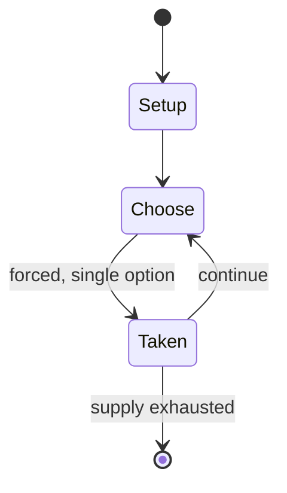

# Gift Trap

*party game*

`gift_trap` &nbsp; state: **DEEPENED** &nbsp; method: **heuristic**

## Found layer (recorded, not trusted)

| field | value |
| --- | --- |
| wikidata | Q5560008 |
| wikipedia | Gift Trap |
| genres (source) | -- |
| instance of (source) | board game, party game |
| country of origin | -- |

## Declared layer (orders bench work)

| field | value |
| --- | --- |
| year created | -- |
| epoch | -- |
| region | -- |
| media | BOARD, PARTY |
| players | 3-8 |
| age band | -- |
| exogenous process | -- |
| loss shape | -- |
| live axes | TRADE |
| horizon | -- |
| scoring shape | -- |
| information | -- |
| interaction | -- |
| turn structure | -- |
| tractability | SAMPLING_ONLY |
| randomness | DICE, HIDDEN_INFO |
| luck factor | 0.63 |
| rules complexity | 1.96 |
| strategic depth | 1.79 |
| novelty | 0.0938 |
| solved status | -- |
| strategies | spatial_packing |
| algorithms | -- |

## Object model

```
Episode
  players      : 3-8
  turn_structure: ?
  horizon       : ?
  scoring       : ?

Board          -- spatial substrate; cells carry position and occupancy
Piece          -- movable token owned by a player
Offer          -- proposed exchange between two agents
```

## State transition diagram



## Research item -- turn trace

```
# Gift Trap -- simulated turn events
# generated from the DECLARED vector, not from a rulebook.
# structure: exo=None loss=None horizon=None scoring=None axes=TRADE

t=0    SETUP        players=3  pot=0  capacity=8
t=1    FORCED       p1 single legal option taken (pot_gain=+1.2)
t=2    FORCED       p1 single legal option taken (pot_gain=+1.9)
t=3    TRADE        p1 offers 2:1 exchange to p2
t=4    ENDTURN      turn passes to p2
t=5    FORCED       p2 single legal option taken (pot_gain=+1.4)
t=6    FORCED       p2 single legal option taken (pot_gain=+0.8)
t=7    TRADE        p2 offers 2:1 exchange to p3
t=8    ENDTURN      turn passes to p3
t=9    FORCED       p3 single legal option taken (pot_gain=+0.8)
t=10   FORCED       p3 single legal option taken (pot_gain=+1.9)
t=11   FORCED       p3 single legal option taken (pot_gain=+1.6)
t=12   ENDTURN      turn passes to p1
t=13   FORCED       p1 single legal option taken (pot_gain=+0.8)
t=14   TRADE        p1 offers 2:1 exchange to p2
t=15   ENDTURN      turn passes to p2
t=16   FORCED       p2 single legal option taken (pot_gain=+1.3)
t=17   FORCED       p2 single legal option taken (pot_gain=+1.7)
t=18   ENDTURN      turn passes to p3
t=19   FORCED       p3 single legal option taken (pot_gain=+1.7)
t=20   TRADE        p3 offers 2:1 exchange to p1
t=21   ENDTURN      turn passes to p1
t=22   FORCED       p1 single legal option taken (pot_gain=+2.0)
t=23   FORCED       p1 single legal option taken (pot_gain=+1.5)
t=24   TRADE        p1 offers 2:1 exchange to p2
t=25   ENDTURN      turn passes to p2
t=26   FORCED       p2 single legal option taken (pot_gain=+1.3)

terminal: VARIABLE
```

## Source extract

Gift Trap is a 2006 indie party board game, invented by Nick Kellet (based on an idea inspired
by his eldest daughter in 2004). Gift Trap is billed as "The hilarious gift-exchange party
game". Gift Trap relies on the players' personal knowledge of each other, requiring the matching
of the right gift to the right person.   == Gameplay ==  Cards are dealt to the table depicting
different gift items. Players use face-down tokens to mark the gifts they would give to each of
the other players, and which gifts they would like to receive themselves. Tokens are then
revealed, and players score according to the correlation of gifting and reception tokens.   ==
Development == Madhouse Creative created the packaging and brand identity for the game. Images
used for the gift cards in the game were licensed using a Creative Commons Attribution license;
Crowdsourcing was used to collect images for use in the game via both a photo contest and
through the use of online websites such as Flickr.com. Winners received a free copy of the game
along with having their names included in the game. Gift Trap donated one copy to the charity
Right To Play for every ten copies sold from the first production run

<sub>Wikipedia, CC BY-SA. Retained as evidence for the structural
classification above. Every rule inferred from it is HYPOTHESIZED
until audited against a rulebook.</sub>
