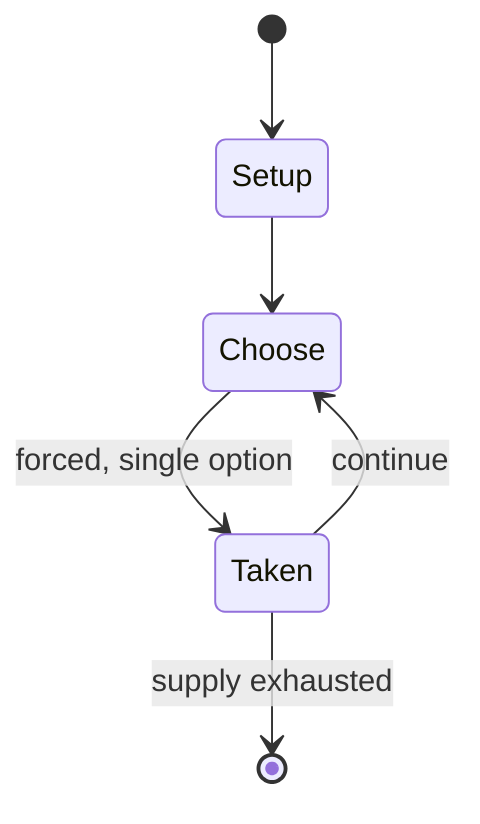

# Gilet (card game)

`gilet_card_game` &nbsp; state: **DEEPENED** &nbsp; method: **heuristic**

## Found layer (recorded, not trusted)

| field | value |
| --- | --- |
| wikidata | Q5561751 |
| wikipedia | Gilet (card game) |
| genres (source) | -- |
| instance of (source) | -- |
| country of origin | -- |

## Declared layer (orders bench work)

| field | value |
| --- | --- |
| year created | -- |
| epoch | -- |
| region | -- |
| media | CARD, GAMBLING |
| players | -- |
| age band | -- |
| exogenous process | -- |
| loss shape | -- |
| live axes | - |
| horizon | -- |
| scoring shape | -- |
| information | -- |
| interaction | -- |
| turn structure | -- |
| tractability | SAMPLING_ONLY |
| randomness | -- |
| luck factor | 0.35 |
| rules complexity | 1.82 |
| strategic depth | 2.0 |
| novelty | 0.0896 |
| solved status | -- |
| strategies | -- |
| algorithms | -- |

## Object model

```
Episode
  players      : ?
  turn_structure: ?
  horizon       : ?
  scoring       : ?

Deck           -- ordered multiset, drawn without replacement
Hand           -- private multiset held by one player
DiscardPile    -- public accumulation of spent cards
```

## State transition diagram



## Research item -- turn trace

```
# Gilet (card game) -- simulated turn events
# generated from the DECLARED vector, not from a rulebook.
# structure: exo=None loss=None horizon=None scoring=None axes=-

t=0    SETUP        players=2  pot=0  capacity=6
t=1    FORCED       p1 single legal option taken (pot_gain=+0.5)
t=2    FORCED       p1 single legal option taken (pot_gain=+1.9)
t=3    FORCED       p1 single legal option taken (pot_gain=+0.7)
t=4    FORCED       p1 single legal option taken (pot_gain=+1.9)
t=5    FORCED       p1 single legal option taken (pot_gain=+1.1)
t=6    FORCED       p1 single legal option taken (pot_gain=+1.0)
t=7    FORCED       p1 single legal option taken (pot_gain=+1.8)
t=8    FORCED       p1 single legal option taken (pot_gain=+1.8)
t=9    FORCED       p1 single legal option taken (pot_gain=+0.6)
t=10   ENDTURN      turn passes to p2
t=11   FORCED       p2 single legal option taken (pot_gain=+1.6)
t=12   FORCED       p2 single legal option taken (pot_gain=+1.6)
t=13   ENDTURN      turn passes to p1
t=14   FORCED       p1 single legal option taken (pot_gain=+1.8)
t=15   FORCED       p1 single legal option taken (pot_gain=+0.5)
t=16   FORCED       p1 single legal option taken (pot_gain=+0.8)
t=17   FORCED       p1 single legal option taken (pot_gain=+0.7)
t=18   ENDTURN      turn passes to p2
t=19   FORCED       p2 single legal option taken (pot_gain=+1.9)
t=20   FORCED       p2 single legal option taken (pot_gain=+1.6)
t=21   FORCED       p2 single legal option taken (pot_gain=+0.7)
t=22   FORCED       p2 single legal option taken (pot_gain=+1.6)
t=23   FORCED       p2 single legal option taken (pot_gain=+1.2)
t=24   FORCED       p2 single legal option taken (pot_gain=+1.8)
t=25   FORCED       p2 single legal option taken (pot_gain=+0.5)
t=26   FORCED       p2 single legal option taken (pot_gain=+0.5)

terminal: VARIABLE
```

## Source extract

Gilet, also Gile, Gillet, is a 16th-century Italian gambling card game that probably predates
the game of Primero. Rabelais, in 1534, gives it pride of place in his list of games played by
Gargantua, and Cardano, in 1564, describes it as Geleus, from the word Geleo, meaning "I have
it".   == History ==   === Italian version === One of the Italian versions of the name is Gilè.
The Manuale dei Giuochi, published in Trieste in 1863 lists a series of games played in Italy at
the time, and among them the game of Gilet. In John Florio's 1611 dictionary it is explained
that the game of Gilet was "like our poste and paire", being "Gé" (spelled J'ai), the word for
"Pair", which is one of the announcements in the French version.   === French version === The
name Gilet changed to Brelan in the time of Henry IV of France (1589–1610), the first occurrence
of Brelan in French being dated 1608. But there is no evidence that Brelan derives from Gilet.
The Gilet of 18th century France was a three-card game of two deals, the first for a fixed stake
won by the best pair or triplet, the second vied for in respect of the best-held flush-point. It
first appeared in the Académie Universelle des Jeux in 1

<sub>Wikipedia, CC BY-SA. Retained as evidence for the structural
classification above. Every rule inferred from it is HYPOTHESIZED
until audited against a rulebook.</sub>
