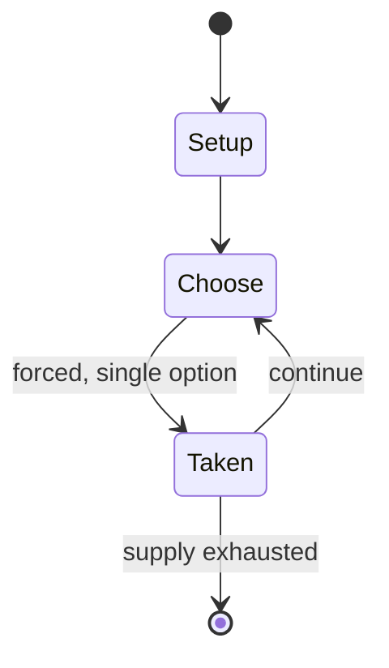

# Gilli-danda

*children's game; amateur sport, originating from the Indian subcontinent*

`gilli_danda` &nbsp; state: **DEEPENED** &nbsp; method: **heuristic**

## Found layer (recorded, not trusted)

| field | value |
| --- | --- |
| wikidata | Q1254757 |
| wikipedia | Gillidanda |
| genres (source) | -- |
| instance of (source) | children's game, traditional sport |
| country of origin | -- |

## Declared layer (orders bench work)

| field | value |
| --- | --- |
| year created | -- |
| epoch | -- |
| region | -- |
| media | SPORT |
| players | -- |
| age band | CHILD |
| exogenous process | -- |
| loss shape | -- |
| live axes | - |
| horizon | -- |
| scoring shape | -- |
| information | -- |
| interaction | COMPETITIVE |
| turn structure | -- |
| tractability | SAMPLING_ONLY |
| randomness | -- |
| luck factor | 0.35 |
| rules complexity | 1.81 |
| strategic depth | 2.0 |
| novelty | 0.3499 |
| solved status | -- |
| strategies | -- |
| algorithms | -- |

## Object model

```
Episode
  players      : ?
  turn_structure: ?
  horizon       : ?
  scoring       : ?

Pitch          -- bounded physical region
Player         -- embodied agent with a foul count
Clock          -- counts down; stoppages are rule events
Official       -- detects infractions and applies penalties
```

## State transition diagram



## Research item -- turn trace

```
# Gilli-danda -- simulated turn events
# generated from the DECLARED vector, not from a rulebook.
# structure: exo=None loss=None horizon=None scoring=None axes=-

t=0    SETUP        players=2  pot=0  capacity=4
t=1    FORCED       p1 single legal option taken (pot_gain=+1.3)
t=2    ENDTURN      turn passes to p2
t=3    FORCED       p2 single legal option taken (pot_gain=+2.0)
t=4    ENDTURN      turn passes to p1
t=5    FORCED       p1 single legal option taken (pot_gain=+0.8)
t=6    FORCED       p1 single legal option taken (pot_gain=+1.6)
t=7    FORCED       p1 single legal option taken (pot_gain=+0.8)
t=8    FORCED       p1 single legal option taken (pot_gain=+1.3)
t=9    FORCED       p1 single legal option taken (pot_gain=+1.1)
t=10   FORCED       p1 single legal option taken (pot_gain=+1.4)
t=11   FORCED       p1 single legal option taken (pot_gain=+0.8)
t=12   FORCED       p1 single legal option taken (pot_gain=+1.0)
t=13   FORCED       p1 single legal option taken (pot_gain=+1.4)
t=14   FORCED       p1 single legal option taken (pot_gain=+1.4)
t=15   FORCED       p1 single legal option taken (pot_gain=+0.7)
t=16   FORCED       p1 single legal option taken (pot_gain=+0.8)
t=17   FORCED       p1 single legal option taken (pot_gain=+1.7)
t=18   FORCED       p1 single legal option taken (pot_gain=+1.9)
t=19   FORCED       p1 single legal option taken (pot_gain=+0.5)
t=20   FORCED       p1 single legal option taken (pot_gain=+1.4)
t=21   FORCED       p1 single legal option taken (pot_gain=+1.0)
t=22   FORCED       p1 single legal option taken (pot_gain=+1.9)
t=23   FORCED       p1 single legal option taken (pot_gain=+0.8)
t=24   FORCED       p1 single legal option taken (pot_gain=+1.1)
t=25   FORCED       p1 single legal option taken (pot_gain=+1.7)
t=26   ENDTURN      turn passes to p2

terminal: VARIABLE
```

## Conditions

| kind | threshold | effect | trigger |
| --- | --- | --- | --- |
| WIN | -- | -- | The team (or individual) with the most points wins the game. |

## Source extract

Gillidanda (Gilli-Danda, IPA: [ɡɪlːiː ɖəɳɖaː]) is an ancient sport originating from the Indian
subcontinent that is still widely played throughout South Asia. The sport is also found as far
north as the Mediterranean and as far east as Southeast Asia. It was a precursor to cricket in
South Asia.  The game is played with two sticks: a large one called a danda, which is used to
hit a smaller one, the gilli. It bears many similarities to bat and ball games such as cricket
and baseball. Gullidanda is an ancient sport that may date back more than 2,500 years.   ==
Etymology == Gillidanda is known by various other names: Tip-cat in English, Iti-Dakar (اٽي ڏڪر)
in Sindhi, guli-badi (ଗୁଲି ବାଡ଼ି) in Odia (regional variations dabalapua ଡାବଲପୁଆ and ପିଲବାଡ଼ି
pilabadi in Phulbani and guti-dabula ଗୁଟିଡାବୁଳ in Balasore), gulli-ṭāṇ (𑂏𑂳𑂪𑂹𑂪𑂲 𑂗𑂰𑂝) in Bhojpuri,
alak-doulak (الک دولک) in Persian, dānggűli (ডাঙ্গুলি) in Bengali, Tang Guti (টাং গুটি) in
Assamese, chinni-kolu ಚಿನ್ನಿ ಕೋಲು in Kannada, kuttiyum kolum in Malayalam, vitti-dandu विट्टी
दांडू in Marathi, Koyando-bal(कोयंडो बाल) in Konkani, kitti-pul (கிட்டி-புல்) in Tamil, Gooti-
Billa (Andhra Pradesh) or Karra-Billa (Andhra Pradesh) or Billam-Go

<sub>Wikipedia, CC BY-SA. Retained as evidence for the structural
classification above. Every rule inferred from it is HYPOTHESIZED
until audited against a rulebook.</sub>
