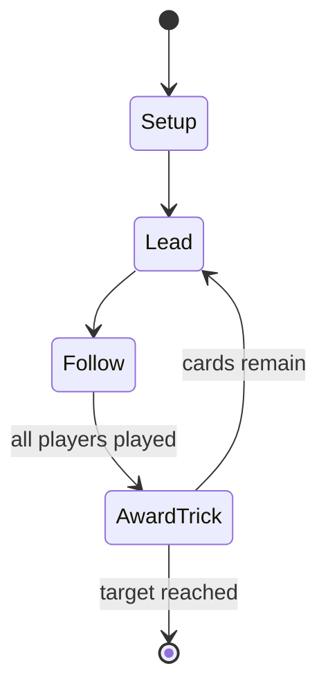

# Gilten

*Austrian card game*

`gilten` &nbsp; state: **DEEPENED** &nbsp; method: **heuristic**

## Found layer (recorded, not trusted)

| field | value |
| --- | --- |
| wikidata | Q107072107 |
| wikipedia | Gilten (card game) |
| genres (source) | -- |
| instance of (source) | trick-taking game |
| country of origin | -- |

## Declared layer (orders bench work)

| field | value |
| --- | --- |
| year created | 2015 |
| epoch | CONTEMPORARY |
| region | -- |
| media | CARD, TRICK_TAKING |
| players | 4 |
| age band | -- |
| exogenous process | DEPLETING_DECK |
| loss shape | -- |
| live axes | ORDER |
| horizon | RACE_TO_TARGET |
| scoring shape | SET_COLLECTION_CONVEX |
| information | -- |
| interaction | SOLITAIRE |
| turn structure | TRICK_ROUND |
| tractability | SAMPLING_ONLY |
| randomness | DECK_SHUFFLE, DICE |
| luck factor | 0.35 |
| rules complexity | 2.11 |
| strategic depth | 2.75 |
| novelty | 0.5931 |
| solved status | -- |
| strategies | opponent_modelling, set_collection, spatial_packing |
| algorithms | -- |

## Object model

```
Episode
  players      : 4
  turn_structure: TRICK_ROUND
  horizon       : RACE_TO_TARGET
  scoring       : SET_COLLECTION_CONVEX

Deck           -- ordered multiset, drawn without replacement
Hand           -- private multiset held by one player
DiscardPile    -- public accumulation of spent cards
Trick          -- one card per player; a winner is determined
Trump          -- suit that dominates the ordering
Sequence       -- the permutation under the player's control
```

## State transition diagram



## Research item -- turn trace

```
# Gilten -- simulated turn events
# generated from the DECLARED vector, not from a rulebook.
# structure: exo=DEPLETING_DECK loss=None horizon=RACE_TO_TARGET scoring=SET_COLLECTION_CONVEX axes=ORDER

t=0    SETUP        players=4  pot=0  capacity=7
t=1    DRAW         p1 draw from deck -> outcome #3  (p=0.131)
t=2    FORCED       p1 single legal option taken (pot_gain=+1.7)
t=3    DRAW         p1 draw from deck -> outcome #6  (p=0.114)
t=4    FORCED       p1 single legal option taken (pot_gain=+2.0)
t=5    DRAW         p1 draw from deck -> outcome #6  (p=0.204)
t=6    FORCED       p1 single legal option taken (pot_gain=+1.8)
t=7    DRAW         p1 draw from deck -> outcome #5  (p=0.099)
t=8    FORCED       p1 single legal option taken (pot_gain=+1.6)
t=9    DRAW         p1 draw from deck -> outcome #2  (p=0.058)
t=10   FORCED       p1 single legal option taken (pot_gain=+0.9)
t=11   ENDTURN      turn passes to p2
t=12   DRAW         p2 draw from deck -> outcome #3  (p=0.024)
t=13   FORCED       p2 single legal option taken (pot_gain=+1.2)
t=14   DRAW         p2 draw from deck -> outcome #4  (p=0.093)
t=15   FORCED       p2 single legal option taken (pot_gain=+0.8)
t=16   DRAW         p2 draw from deck -> outcome #6  (p=0.233)
t=17   FORCED       p2 single legal option taken (pot_gain=+0.9)
t=18   DRAW         p2 draw from deck -> outcome #3  (p=0.066)
t=19   FORCED       p2 single legal option taken (pot_gain=+1.6)
t=20   DRAW         p2 draw from deck -> outcome #3  (p=0.225)
t=21   FORCED       p2 single legal option taken (pot_gain=+1.8)
t=22   DRAW         p2 draw from deck -> outcome #5  (p=0.158)
t=23   FORCED       p2 single legal option taken (pot_gain=+0.6)
t=24   DRAW         p2 draw from deck -> outcome #1  (p=0.279)
t=25   FORCED       p2 single legal option taken (pot_gain=+1.0)
t=26   ENDTURN      turn passes to p3

terminal: RACE_TO_TARGET
```

## Conditions

| kind | threshold | effect | trigger |
| --- | --- | --- | --- |
| WIN | 4 players | -- | Four players form two teams of two, the aim being to be first to score 11 (or 15) points. |
| BOUNDARY | 1 player | -- | A sequence of at least two consecutive cards in the same suit held by one player. |
| WIN | -- | -- | Points are recorded on a scoresheet and the first team to reach the target score is the winner. |
| BOUNDARY | -- | -- | The team taking at least three of the five available tricks scores the point for Spiel i.e. |
| BOUNDARY | -- | -- | If Gleich and/or Hanger are undecided, there is a so-called 'show' in which the team winning the Spiel goes first by conceding the figure, revealing cards to at least the same value as the opponent has shown or bet on th |

## Source extract

Gilten or Giltspiel is a "very old" Austrian card game for four players, playing in partnership,
with 32 German-suited cards of the William Tell pattern. Despite its age, it is still played
locally in parts of Austria today. It is a trick-taking game which involves betting on the
outcome and certain card combinations.   == History == Gilten is ancestral to the renowned
Tyrolean game of Perlaggen, which itself has earned UNESCO heritage status. Its age is indicated
in an 1853 book on Perlaggen which states that "Giltspiel has been played for as long as anyone
can remember". However, detailed rules were not published until 2015 when research by Hubert
Auer discovered it still being played regularly in Fiss, Serfaus and Ladis in the upper Inn
valley (south of Landeck) and added the rules to his book, Watten, Bieten & Perlaggen. The name
comes from the expression Gilt's... as in "Gilt's Hanger?" ("is the Hanger valid?") or "Gilt's
Spiel?" ("is the Spiel valid?") which was formerly used in betting.   == Cards == Players use
the standard German-suited pack found in most of Austria and referred to as the Tell pattern by
the International Playing-Card Society. This comprises 32 cards ranki

<sub>Wikipedia, CC BY-SA. Retained as evidence for the structural
classification above. Every rule inferred from it is HYPOTHESIZED
until audited against a rulebook.</sub>
