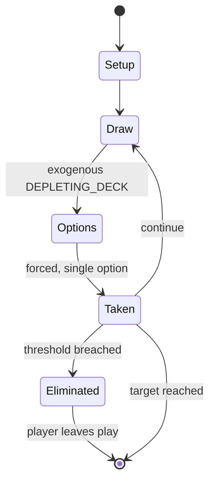

# Gin rummy

*Card game*

`gin_rummy` &nbsp; state: **DEEPENED** &nbsp; method: **heuristic**

## Found layer (recorded, not trusted)

| field | value |
| --- | --- |
| wikidata | Q11082926 |
| wikipedia | Gin rummy |
| genres (source) | -- |
| instance of (source) | card game |
| country of origin | United States |

## Declared layer (orders bench work)

| field | value |
| --- | --- |
| year created | -- |
| epoch | -- |
| region | NORTH_AMERICA |
| media | CARD |
| players | -- |
| age band | -- |
| exogenous process | DEPLETING_DECK |
| loss shape | ELIMINATION |
| live axes | DISCARD |
| horizon | RACE_TO_TARGET |
| scoring shape | SET_COLLECTION_CONVEX |
| information | -- |
| interaction | SOLITAIRE |
| turn structure | -- |
| tractability | EXACT_WITH_CUT |
| randomness | HIDDEN_INFO, NONE |
| luck factor | 0.08 |
| rules complexity | 2.33 |
| strategic depth | 2.25 |
| novelty | 0.7657 |
| solved status | -- |
| strategies | set_collection |
| algorithms | -- |

## Object model

```
Episode
  players      : ?
  turn_structure: ?
  horizon       : RACE_TO_TARGET
  scoring       : SET_COLLECTION_CONVEX

Deck           -- ordered multiset, drawn without replacement
Hand           -- private multiset held by one player
DiscardPile    -- public accumulation of spent cards
DiscardChoice  -- what is given up to satisfy a limit
```

## State transition diagram



## Research item -- turn trace

```
# Gin rummy -- simulated turn events
# generated from the DECLARED vector, not from a rulebook.
# structure: exo=DEPLETING_DECK loss=ELIMINATION horizon=RACE_TO_TARGET scoring=SET_COLLECTION_CONVEX axes=DISCARD

t=0    SETUP        players=2  pot=0  capacity=4
t=1    DRAW         p1 draw from deck -> outcome #1  (p=0.242)
t=2    FORCED       p1 single legal option taken (pot_gain=+0.6)
t=3    DISCARD      p1 discards to hand limit
t=4    DRAW         p1 draw from deck -> outcome #6  (p=0.253)
t=5    FORCED       p1 single legal option taken (pot_gain=+1.0)
t=6    DISCARD      p1 discards to hand limit
t=7    DRAW         p1 draw from deck -> outcome #4  (p=0.122)
t=8    FORCED       p1 single legal option taken (pot_gain=+0.6)
t=9    DISCARD      p1 discards to hand limit
t=10   DRAW         p1 draw from deck -> outcome #5  (p=0.084)
t=11   FORCED       p1 single legal option taken (pot_gain=+0.6)
t=12   DRAW         p1 draw from deck -> outcome #2  (p=0.072)
t=13   FORCED       p1 single legal option taken (pot_gain=+0.5)
t=14   DRAW         p1 draw from deck -> outcome #3  (p=0.139)
t=15   FORCED       p1 single legal option taken (pot_gain=+1.2)
t=16   ENDTURN      turn passes to p2
t=17   DRAW         p2 draw from deck -> outcome #3  (p=0.026)
t=18   FORCED       p2 single legal option taken (pot_gain=+2.0)
t=19   DISCARD      p2 discards to hand limit
t=20   DRAW         p2 draw from deck -> outcome #2  (p=0.033)
t=21   FORCED       p2 single legal option taken (pot_gain=+1.2)
t=22   DRAW         p2 draw from deck -> outcome #3  (p=0.223)
t=23   FORCED       p2 single legal option taken (pot_gain=+2.0)
t=24   DISCARD      p2 discards to hand limit
t=25   DRAW         p2 draw from deck -> outcome #3  (p=0.169)
t=26   FORCED       p2 single legal option taken (pot_gain=+1.6)
t=27   DISCARD      p2 discards to hand limit
t=28   ENDTURN      turn passes to p1

terminal: RACE_TO_TARGET
```

## Conditions

| kind | threshold | effect | trigger |
| --- | --- | --- | --- |
| WIN | 100 points | -- | The objective in gin rummy is to be the first to reach an agreed-upon score, usually 100 points. |
| TERMINATE | 1 player | -- | Players alternate taking turns until one player ends the round by declaring the hand over (knocking), or until only two cards remain in the stock pile, in which case the round ends in a draw and no points are awarded. |
| TERMINATE | 100 points | -- | Once a player has acquired 100 points (200, 500 or some other agreed-upon number) the game is over, and that player receives a game bonus of 100 points. |
| TERMINATE | 1 player | -- | Each individual match ends when one player scores 100 match points. |
| ELIMINATE | -- | -- | The basic game strategy is to improve one's hand by melds and eliminating deadwood. |
| WIN | -- | -- | This player wins the match. |
| TERMINATE | -- | -- | The game ends when a player reaches 100 or more points (or another established amount). |
| BOUNDARY | -- | -- | In this version of gin rummy, the value of the first upcard is used to determine the maximum count at which players can knock. |

## Source extract

Gin rummy, or simply gin, is a two-player card game variant of Rummy. It has enjoyed widespread
popularity as both a social and a gambling game, especially during the mid twentieth century,
and remains today one of the most widely played two-player card games.   == History == Gin rummy
was created in 1909 by Elwood T. Baker and his son C. Graham Baker. The game remained local to
New York until 1941, when it was publicized throughout the United States after becoming a
Hollywood fad. In 1947, a survey by an association of U.S. playing card manufacturers concluded
that the number of people who learned gin rummy during World War II was equal to the number that
learned to play pinochle, cribbage, poker, and bridge combined. Magician and writer John Scarne
believed gin rummy to have evolved from 19th-century whiskey poker (a game similar to commerce,
with players forming poker combinations) and to have been created with the intention of being
faster than standard rummy but less spontaneous than knock rummy. Card game historian David
Parlett finds Scarne's theory to be "highly implausible", and considers the game of Conquian to
be gin rummy's forerunner.   == Deck == Gin rummy is played u

<sub>Wikipedia, CC BY-SA. Retained as evidence for the structural
classification above. Every rule inferred from it is HYPOTHESIZED
until audited against a rulebook.</sub>
