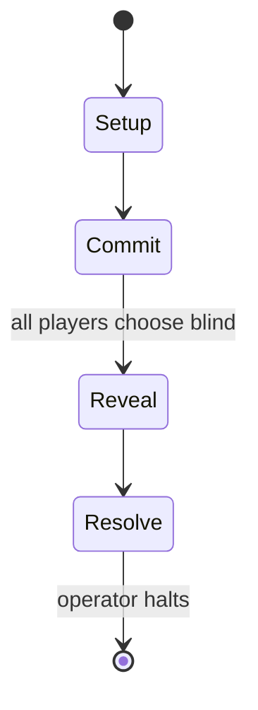

# Gloomhaven

*2017 board game*

`gloomhaven` &nbsp; state: **DEEPENED** &nbsp; method: **heuristic**

## Found layer (recorded, not trusted)

| field | value |
| --- | --- |
| wikidata | Q36816341 |
| wikipedia | Gloomhaven |
| genres (source) | -- |
| instance of (source) | board game |
| country of origin | United States |

## Declared layer (orders bench work)

| field | value |
| --- | --- |
| year created | 2017 |
| epoch | CONTEMPORARY |
| region | NORTH_AMERICA |
| media | BOARD |
| players | 1-4 |
| age band | -- |
| exogenous process | IID |
| loss shape | -- |
| live axes | COMMIT_BLIND |
| horizon | OPEN_ENDED |
| scoring shape | -- |
| information | SIMULTANEOUS |
| interaction | COOPERATIVE |
| turn structure | SIMULTANEOUS |
| tractability | EXACT_WITH_CUT |
| randomness | DICE |
| luck factor | 0.58 |
| rules complexity | 2.04 |
| strategic depth | 1.87 |
| novelty | 0.8328 |
| solved status | -- |
| strategies | -- |
| algorithms | -- |

## Object model

```
Episode
  players      : 1-4
  turn_structure: SIMULTANEOUS
  horizon       : OPEN_ENDED
  scoring       : ?

Board          -- spatial substrate; cells carry position and occupancy
Piece          -- movable token owned by a player
SealedChoice   -- irrevocable choice made without observation
```

## State transition diagram



## Research item -- turn trace

```
# Gloomhaven -- simulated turn events
# generated from the DECLARED vector, not from a rulebook.
# structure: exo=IID loss=None horizon=OPEN_ENDED scoring=None axes=COMMIT_BLIND

t=0    SETUP        players=1  pot=0  capacity=3
t=1    DRAW         p1 roll from d6 pool -> outcome #4  (p=0.241)
t=2    FORCED       p1 single legal option taken (pot_gain=+1.5)
t=3    DRAW         p1 roll from d6 pool -> outcome #2  (p=0.070)
t=4    FORCED       p1 single legal option taken (pot_gain=+1.9)
t=5    DRAW         p1 roll from d6 pool -> outcome #4  (p=0.238)
t=6    FORCED       p1 single legal option taken (pot_gain=+1.8)
t=7    DRAW         p1 roll from d6 pool -> outcome #1  (p=0.290)
t=8    FORCED       p1 single legal option taken (pot_gain=+0.9)
t=9    DRAW         p1 roll from d6 pool -> outcome #4  (p=0.061)
t=10   FORCED       p1 single legal option taken (pot_gain=+1.4)
t=11   DRAW         p1 roll from d6 pool -> outcome #3  (p=0.266)
t=12   FORCED       p1 single legal option taken (pot_gain=+0.8)
t=13   ENDTURN      turn passes to p1
t=14   DRAW         p1 roll from d6 pool -> outcome #3  (p=0.300)
t=15   FORCED       p1 single legal option taken (pot_gain=+0.9)
t=16   DRAW         p1 roll from d6 pool -> outcome #5  (p=0.200)
t=17   FORCED       p1 single legal option taken (pot_gain=+1.6)
t=18   ENDTURN      turn passes to p1
t=19   DRAW         p1 roll from d6 pool -> outcome #6  (p=0.174)
t=20   FORCED       p1 single legal option taken (pot_gain=+0.8)
t=21   ENDTURN      turn passes to p1
t=22   DRAW         p1 roll from d6 pool -> outcome #2  (p=0.271)
t=23   FORCED       p1 single legal option taken (pot_gain=+1.4)
t=24   DRAW         p1 roll from d6 pool -> outcome #2  (p=0.178)
t=25   FORCED       p1 single legal option taken (pot_gain=+1.5)
t=26   ENDTURN      turn passes to p1

terminal: OPEN_ENDED
```

## Source extract

Gloomhaven is a cooperative board game for one to four players designed by Isaac Childres and
published by Cephalofair Games in 2017. It is a campaign-based dungeon crawl game including a
narrative campaign, 95 unique playable scenarios, and 17 playable classes. Since its
introduction the game has been acclaimed by reviewers, and has been described as one of the best
board games ever made.   == Gameplay == Gloomhaven is a fantasy-themed, campaign-based tactical
skirmish game, in which players try to triumph in combat-based scenarios which scale in
difficulty depending on the number of players. The game is cooperative and campaign driven, with
one to four players working their way through a branching story consisting of 95 scenarios. The
campaign develops in a legacy format, with stickers that are placed on the board and cards and
sealed envelopes that are opened when certain criteria are met. While it has drawn comparisons
to role-playing games such as Dungeons & Dragons and other dungeon crawl board games, Gloomhaven
uses game mechanics similar to modern eurogames. Characters and monsters move about on hex tiles
representing dungeons and cellars. Players simultaneously choose two

<sub>Wikipedia, CC BY-SA. Retained as evidence for the structural
classification above. Every rule inferred from it is HYPOTHESIZED
until audited against a rulebook.</sub>
