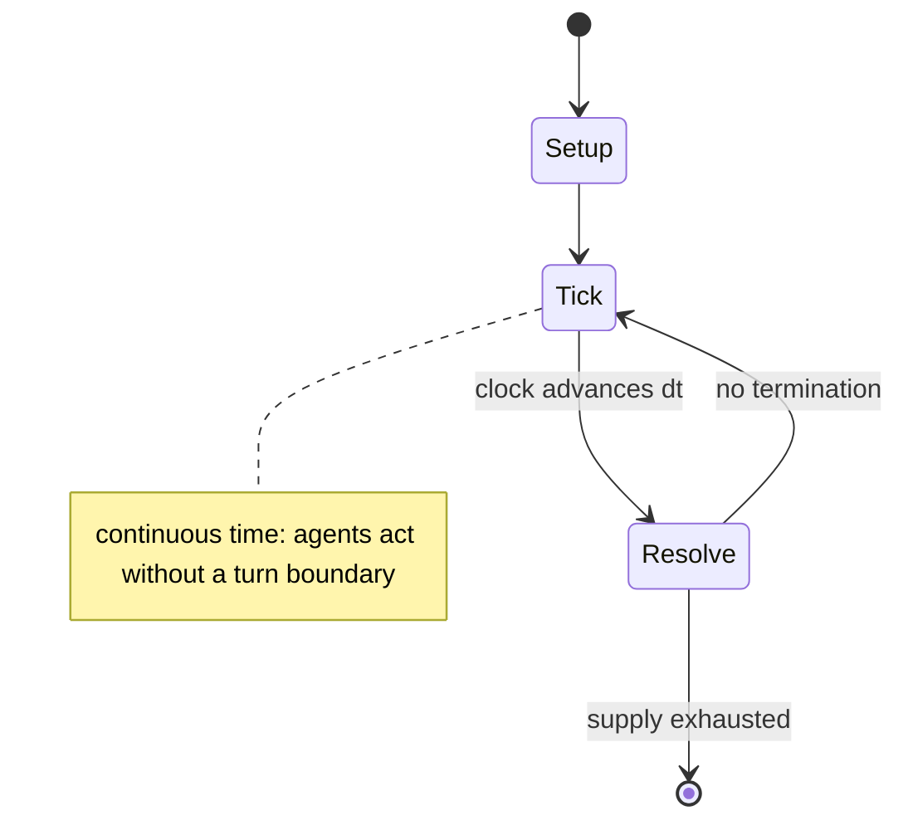

# GNOME Chess

*GNOME graphical front-end for playing chess*

`gnome_chess` &nbsp; state: **DEEPENED** &nbsp; method: **heuristic**

## Found layer (recorded, not trusted)

| field | value |
| --- | --- |
| wikidata | Q1019252 |
| wikipedia | GNOME Chess |
| genres (source) | -- |
| instance of (source) | chess playing software, free software |
| country of origin | -- |

## Declared layer (orders bench work)

| field | value |
| --- | --- |
| year created | 2000 |
| epoch | CONTEMPORARY |
| region | -- |
| media | VIDEO |
| players | -- |
| age band | -- |
| exogenous process | CONTINUOUS_TIME |
| loss shape | OPPORTUNITY_ONLY |
| live axes | ORDER |
| horizon | -- |
| scoring shape | -- |
| information | PERFECT |
| interaction | -- |
| turn structure | REAL_TIME |
| tractability | SAMPLING_ONLY |
| randomness | REAL_TIME_PHYSICAL |
| luck factor | 0.3 |
| rules complexity | 2.15 |
| strategic depth | 2.4 |
| novelty | 0.7296 |
| solved status | -- |
| strategies | -- |
| algorithms | -- |

## Object model

```
Episode
  players      : ?
  turn_structure: REAL_TIME
  horizon       : ?
  scoring       : ?

WorldState     -- simulation state advanced by the engine
Avatar         -- player-controlled agent
Clock          -- frame or tick counter
Sequence       -- the permutation under the player's control
```

## State transition diagram



## Research item -- clock trace

```
# GNOME Chess -- simulated clock trace (no turn boundary)
# generated from the DECLARED vector, not from a rulebook.
# structure: exo=CONTINUOUS_TIME loss=OPPORTUNITY_ONLY horizon=None scoring=None axes=ORDER

clk=0.000s  START        agents=4  clock=free running
clk=0.600s  CONTEST      a1 and a2 contend for the same resource
clk=3.503s  STOPPAGE     clock halts; state frozen
clk=6.302s  ACTION       a2 acts continuously; no turn boundary crossed
clk=6.530s  INFRACTION   a2 commits infraction (count=1)
clk=8.926s  ACTION       a2 acts continuously; no turn boundary crossed
clk=9.878s  ACTION       a2 acts continuously; no turn boundary crossed
clk=10.290s  ACTION       a2 acts continuously; no turn boundary crossed
clk=12.357s  INFRACTION   a1 commits infraction (count=1)
clk=13.989s  ACTION       a3 acts continuously; no turn boundary crossed
clk=16.269s  INFRACTION   a4 commits infraction (count=1)
clk=18.782s  STOPPAGE     clock halts; state frozen
clk=19.782s  ACTION       a4 acts continuously; no turn boundary crossed
clk=21.493s  STOPPAGE     clock halts; state frozen
clk=23.823s  STOPPAGE     clock halts; state frozen
clk=25.298s  ACTION       a3 acts continuously; no turn boundary crossed
clk=27.635s  ACTION       a3 acts continuously; no turn boundary crossed
clk=29.616s  STOPPAGE     clock halts; state frozen
clk=31.156s  ACTION       a1 acts continuously; no turn boundary crossed
clk=32.561s  CONTEST      a4 and a1 contend for the same resource
clk=34.508s  SCORE        a3 scores (+2)
clk=36.284s  SCORE        a1 scores (+2)
clk=36.726s  SCORE        a1 scores (+1)
clk=37.217s  SCORE        a2 scores (+3)
clk=39.175s  INFRACTION   a1 commits infraction (count=2)
clk=41.342s  SCORE        a2 scores (+1)
clk=41.861s  CONTEST      a2 and a3 contend for the same resource

note: elapsed time, not move count, is the episode's ordering variable.
```

## Source extract

An open-source video game, or simply an open-source game, is a video game whose source code is
open-source. They are often freely distributable and sometimes cross-platform compatible.   ==
Definition and differentiation == Not all open-source games are free software; some open-source
games contain proprietary non-free content. Open-source games that are free software and contain
exclusively free content conform to DFSG, free culture, and open content and are sometimes
called free games. Many Linux distributions require for inclusion that the game content is
freely redistributable, freeware or commercial restriction clauses are prohibited.   ==
Background ==  In general, open-source games are developed by relatively small groups of people
in their free time, with profit not being the main focus. Many open-source games are volunteer-
run projects, and as such, developers of free games are often hobbyists and enthusiasts. The
consequence of this is that open-source games often take longer to mature, are less common and
often lack the production value of commercial titles. In the 1990s a challenge to build high-
quality content for games was the missing availability or the excessive pri

<sub>Wikipedia, CC BY-SA. Retained as evidence for the structural
classification above. Every rule inferred from it is HYPOTHESIZED
until audited against a rulebook.</sub>
