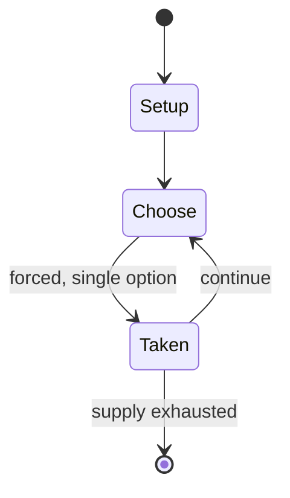

# GNU Chess

*chess-playing program for playing chess against the computer on a terminal or, more commonly, as a chess engine for graphical chess front-ends*

`gnu_chess` &nbsp; state: **DEEPENED** &nbsp; method: **heuristic**

## Found layer (recorded, not trusted)

| field | value |
| --- | --- |
| wikidata | Q494713 |
| wikipedia | GNU Chess |
| genres (source) | chess video game |
| instance of (source) | GNU package, chess playing software, free software |
| country of origin | United States |

## Declared layer (orders bench work)

| field | value |
| --- | --- |
| year created | 1984 |
| epoch | DIGITAL |
| region | NORTH_AMERICA |
| media | VIDEO |
| players | -- |
| age band | -- |
| exogenous process | -- |
| loss shape | -- |
| live axes | - |
| horizon | -- |
| scoring shape | -- |
| information | -- |
| interaction | TEAM |
| turn structure | -- |
| tractability | SAMPLING_ONLY |
| randomness | -- |
| luck factor | 0.35 |
| rules complexity | 1.72 |
| strategic depth | 2.25 |
| novelty | 0.0938 |
| solved status | -- |
| strategies | spatial_packing |
| algorithms | -- |

## Object model

```
Episode
  players      : ?
  turn_structure: ?
  horizon       : ?
  scoring       : ?

WorldState     -- simulation state advanced by the engine
Avatar         -- player-controlled agent
Clock          -- frame or tick counter
```

## State transition diagram



## Research item -- turn trace

```
# GNU Chess -- simulated turn events
# generated from the DECLARED vector, not from a rulebook.
# structure: exo=None loss=None horizon=None scoring=None axes=-

t=0    SETUP        players=2  pot=0  capacity=8
t=1    FORCED       p1 single legal option taken (pot_gain=+0.7)
t=2    ENDTURN      turn passes to p2
t=3    FORCED       p2 single legal option taken (pot_gain=+1.6)
t=4    FORCED       p2 single legal option taken (pot_gain=+1.7)
t=5    FORCED       p2 single legal option taken (pot_gain=+0.8)
t=6    FORCED       p2 single legal option taken (pot_gain=+0.6)
t=7    ENDTURN      turn passes to p1
t=8    FORCED       p1 single legal option taken (pot_gain=+1.9)
t=9    FORCED       p1 single legal option taken (pot_gain=+0.5)
t=10   ENDTURN      turn passes to p2
t=11   FORCED       p2 single legal option taken (pot_gain=+0.6)
t=12   FORCED       p2 single legal option taken (pot_gain=+0.8)
t=13   FORCED       p2 single legal option taken (pot_gain=+0.7)
t=14   FORCED       p2 single legal option taken (pot_gain=+1.0)
t=15   ENDTURN      turn passes to p1
t=16   FORCED       p1 single legal option taken (pot_gain=+0.9)
t=17   FORCED       p1 single legal option taken (pot_gain=+1.2)
t=18   FORCED       p1 single legal option taken (pot_gain=+1.8)
t=19   FORCED       p1 single legal option taken (pot_gain=+1.8)
t=20   ENDTURN      turn passes to p2
t=21   FORCED       p2 single legal option taken (pot_gain=+0.7)
t=22   ENDTURN      turn passes to p1
t=23   FORCED       p1 single legal option taken (pot_gain=+1.2)
t=24   FORCED       p1 single legal option taken (pot_gain=+0.8)
t=25   FORCED       p1 single legal option taken (pot_gain=+1.6)
t=26   FORCED       p1 single legal option taken (pot_gain=+1.4)

terminal: VARIABLE
```

## Source extract

GNU Chess is a free software chess engine and command-line interface chessboard. The goal of GNU
Chess is to serve as a basis for research, and as such it has been used in numerous contexts.
GNU Chess is free software, licensed under the terms of the GNU General Public License version 3
or any later version, and is maintained by collaborating developers. As one of the earliest
computer chess programs with full source code available, it is one of the oldest for Unix-based
systems and has since been ported to many other platforms.   == Features == GNU Chess 6.2.5 is
rated at 2661 Elo points on CCRL's 40-moves-in-2-minutes list. On the same list, Fritz 8 was
rated at 2665 Elo, and that program in the 2004 Man vs Machine World Team Championship beat
grandmasters Sergey Karjakin, Veselin Topalov and reached a draw with Ruslan Ponomariov. It is
often used in conjunction with a GUI program such as XBoard or GNOME Chess, where it is included
as the default engine. Initial versions of XBoard's Chess Engine Communication Protocol were
based on GNU Chess's command-line interface. Version 6 also supports the Universal Chess
Interface (UCI). Since version 6.1 GNU chess supports a graphical mode

<sub>Wikipedia, CC BY-SA. Retained as evidence for the structural
classification above. Every rule inferred from it is HYPOTHESIZED
until audited against a rulebook.</sub>
