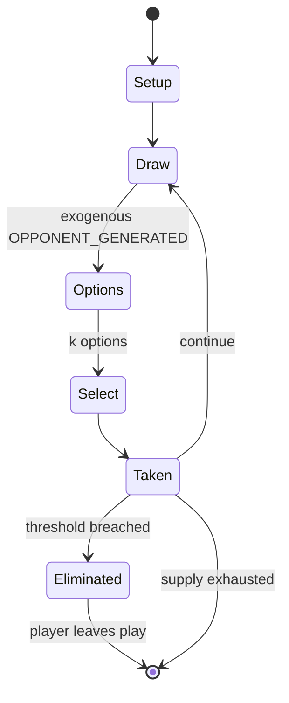

# Go (game)

`go_game` &nbsp; state: **DEEPENED** &nbsp; method: **heuristic**

## Found layer (recorded, not trusted)

| field | value |
| --- | --- |
| wikidata | Q11413 |
| wikipedia | Go (game) |
| genres (source) | -- |
| instance of (source) | -- |
| country of origin | -- |

## Declared layer (orders bench work)

| field | value |
| --- | --- |
| year created | -- |
| epoch | -- |
| region | -- |
| media | BOARD, DEXTERITY |
| players | 2 |
| age band | -- |
| exogenous process | OPPONENT_GENERATED |
| loss shape | ELIMINATION |
| live axes | ORDER, SELECT, SPATIAL, TRADE |
| horizon | VARIABLE |
| scoring shape | RACE_POSITION |
| information | SIMULTANEOUS |
| interaction | SOLITAIRE |
| turn structure | STRICT_TURN |
| tractability | SAMPLING_ONLY |
| randomness | DICE |
| luck factor | 0.58 |
| rules complexity | 4.0 |
| strategic depth | 2.42 |
| novelty | 0.78 |
| solved status | -- |
| strategies | sacrifice |
| algorithms | heuristic_evaluation |

## Object model

```
Episode
  players      : 2
  turn_structure: STRICT_TURN
  horizon       : VARIABLE
  scoring       : RACE_POSITION

Board          -- spatial substrate; cells carry position and occupancy
Piece          -- movable token owned by a player
Sequence       -- the permutation under the player's control
OptionSet      -- the choices available after an exogenous draw
Placement      -- position subject to geometric legality
Offer          -- proposed exchange between two agents
```

## State transition diagram



## Research item -- turn trace

```
# Go (game) -- simulated turn events
# generated from the DECLARED vector, not from a rulebook.
# structure: exo=OPPONENT_GENERATED loss=ELIMINATION horizon=VARIABLE scoring=RACE_POSITION axes=ORDER,SELECT,SPATIAL,TRADE

t=0    SETUP        players=2  pot=0  capacity=4
t=1    DRAW         p1 observe from opponent move -> outcome #2  (p=0.227)
t=2    SELECT       p1 3 options; take #3  (pot_gain=+3.3, capacity=-1)
t=3    ENDTURN      turn passes to p2
t=4    DRAW         p2 observe from opponent move -> outcome #1  (p=0.041)
t=5    SELECT       p2 4 options; take #4  (pot_gain=+3.1, capacity=-0)
t=6    SPATIAL      p2 places at (7,3); adjacency legal
t=7    ENDTURN      turn passes to p1
t=8    DRAW         p1 observe from opponent move -> outcome #6  (p=0.149)
t=9    SELECT       p1 1 options; take #1  (pot_gain=+1.5, capacity=-1)
t=10   SPATIAL      p1 places at (6,7); adjacency legal
t=11   DRAW         p1 observe from opponent move -> outcome #5  (p=0.015)
t=12   SELECT       p1 3 options; take #2  (pot_gain=+1.3, capacity=-0)
t=13   SPATIAL      p1 places at (5,4); adjacency legal
t=14   DRAW         p1 observe from opponent move -> outcome #1  (p=0.041)
t=15   SELECT       p1 4 options; take #1  (pot_gain=+1.9, capacity=-2)
t=16   TRADE        p1 offers 2:1 exchange to p2
t=17   DRAW         p1 observe from opponent move -> outcome #3  (p=0.260)
t=18   SELECT       p1 4 options; take #1  (pot_gain=+2.7, capacity=-0)
t=19   TRADE        p1 offers 2:1 exchange to p2
t=20   SPATIAL      p1 places at (0,7); adjacency legal
t=21   DRAW         p1 observe from opponent move -> outcome #5  (p=0.070)
t=22   SELECT       p1 4 options; take #1  (pot_gain=+2.4, capacity=-0)
t=23   TRADE        p1 offers 2:1 exchange to p2
t=24   SPATIAL      p1 places at (7,2); adjacency legal
t=25   DRAW         p1 observe from opponent move -> outcome #1  (p=0.235)
t=26   SELECT       p1 4 options; take #3  (pot_gain=+1.6, capacity=-2)
t=27   TRADE        p1 offers 2:1 exchange to p2

terminal: VARIABLE
```

## Conditions

| kind | threshold | effect | trigger |
| --- | --- | --- | --- |
| TERMINATE | 1 player | -- | The game ends when both players pass or when one player resigns. |
| WIN | -- | -- | The player with the greater score (after adjusting for handicapping called komi) wins the game. |
| TERMINATE | -- | -- | When both players pass consecutively, the game ends and is then scored. |
| BOUNDARY | -- | -- | An essential aspect of the game is that any formation of stones needs to have, or be capable of making, at least two enclosed open points known as eyes, in order to preserve itself from being captured. |
| BOUNDARY | -- | -- | Liberty rule states that every stone remaining on the board must have at least one open point (a liberty) directly orthogonally adjacent (up, down, left, or right), or must be part of a connected group that has at least  |
| BOUNDARY | -- | -- | A chain of stones must have at least one liberty to remain on the board. |
| BOUNDARY | -- | -- | In the second case, the enemy group is captured, leaving the new stone with at least one liberty, so the new stone can be placed. |
| BOUNDARY | -- | -- | While not actually mentioned in the rules of Go (at least in simpler rule sets, such as those of New Zealand and the U.S.), the concept of a living group of stones is necessary for a practical understanding of the game. |
| BOUNDARY | -- | -- | The two black groups in the upper corners are alive, as both have at least two eyes. |
| BOUNDARY | -- | -- | Neither player receives any points for those groups, but at least those groups themselves remain living, as opposed to being captured. |
| PENALTY | -- | -- | Under territory scoring there can be an extra penalty for playing inside ones' territory, so if there is a disagreement extra play to resolve it would, in tournament settings, happen on a separate board, where the player |

## Source extract

Go, Weiqi, or Baduk is an abstract strategy board game for two players in which the aim is to
fence off more territory than the opponent. The game was invented in China more than 2,500 years
ago and is believed to be the oldest board game continuously played to the present day. A 2016
survey by the International Go Federation's 75 member nations found that there are over 46
million people worldwide who know how to play Go, and over 20 million current players, the
majority of whom live in East Asia. The playing pieces are called stones. One player uses the
white stones and the other black stones. The players take turns placing their stones on the
vacant intersections (points) on the board. Once placed, stones may not be moved, but captured
stones are immediately removed from the board. A single stone (or connected group of stones) is
captured when surrounded by the opponent's stones on all orthogonally adjacent points. The game
proceeds until neither player wishes to make another move. When a game concludes, the winner is
determined by counting each player's surrounded territory along with captured stones and komi
(points added to the score of the player with the white stones as com

<sub>Wikipedia, CC BY-SA. Retained as evidence for the structural
classification above. Every rule inferred from it is HYPOTHESIZED
until audited against a rulebook.</sub>
