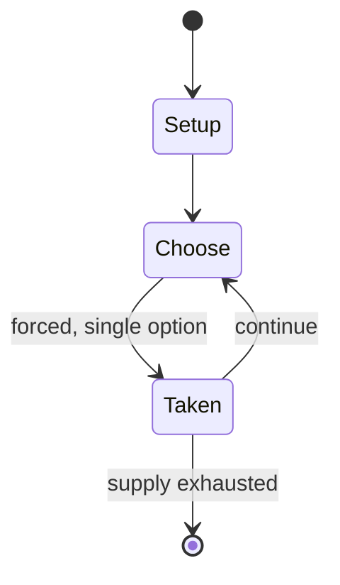

# Go Go Burunyanman

*series of Japanese shoot'em up video games*

`go_go_burunyanman` &nbsp; state: **DEEPENED** &nbsp; method: **heuristic**

## Found layer (recorded, not trusted)

| field | value |
| --- | --- |
| wikidata | Q17223858 |
| wikipedia | Go Go Burunyanman |
| genres (source) | shoot 'em up |
| instance of (source) | video game |
| country of origin | -- |

## Declared layer (orders bench work)

| field | value |
| --- | --- |
| year created | 2008 |
| epoch | CONTEMPORARY |
| region | -- |
| media | VIDEO |
| players | -- |
| age band | -- |
| exogenous process | -- |
| loss shape | -- |
| live axes | - |
| horizon | -- |
| scoring shape | -- |
| information | -- |
| interaction | -- |
| turn structure | -- |
| tractability | SAMPLING_ONLY |
| randomness | -- |
| luck factor | 0.35 |
| rules complexity | 1.76 |
| strategic depth | 2.0 |
| novelty | 0.0896 |
| solved status | -- |
| strategies | -- |
| algorithms | -- |

## Object model

```
Episode
  players      : ?
  turn_structure: ?
  horizon       : ?
  scoring       : ?

WorldState     -- simulation state advanced by the engine
Avatar         -- player-controlled agent
Clock          -- frame or tick counter
```

## State transition diagram



## Research item -- turn trace

```
# Go Go Burunyanman -- simulated turn events
# generated from the DECLARED vector, not from a rulebook.
# structure: exo=None loss=None horizon=None scoring=None axes=-

t=0    SETUP        players=2  pot=0  capacity=5
t=1    FORCED       p1 single legal option taken (pot_gain=+1.8)
t=2    FORCED       p1 single legal option taken (pot_gain=+1.6)
t=3    FORCED       p1 single legal option taken (pot_gain=+1.2)
t=4    FORCED       p1 single legal option taken (pot_gain=+1.1)
t=5    FORCED       p1 single legal option taken (pot_gain=+1.4)
t=6    FORCED       p1 single legal option taken (pot_gain=+1.7)
t=7    FORCED       p1 single legal option taken (pot_gain=+0.8)
t=8    FORCED       p1 single legal option taken (pot_gain=+1.4)
t=9    FORCED       p1 single legal option taken (pot_gain=+1.4)
t=10   FORCED       p1 single legal option taken (pot_gain=+0.9)
t=11   FORCED       p1 single legal option taken (pot_gain=+0.5)
t=12   FORCED       p1 single legal option taken (pot_gain=+1.4)
t=13   FORCED       p1 single legal option taken (pot_gain=+0.6)
t=14   FORCED       p1 single legal option taken (pot_gain=+1.2)
t=15   FORCED       p1 single legal option taken (pot_gain=+0.7)
t=16   ENDTURN      turn passes to p2
t=17   FORCED       p2 single legal option taken (pot_gain=+0.8)
t=18   FORCED       p2 single legal option taken (pot_gain=+1.6)
t=19   FORCED       p2 single legal option taken (pot_gain=+1.1)
t=20   FORCED       p2 single legal option taken (pot_gain=+0.7)
t=21   ENDTURN      turn passes to p1
t=22   FORCED       p1 single legal option taken (pot_gain=+1.9)
t=23   FORCED       p1 single legal option taken (pot_gain=+0.7)
t=24   FORCED       p1 single legal option taken (pot_gain=+1.4)
t=25   FORCED       p1 single legal option taken (pot_gain=+1.1)
t=26   ENDTURN      turn passes to p2

terminal: VARIABLE
```

## Source extract

Go Go Burunyan-man (それゆけ！ぶるにゃんマン, Soreyuke! Burunyan-man) is a series of Japanese horizontal
shoot'em up video games originally developed for Windows by Digital Cute. It was originally
released as a minigame within Musumaker (むすめーかー, Musumēkā; Daughter Maker), a life simulation
eroge. The title name comes from a combination of the words "Buruma" (bloomers) and "Nya"
(meow). All playable characters are moe anthropomorphization of a cat, and all bosses are the
same of a mouse.   == GamePlay == The game system is generally a typical horizontal-scrolling
shooters. It has three actions; moving the player's character, shooting and the bomb. The
player's bullet power increases during the player is close to enemy's bullet. At the Easy or
Normal difficulty level, the speed of enemy's bullets also becomes slower. In the Story mode,
the game inserts scenes of dialogue between the protagonist and a boss character or thoughts of
the protagonist. When Dark-Burunyan-man (ダークぶるにゃんマン) is selected, a H-scene is inserted in the
end of each stage.   == Games ==   === Soreyuke! Burunyan-man === The first game of the series
(Soreyuke! Burunyan-man (それゆけ！ぶるにゃんマン)) was released as a minigame within Musuma

<sub>Wikipedia, CC BY-SA. Retained as evidence for the structural
classification above. Every rule inferred from it is HYPOTHESIZED
until audited against a rulebook.</sub>
