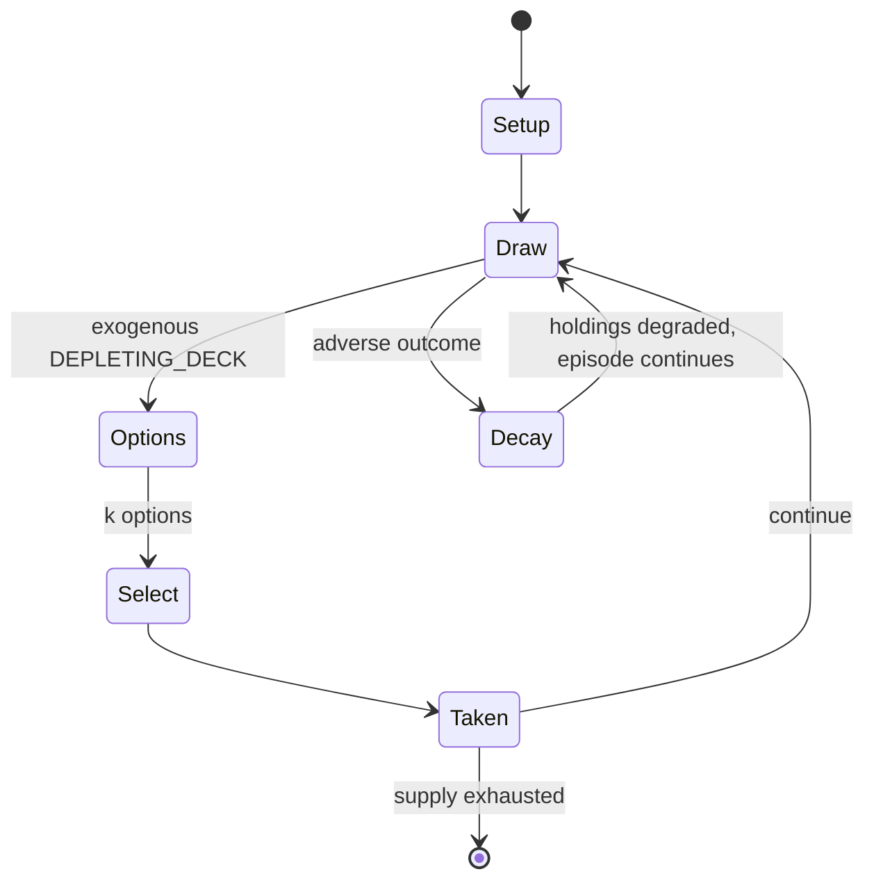

# Go-Stop

*Korean card game using hanafuda cards*

`go_stop` &nbsp; state: **DEEPENED** &nbsp; method: **heuristic**

## Found layer (recorded, not trusted)

| field | value |
| --- | --- |
| wikidata | Q145350 |
| wikipedia | Go-Stop |
| genres (source) | -- |
| instance of (source) | card game |
| country of origin | Korea |

## Declared layer (orders bench work)

| field | value |
| --- | --- |
| year created | -- |
| epoch | -- |
| region | EAST_ASIA |
| media | CARD |
| players | 2-7 |
| age band | -- |
| exogenous process | DEPLETING_DECK |
| loss shape | PARTIAL_DECAY |
| live axes | SELECT |
| horizon | -- |
| scoring shape | SET_COLLECTION_CONVEX |
| information | -- |
| interaction | COMPETITIVE |
| turn structure | STRICT_TURN |
| tractability | EXACT_WITH_CUT |
| randomness | DECK_SHUFFLE |
| luck factor | 0.48 |
| rules complexity | 2.27 |
| strategic depth | 2.25 |
| novelty | 0.6942 |
| solved status | -- |
| strategies | set_collection |
| algorithms | -- |

## Object model

```
Episode
  players      : 2-7
  turn_structure: STRICT_TURN
  horizon       : ?
  scoring       : SET_COLLECTION_CONVEX

Deck           -- ordered multiset, drawn without replacement
Hand           -- private multiset held by one player
DiscardPile    -- public accumulation of spent cards
OptionSet      -- the choices available after an exogenous draw
```

## State transition diagram



## Research item -- turn trace

```
# Go-Stop -- simulated turn events
# generated from the DECLARED vector, not from a rulebook.
# structure: exo=DEPLETING_DECK loss=PARTIAL_DECAY horizon=None scoring=SET_COLLECTION_CONVEX axes=SELECT

t=0    SETUP        players=2  pot=0  capacity=8
t=1    DRAW         p1 draw from deck -> outcome #2  (p=0.041)
t=2    SELECT       p1 2 options; take #1  (pot_gain=+2.8, capacity=-1)
t=3    DRAW         p1 draw from deck -> outcome #5  (p=0.005)
t=4    SELECT       p1 3 options; take #1  (pot_gain=+2.5, capacity=-1)
t=5    ENDTURN      turn passes to p2
t=6    DRAW         p2 draw from deck -> outcome #3  (p=0.292)
t=7    SELECT       p2 2 options; take #1  (pot_gain=+2.0, capacity=-0)
t=8    DRAW         p2 draw from deck -> outcome #6  (p=0.202)
t=9    SELECT       p2 4 options; take #3  (pot_gain=+1.9, capacity=-0)
t=10   DRAW         p2 draw from deck -> outcome #4  (p=0.047)
t=11   SELECT       p2 3 options; take #2  (pot_gain=+1.4, capacity=-0)
t=12   DRAW         p2 draw from deck -> outcome #3  (p=0.097)
t=13   SELECT       p2 2 options; take #2  (pot_gain=+1.7, capacity=-1)
t=14   DRAW         p2 draw from deck -> outcome #4  (p=0.191)
t=15   SELECT       p2 4 options; take #1  (pot_gain=+3.4, capacity=-1)
t=16   DRAW         p2 draw from deck -> outcome #3  (p=0.155)
t=17   SELECT       p2 2 options; take #2  (pot_gain=+0.6, capacity=-1)
t=18   DRAW         p2 draw from deck -> outcome #1  (p=0.282)
t=19   SELECT       p2 1 options; take #1  (pot_gain=+1.9, capacity=-1)
t=20   DRAW         p2 draw from deck -> outcome #4  (p=0.067)
t=21   SELECT       p2 3 options; take #2  (pot_gain=+0.8, capacity=-0)
t=22   DRAW         p2 draw from deck -> outcome #2  (p=0.175)
t=23   SELECT       p2 2 options; take #1  (pot_gain=+2.9, capacity=-1)
t=24   DRAW         p2 draw from deck -> outcome #2  (p=0.258)
t=25   SELECT       p2 1 options; take #1  (pot_gain=+2.1, capacity=-2)
t=26   DRAW         p2 draw from deck -> outcome #6  (p=0.101)
t=27   SELECT       p2 3 options; take #1  (pot_gain=+1.1, capacity=-1)

terminal: VARIABLE
```

## Conditions

| kind | threshold | effect | trigger |
| --- | --- | --- | --- |
| BOUNDARY | 3 players | -- | When a player accumulates at least three (for three players) or seven (for two players) points, the player must decide if they will continue that hand by calling "Go" (고; go) or end it by calling "Stop" (스톱; seutop). |
| BOUNDARY | 1 point | -- | If a player says "Go" once, the player must increase their score by at least one point in order to be given another opportunity to call "Go" or “Stop". |
| BOUNDARY | 7 points | -- | But before calling "Go", the winner must consider whether another player may increase their score to at least three or seven points within the next turn. |
| BOUNDARY | 7 points | -- | If, however, before the first player is given another opportunity to call "Go" or "Stop" another player accumulates at least seven points through both Bright cards and junk cards and subsequently calls "Stop", the first  |
| TERMINATE | -- | -- | If a "Stop" is called, the game ends and the caller collects their winnings. |
| TERMINATE | -- | -- | The dealer and play order of the next game remain the same as with the Nagari game, and when the game ends, the loser owes the winner double money. |
| PENALTY | -- | -- | When "Stop" is called, any non-winning players who have called "Go" have their penalty (calculated from the winning player's total points) doubled. |
| PENALTY | -- | -- | If a non-winning player has no Bright cards when the winner has accumulated points by collecting Bright cards, the player without Bright cards will have their penalty doubled. |
| PENALTY | -- | -- | Further, if a non-winning player has fewer than six junk cards and the winner has accumulated points by collecting junk cards, the non-winning player will have their penalty doubled. |
| PENALTY | -- | -- | Thus, the player's penalty would be doubled three times, or multiplied by eight. |

## Source extract

Go-Stop (Korean: 고스톱; RR: Goseutop), also called Godori (고도리, after the winning move in the
game) is a Korean fishing card game played with a Hwatu (화투) deck. The game can be called Matgo
(맞고) when only two players are playing. The game is derived from similar Japanese fishing games
such as Hana-awase and Hachihachi, though the Japanese hanafuda game Koi-koi is in turn
partially derived from Go-Stop. Modern Korean-produced hwatu decks usually include bonus cards
specifically intended for play with Go-Stop, unlike Japanese hanafuda decks. Typically there are
two or three players, although there is a variation where four players can play. The objective
of this game is to score a minimum predetermined number of points, usually three or seven, and
then call a "Go" or a "Stop", where the name of the game derives. When a "Go" is called, the
game continues, and the number of points or amount of money is first increased, and then
doubled, tripled, quadrupled and so on. A player calling "Go" risks another player scoring the
minimum and winning all the points themselves. If a "Stop" is called, the game ends and the
caller collects their winnings.   == History == The game was invented in the

<sub>Wikipedia, CC BY-SA. Retained as evidence for the structural
classification above. Every rule inferred from it is HYPOTHESIZED
until audited against a rulebook.</sub>
