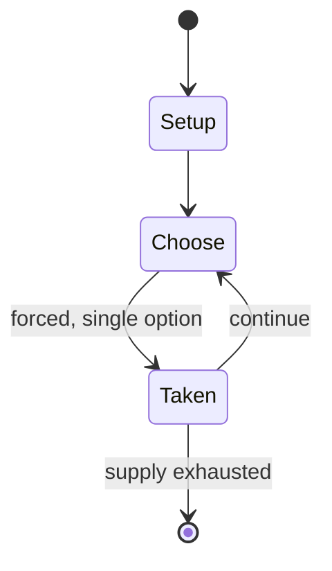

# go variant

*abstract strategy game*

`go_variant` &nbsp; state: **DEEPENED** &nbsp; method: **heuristic**

## Found layer (recorded, not trusted)

| field | value |
| --- | --- |
| wikidata | Q1275314 |
| wikipedia | Go variants |
| genres (source) | -- |
| instance of (source) | abstract strategy game |
| country of origin | -- |

## Declared layer (orders bench work)

| field | value |
| --- | --- |
| year created | -- |
| epoch | -- |
| region | -- |
| media | ABSTRACT |
| players | 3 |
| age band | -- |
| exogenous process | NONE |
| loss shape | OPPORTUNITY_ONLY |
| live axes | SPATIAL |
| horizon | -- |
| scoring shape | NONLINEAR |
| information | PERFECT |
| interaction | SOLITAIRE |
| turn structure | -- |
| tractability | EXACT_WITH_CUT |
| randomness | NONE |
| luck factor | 0.02 |
| rules complexity | 2.17 |
| strategic depth | 2.65 |
| novelty | 0.7924 |
| solved status | -- |
| strategies | signalling |
| algorithms | -- |

## Object model

```
Episode
  players      : 3
  turn_structure: ?
  horizon       : ?
  scoring       : NONLINEAR

Placement      -- position subject to geometric legality
```

## State transition diagram



## Research item -- turn trace

```
# go variant -- simulated turn events
# generated from the DECLARED vector, not from a rulebook.
# structure: exo=NONE loss=OPPORTUNITY_ONLY horizon=None scoring=NONLINEAR axes=SPATIAL

t=0    SETUP        players=3  pot=0  capacity=8
t=1    FORCED       p1 single legal option taken (pot_gain=+0.6)
t=2    SPATIAL      p1 places at (5,1); adjacency legal
t=3    FORCED       p1 single legal option taken (pot_gain=+0.6)
t=4    FORCED       p1 single legal option taken (pot_gain=+1.9)
t=5    FORCED       p1 single legal option taken (pot_gain=+0.8)
t=6    FORCED       p1 single legal option taken (pot_gain=+1.6)
t=7    FORCED       p1 single legal option taken (pot_gain=+0.9)
t=8    FORCED       p1 single legal option taken (pot_gain=+1.3)
t=9    FORCED       p1 single legal option taken (pot_gain=+1.0)
t=10   FORCED       p1 single legal option taken (pot_gain=+1.6)
t=11   FORCED       p1 single legal option taken (pot_gain=+1.3)
t=12   SPATIAL      p1 places at (2,0); adjacency legal
t=13   ENDTURN      turn passes to p2
t=14   FORCED       p2 single legal option taken (pot_gain=+1.2)
t=15   FORCED       p2 single legal option taken (pot_gain=+1.3)
t=16   FORCED       p2 single legal option taken (pot_gain=+1.8)
t=17   FORCED       p2 single legal option taken (pot_gain=+1.1)
t=18   SPATIAL      p2 places at (6,7); adjacency legal
t=19   FORCED       p2 single legal option taken (pot_gain=+1.9)
t=20   SPATIAL      p2 places at (3,4); adjacency legal
t=21   ENDTURN      turn passes to p3
t=22   FORCED       p3 single legal option taken (pot_gain=+1.7)
t=23   SPATIAL      p3 places at (6,5); adjacency legal
t=24   FORCED       p3 single legal option taken (pot_gain=+0.8)
t=25   FORCED       p3 single legal option taken (pot_gain=+0.9)
t=26   FORCED       p3 single legal option taken (pot_gain=+0.7)
t=27   SPATIAL      p3 places at (7,5); adjacency legal

terminal: VARIABLE
```

## Conditions

| kind | threshold | effect | trigger |
| --- | --- | --- | --- |
| TERMINATE | 1 player | -- | The game ends when one player either resigns or both players pass on successive turns. |
| WIN | -- | -- | If the lone player doesn't reach the goal, the other two win the game. |
| BOUNDARY | -- | -- | For instance, snapbacks must be delayed by at least one move, allowing an opponent the chance to create life. |
| BOUNDARY | -- | -- | (There are five four-stone patterns possible, two three-stone patterns, and one two-stone pattern, ignoring rotations and reflections.) There is no komi; Black is restricted on their first turn to playing no more than tw |
| PENALTY | -- | -- | Each player in the team must play in turn, playing out of sequence will normally result in a small penalty (usually three prisoners). |

## Source extract

There are many variations of the simple rules of Go. Some are ancient digressions, while other
are modern deviations. They are often side events at tournaments, for example, the U.S. Go
Congress holds a "Crazy Go" event every year.   == National variants == The difficulty in
defining the rules of Go has led to the creation of many subtly different rulesets. They vary in
areas like scoring method, ko, suicide, handicap placement, and how neutral points are dealt
with at the end. These differences are usually small enough to maintain the character and
strategy of the game, and are typically not considered variants. Different rulesets are
explained in Rules of Go. In some of the examples below, the effects of rule differences on
actual play are minor, but the tactical consequences are substantial.   === Tibetan Go ===
Tibetan Go is played on a 17×17 board, and starts with six stones (called Bo) from each color
placed on the third line. White makes the first move. There is a unique ko rule: a stone may not
be played at an intersection where the opponent has just removed a stone. This ko rule is so
different from other major rulesets that it alone significantly changes the character of

<sub>Wikipedia, CC BY-SA. Retained as evidence for the structural
classification above. Every rule inferred from it is HYPOTHESIZED
until audited against a rulebook.</sub>
