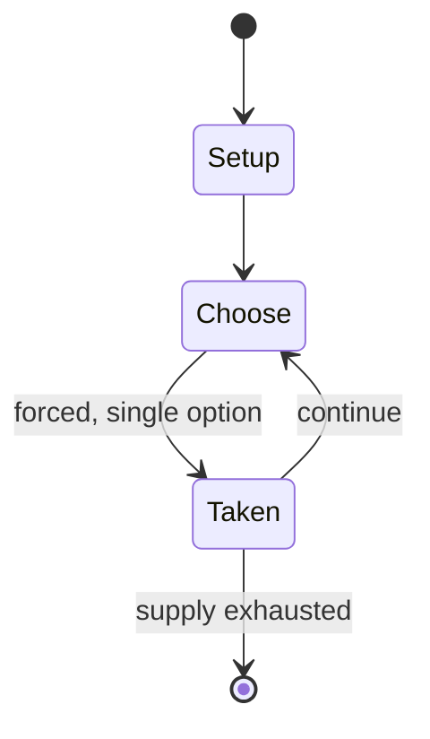

# Goldfish scooping

*traditional Japanese game*

`goldfish_scooping` &nbsp; state: **DEEPENED** &nbsp; method: **heuristic**

## Found layer (recorded, not trusted)

| field | value |
| --- | --- |
| wikidata | Q2564031 |
| wikipedia | Goldfish scooping |
| genres (source) | -- |
| instance of (source) | traditional game |
| country of origin | Japan |

## Declared layer (orders bench work)

| field | value |
| --- | --- |
| year created | -- |
| epoch | -- |
| region | EAST_ASIA |
| media | - |
| players | -- |
| age band | -- |
| exogenous process | -- |
| loss shape | -- |
| live axes | - |
| horizon | -- |
| scoring shape | -- |
| information | -- |
| interaction | COOPERATIVE |
| turn structure | -- |
| tractability | SAMPLING_ONLY |
| randomness | -- |
| luck factor | 0.35 |
| rules complexity | 1.75 |
| strategic depth | 2.0 |
| novelty | 0.5176 |
| solved status | -- |
| strategies | -- |
| algorithms | -- |

## Object model

```
Episode
  players      : ?
  turn_structure: ?
  horizon       : ?
  scoring       : ?

State          -- opaque; no medium or axis evidence was found
Player         -- an agent that selects among legal successors
```

## State transition diagram



## Research item -- turn trace

```
# Goldfish scooping -- simulated turn events
# generated from the DECLARED vector, not from a rulebook.
# structure: exo=None loss=None horizon=None scoring=None axes=-

t=0    SETUP        players=2  pot=0  capacity=5
t=1    FORCED       p1 single legal option taken (pot_gain=+0.6)
t=2    ENDTURN      turn passes to p2
t=3    FORCED       p2 single legal option taken (pot_gain=+2.0)
t=4    FORCED       p2 single legal option taken (pot_gain=+1.2)
t=5    FORCED       p2 single legal option taken (pot_gain=+2.0)
t=6    FORCED       p2 single legal option taken (pot_gain=+1.1)
t=7    FORCED       p2 single legal option taken (pot_gain=+0.8)
t=8    FORCED       p2 single legal option taken (pot_gain=+0.8)
t=9    FORCED       p2 single legal option taken (pot_gain=+1.6)
t=10   FORCED       p2 single legal option taken (pot_gain=+0.9)
t=11   FORCED       p2 single legal option taken (pot_gain=+1.3)
t=12   FORCED       p2 single legal option taken (pot_gain=+1.8)
t=13   FORCED       p2 single legal option taken (pot_gain=+1.7)
t=14   FORCED       p2 single legal option taken (pot_gain=+1.0)
t=15   FORCED       p2 single legal option taken (pot_gain=+1.3)
t=16   FORCED       p2 single legal option taken (pot_gain=+0.7)
t=17   FORCED       p2 single legal option taken (pot_gain=+1.4)
t=18   FORCED       p2 single legal option taken (pot_gain=+0.9)
t=19   FORCED       p2 single legal option taken (pot_gain=+0.6)
t=20   FORCED       p2 single legal option taken (pot_gain=+1.6)
t=21   FORCED       p2 single legal option taken (pot_gain=+1.9)
t=22   FORCED       p2 single legal option taken (pot_gain=+0.6)
t=23   ENDTURN      turn passes to p1
t=24   FORCED       p1 single legal option taken (pot_gain=+1.6)
t=25   FORCED       p1 single legal option taken (pot_gain=+0.6)
t=26   FORCED       p1 single legal option taken (pot_gain=+1.4)

terminal: VARIABLE
```

## Conditions

| kind | threshold | effect | trigger |
| --- | --- | --- | --- |
| TERMINATE | -- | -- | The game is over when the poi is completely broken or incapable of scooping properly. |
| TERMINATE | -- | -- | If the paper of poi is completely broken, the game is over and the score is the number of goldfish scooped until then. |

## Source extract

Goldfish scooping (金魚すくい, 金魚掬い, Kingyo-sukui) is a traditional Japanese game in which a player
scoops goldfish with a paper scooper. It is also called "Scooping Goldfish", "Dipping for
Goldfish", or "Snatching Goldfish". Kingyo means "goldfish" and sukui means "scooping".
Sometimes bouncy balls are used instead of goldfish. Japanese summer festivals or ennichi
commonly have a stall for this activity.   == Rules ==  Each person plays individually. The
basic rule is that the player scoops goldfish from a pool with a paper scooper called a poi and
puts them into a bowl with the poi. This game requires care and speed as the poi can tear
easily. The game is over when the poi is completely broken or incapable of scooping properly.
Even if one part of the poi is torn, the player can continue the game with the remaining part.
At ennichi or summer festival stalls, the game is not a competition. Participation typically
costs around 100 yen and players can take the scooped goldfish home in a plastic bag provided by
the stall keeper.  The game is unlimited, so players can scoop until their pois are completely
broken. If they cannot scoop any goldfish, the stall keeper may be kind enough to giv

<sub>Wikipedia, CC BY-SA. Retained as evidence for the structural
classification above. Every rule inferred from it is HYPOTHESIZED
until audited against a rulebook.</sub>
