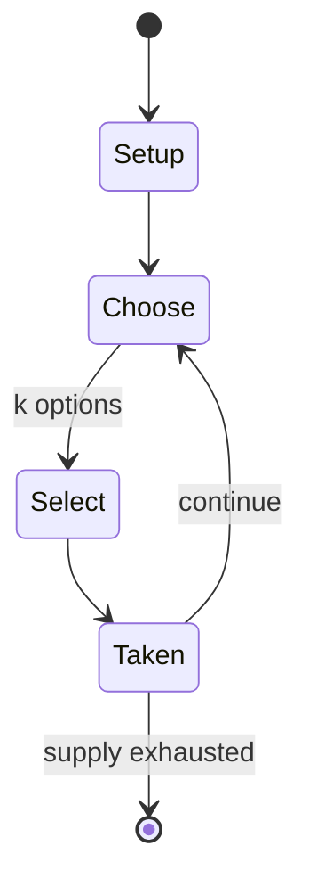

# Gomoku

`gomoku` &nbsp; state: **DEEPENED** &nbsp; method: **heuristic**

## Found layer (recorded, not trusted)

| field | value |
| --- | --- |
| wikidata | Q908381 |
| wikipedia | Gomoku |
| genres (source) | -- |
| instance of (source) | -- |
| country of origin | -- |

## Declared layer (orders bench work)

| field | value |
| --- | --- |
| year created | 1962 |
| epoch | MODERN |
| region | -- |
| media | ABSTRACT, BOARD, DEXTERITY, PAPER_AND_PENCIL |
| players | -- |
| age band | CHILD |
| exogenous process | NONE |
| loss shape | OPPORTUNITY_ONLY |
| live axes | SELECT |
| horizon | -- |
| scoring shape | SURVIVAL |
| information | SIMULTANEOUS |
| interaction | COMPETITIVE |
| turn structure | STRICT_TURN |
| tractability | SAMPLING_ONLY |
| randomness | SIMULTANEOUS_CHOICE |
| luck factor | 0.35 |
| rules complexity | 2.08 |
| strategic depth | 2.0 |
| novelty | 0.4346 |
| solved status | -- |
| strategies | -- |
| algorithms | alpha_beta |

## Object model

```
Episode
  players      : ?
  turn_structure: STRICT_TURN
  horizon       : ?
  scoring       : SURVIVAL

Board          -- spatial substrate; cells carry position and occupancy
Piece          -- movable token owned by a player
OptionSet      -- the choices available after an exogenous draw
```

## State transition diagram



## Research item -- turn trace

```
# Gomoku -- simulated turn events
# generated from the DECLARED vector, not from a rulebook.
# structure: exo=NONE loss=OPPORTUNITY_ONLY horizon=None scoring=SURVIVAL axes=SELECT

t=0    SETUP        players=2  pot=0  capacity=8
t=1    SELECT       p1 2 options; take #2  (pot_gain=+1.5, capacity=-1)
t=2    SELECT       p1 4 options; take #1  (pot_gain=+1.1, capacity=-0)
t=3    SELECT       p1 3 options; take #2  (pot_gain=+1.8, capacity=-1)
t=4    SELECT       p1 4 options; take #1  (pot_gain=+1.5, capacity=-0)
t=5    SELECT       p1 3 options; take #1  (pot_gain=+2.0, capacity=-0)
t=6    SELECT       p1 4 options; take #3  (pot_gain=+0.9, capacity=-2)
t=7    SELECT       p1 1 options; take #1  (pot_gain=+3.5, capacity=-1)
t=8    SELECT       p1 3 options; take #1  (pot_gain=+2.6, capacity=-1)
t=9    ENDTURN      turn passes to p2
t=10   SELECT       p2 4 options; take #4  (pot_gain=+1.2, capacity=-0)
t=11   SELECT       p2 4 options; take #2  (pot_gain=+2.6, capacity=-1)
t=12   SELECT       p2 3 options; take #1  (pot_gain=+1.8, capacity=-0)
t=13   SELECT       p2 3 options; take #3  (pot_gain=+1.7, capacity=-0)
t=14   ENDTURN      turn passes to p1
t=15   SELECT       p1 1 options; take #1  (pot_gain=+1.1, capacity=-2)
t=16   SELECT       p1 3 options; take #1  (pot_gain=+1.3, capacity=-1)
t=17   SELECT       p1 3 options; take #2  (pot_gain=+3.2, capacity=-0)
t=18   ENDTURN      turn passes to p2
t=19   SELECT       p2 3 options; take #2  (pot_gain=+2.7, capacity=-1)
t=20   SELECT       p2 1 options; take #1  (pot_gain=+2.0, capacity=-0)
t=21   SELECT       p2 4 options; take #3  (pot_gain=+0.9, capacity=-2)
t=22   SELECT       p2 4 options; take #2  (pot_gain=+3.3, capacity=-0)
t=23   SELECT       p2 2 options; take #1  (pot_gain=+2.3, capacity=-0)
t=24   SELECT       p2 2 options; take #2  (pot_gain=+2.3, capacity=-0)
t=25   ENDTURN      turn passes to p1
t=26   SELECT       p1 1 options; take #1  (pot_gain=+3.2, capacity=-0)

terminal: VARIABLE
```

## Conditions

| kind | threshold | effect | trigger |
| --- | --- | --- | --- |
| TERMINATE | -- | -- | If the board is completely filled and no one has made a line of 5 stones, then the game ends in a draw. |
| BOUNDARY | -- | -- | The first player's second stone had to be placed at least three intersections away from the first player's first stone. |
| BOUNDARY | -- | -- | The first player's second stone must be placed at least three intersections away from the first stone (two empty intersections in between the two stones). |
| BOUNDARY | -- | -- | The first player's second stone must be placed at least four intersections away from the first stone (three empty intersections in between the two stones). |

## Source extract

Gomoku, also called five in a row, is an abstract strategy board game. It is traditionally
played with Go pieces (black and white stones) on a 15×15 Go board while in the past a 19×19
board was standard. Because pieces are typically not moved or removed from the board, gomoku may
also be played as a paper-and-pencil game. The game is known in several countries under
different names.   == Rules == Players alternate turns placing a stone of their color on an
empty intersection. Black plays first. The winner is the first player to form an unbroken line
of five stones of their color horizontally, vertically, or diagonally. In some rules, this line
must be exactly five stones long; six or more stones in a row does not count as a win and is
called an overline. If the board is completely filled and no one has made a line of 5 stones,
then the game ends in a draw.   == Origin == Historical records indicate that the origins of
gomoku can be traced back to the mid-1700s during the Edo period. It is said that the 10th
generation of Kuwanaya Buemon, a merchant who frequented the Nijō family, was highly skilled in
this game, which subsequently spread among the people. By the late Edo period, ar

<sub>Wikipedia, CC BY-SA. Retained as evidence for the structural
classification above. Every rule inferred from it is HYPOTHESIZED
until audited against a rulebook.</sub>
