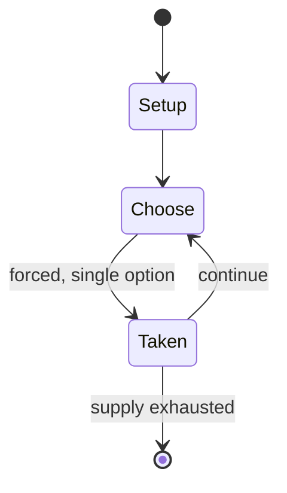

# Google Santa Tracker

*website designed by Google simulating the tracking of Santa Claus*

`google_santa_tracker` &nbsp; state: **DEEPENED** &nbsp; method: **heuristic**

## Found layer (recorded, not trusted)

| field | value |
| --- | --- |
| wikidata | Q22077991 |
| wikipedia | Google Santa Tracker |
| genres (source) | educational video game |
| instance of (source) | video game |
| country of origin | -- |

## Declared layer (orders bench work)

| field | value |
| --- | --- |
| year created | 2004 |
| epoch | CONTEMPORARY |
| region | -- |
| media | VIDEO |
| players | -- |
| age band | -- |
| exogenous process | -- |
| loss shape | -- |
| live axes | - |
| horizon | -- |
| scoring shape | -- |
| information | -- |
| interaction | -- |
| turn structure | -- |
| tractability | SAMPLING_ONLY |
| randomness | -- |
| luck factor | 0.35 |
| rules complexity | 1.83 |
| strategic depth | 2.0 |
| novelty | 0.0896 |
| solved status | -- |
| strategies | -- |
| algorithms | -- |

## Object model

```
Episode
  players      : ?
  turn_structure: ?
  horizon       : ?
  scoring       : ?

WorldState     -- simulation state advanced by the engine
Avatar         -- player-controlled agent
Clock          -- frame or tick counter
```

## State transition diagram



## Research item -- turn trace

```
# Google Santa Tracker -- simulated turn events
# generated from the DECLARED vector, not from a rulebook.
# structure: exo=None loss=None horizon=None scoring=None axes=-

t=0    SETUP        players=2  pot=0  capacity=6
t=1    FORCED       p1 single legal option taken (pot_gain=+1.3)
t=2    FORCED       p1 single legal option taken (pot_gain=+1.5)
t=3    FORCED       p1 single legal option taken (pot_gain=+1.3)
t=4    FORCED       p1 single legal option taken (pot_gain=+1.1)
t=5    FORCED       p1 single legal option taken (pot_gain=+0.8)
t=6    FORCED       p1 single legal option taken (pot_gain=+1.9)
t=7    FORCED       p1 single legal option taken (pot_gain=+1.4)
t=8    FORCED       p1 single legal option taken (pot_gain=+2.0)
t=9    FORCED       p1 single legal option taken (pot_gain=+0.7)
t=10   FORCED       p1 single legal option taken (pot_gain=+0.6)
t=11   FORCED       p1 single legal option taken (pot_gain=+1.1)
t=12   FORCED       p1 single legal option taken (pot_gain=+1.2)
t=13   FORCED       p1 single legal option taken (pot_gain=+0.9)
t=14   FORCED       p1 single legal option taken (pot_gain=+1.1)
t=15   FORCED       p1 single legal option taken (pot_gain=+1.1)
t=16   ENDTURN      turn passes to p2
t=17   FORCED       p2 single legal option taken (pot_gain=+1.7)
t=18   FORCED       p2 single legal option taken (pot_gain=+2.0)
t=19   FORCED       p2 single legal option taken (pot_gain=+1.5)
t=20   FORCED       p2 single legal option taken (pot_gain=+1.8)
t=21   FORCED       p2 single legal option taken (pot_gain=+1.0)
t=22   ENDTURN      turn passes to p1
t=23   FORCED       p1 single legal option taken (pot_gain=+1.0)
t=24   ENDTURN      turn passes to p2
t=25   FORCED       p2 single legal option taken (pot_gain=+0.7)
t=26   FORCED       p2 single legal option taken (pot_gain=+1.9)

terminal: VARIABLE
```

## Source extract

Google Santa Tracker is an annual Christmas-themed entertainment website, launched on December
1, 2004 by Google, that simulates the tracking of the legendary character Santa Claus on
Christmas Eve, using pre-determined location information. It also allows users to play, watch,
and learn through various Christmas-themed activities. The site was inspired by NORAD Tracks
Santa, which has operated since 1955.   == History == In early 2004, employees at Google stated
that "they felt like it could be better for users to 'visualize' where Santa is currently at" in
response to the NORAD Tracks Santa service. Later that year, Keyhole, Inc. was acquired by
Google and they launched a paid service titled the "Keyhole Earth Viewer" (Google Earth's
original name), where they would launch a service within the program titled the "Keyhole Santa
Radar". The service received 25,000 viewers in its debut, and 250,000 the following year.  In
2007, NORAD and Google formally announced a partnership which would last for the next five
years. In 2015, Google announced that Google Santa Tracker is now open source through GitHub.
This would mean that its users could install Google Santa Tracker as an APK file

<sub>Wikipedia, CC BY-SA. Retained as evidence for the structural
classification above. Every rule inferred from it is HYPOTHESIZED
until audited against a rulebook.</sub>
