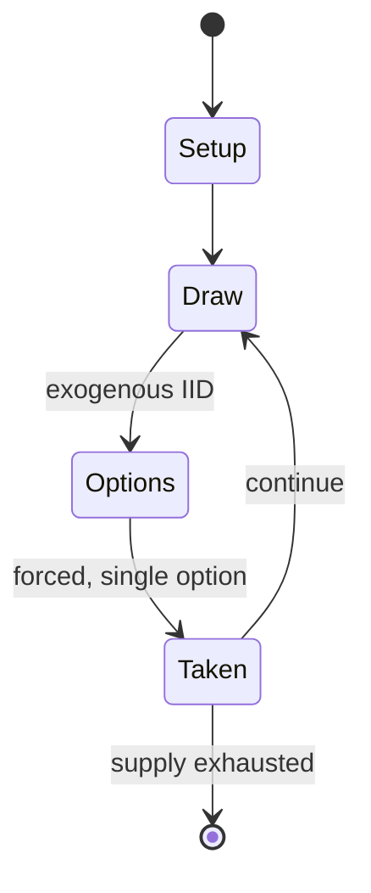

# Gorgar

*1979 pinball machine*

`gorgar` &nbsp; state: **DEEPENED** &nbsp; method: **heuristic**

## Found layer (recorded, not trusted)

| field | value |
| --- | --- |
| wikidata | Q5586229 |
| wikipedia | Gorgar |
| genres (source) | pinball video game |
| instance of (source) | pinball machine game, video game |
| country of origin | -- |

## Declared layer (orders bench work)

| field | value |
| --- | --- |
| year created | 1979 |
| epoch | DIGITAL |
| region | -- |
| media | VIDEO, WORD |
| players | -- |
| age band | -- |
| exogenous process | IID |
| loss shape | -- |
| live axes | - |
| horizon | -- |
| scoring shape | NONLINEAR |
| information | -- |
| interaction | -- |
| turn structure | -- |
| tractability | SAMPLING_ONLY |
| randomness | SPINNER |
| luck factor | 0.42 |
| rules complexity | 1.87 |
| strategic depth | 2.25 |
| novelty | 0.5621 |
| solved status | -- |
| strategies | sacrifice |
| algorithms | -- |

## Object model

```
Episode
  players      : ?
  turn_structure: ?
  horizon       : ?
  scoring       : NONLINEAR

WorldState     -- simulation state advanced by the engine
Avatar         -- player-controlled agent
Clock          -- frame or tick counter
```

## State transition diagram



## Research item -- turn trace

```
# Gorgar -- simulated turn events
# generated from the DECLARED vector, not from a rulebook.
# structure: exo=IID loss=None horizon=None scoring=NONLINEAR axes=-

t=0    SETUP        players=2  pot=0  capacity=3
t=1    DRAW         p1 roll from d6 pool -> outcome #5  (p=0.164)
t=2    FORCED       p1 single legal option taken (pot_gain=+1.8)
t=3    ENDTURN      turn passes to p2
t=4    DRAW         p2 roll from d6 pool -> outcome #4  (p=0.019)
t=5    FORCED       p2 single legal option taken (pot_gain=+1.1)
t=6    DRAW         p2 roll from d6 pool -> outcome #6  (p=0.036)
t=7    FORCED       p2 single legal option taken (pot_gain=+0.9)
t=8    DRAW         p2 roll from d6 pool -> outcome #5  (p=0.022)
t=9    FORCED       p2 single legal option taken (pot_gain=+1.2)
t=10   DRAW         p2 roll from d6 pool -> outcome #3  (p=0.077)
t=11   FORCED       p2 single legal option taken (pot_gain=+1.2)
t=12   DRAW         p2 roll from d6 pool -> outcome #4  (p=0.182)
t=13   FORCED       p2 single legal option taken (pot_gain=+1.6)
t=14   ENDTURN      turn passes to p1
t=15   DRAW         p1 roll from d6 pool -> outcome #5  (p=0.174)
t=16   FORCED       p1 single legal option taken (pot_gain=+2.0)
t=17   DRAW         p1 roll from d6 pool -> outcome #1  (p=0.211)
t=18   FORCED       p1 single legal option taken (pot_gain=+1.1)
t=19   DRAW         p1 roll from d6 pool -> outcome #6  (p=0.133)
t=20   FORCED       p1 single legal option taken (pot_gain=+0.6)
t=21   DRAW         p1 roll from d6 pool -> outcome #5  (p=0.273)
t=22   FORCED       p1 single legal option taken (pot_gain=+1.2)
t=23   DRAW         p1 roll from d6 pool -> outcome #6  (p=0.169)
t=24   FORCED       p1 single legal option taken (pot_gain=+0.9)
t=25   ENDTURN      turn passes to p2
t=26   DRAW         p2 roll from d6 pool -> outcome #1  (p=0.050)
t=27   FORCED       p2 single legal option taken (pot_gain=+1.8)

terminal: VARIABLE
```

## Conditions

| kind | threshold | effect | trigger |
| --- | --- | --- | --- |
| BOUNDARY | -- | -- | A maximum of one extra ball per ordinal ball can be earned. |

## Source extract

Gorgar is a 1979 pinball machine designed by Barry Oursler and released by Williams Electronics.
It is the first speech-synthesized ("talking") pinball machine, containing a vocabulary of seven
words.   == Design == The game was planned for a year before its introduction at the 1979 AMOA
show; a single prototype of an earlier game, Disco Fever, with speech was shown at the 1978 AMOA
show, but the table never went into production with this feature. The backglass shows an
apparent Satanic ritual sacrifice. The artwork on the playfield depicts Gorgar emerging from a
pit of fire, engaged in combat with a barbarian. This bears a passing resemblance to the 1978
Boris Vallejo painting In the Underworld.   === Sound design === The game uses its vocabulary of
seven words ("Gorgar", "speaks", "beat", "you", "me", "hurt", "got") to combine to form varying
broken-English phrases, such as "Gorgar speaks" and "Me got you". The pinball machine also has a
heartbeat sound effect that increases in speed during longer gameplay. The sound board uses a
Motorola CVSD chip. The words were played back about 30% slower than they were recorded for a
robot-like sound. The background sound improved on that us

<sub>Wikipedia, CC BY-SA. Retained as evidence for the structural
classification above. Every rule inferred from it is HYPOTHESIZED
until audited against a rulebook.</sub>
