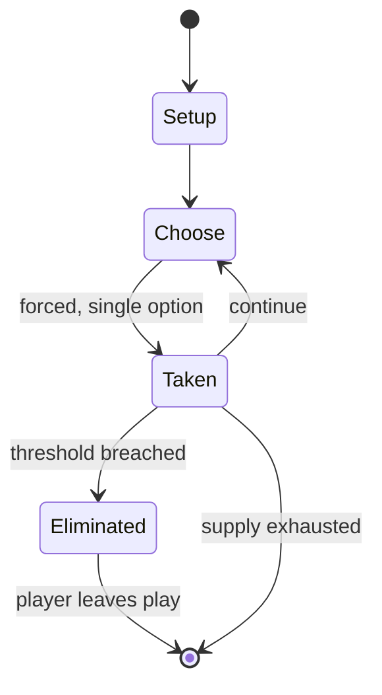

# Gorodki

*Russian folk game*

`gorodki` &nbsp; state: **DEEPENED** &nbsp; method: **heuristic**

## Found layer (recorded, not trusted)

| field | value |
| --- | --- |
| wikidata | Q1296931 |
| wikipedia | Gorodki |
| genres (source) | -- |
| instance of (source) | Russian folk game |
| country of origin | -- |

## Declared layer (orders bench work)

| field | value |
| --- | --- |
| year created | -- |
| epoch | -- |
| region | -- |
| media | SPORT |
| players | -- |
| age band | -- |
| exogenous process | -- |
| loss shape | ELIMINATION |
| live axes | - |
| horizon | -- |
| scoring shape | SET_COLLECTION_CONVEX |
| information | -- |
| interaction | -- |
| turn structure | -- |
| tractability | SAMPLING_ONLY |
| randomness | -- |
| luck factor | 0.35 |
| rules complexity | 1.76 |
| strategic depth | 2.25 |
| novelty | 0.5493 |
| solved status | -- |
| strategies | set_collection |
| algorithms | -- |

## Object model

```
Episode
  players      : ?
  turn_structure: ?
  horizon       : ?
  scoring       : SET_COLLECTION_CONVEX

Pitch          -- bounded physical region
Player         -- embodied agent with a foul count
Clock          -- counts down; stoppages are rule events
Official       -- detects infractions and applies penalties
```

## State transition diagram



## Research item -- turn trace

```
# Gorodki -- simulated turn events
# generated from the DECLARED vector, not from a rulebook.
# structure: exo=None loss=ELIMINATION horizon=None scoring=SET_COLLECTION_CONVEX axes=-

t=0    SETUP        players=2  pot=0  capacity=5
t=1    FORCED       p1 single legal option taken (pot_gain=+1.8)
t=2    ENDTURN      turn passes to p2
t=3    FORCED       p2 single legal option taken (pot_gain=+1.7)
t=4    FORCED       p2 single legal option taken (pot_gain=+1.7)
t=5    FORCED       p2 single legal option taken (pot_gain=+1.1)
t=6    ENDTURN      turn passes to p1
t=7    FORCED       p1 single legal option taken (pot_gain=+1.2)
t=8    FORCED       p1 single legal option taken (pot_gain=+1.1)
t=9    FORCED       p1 single legal option taken (pot_gain=+0.6)
t=10   FORCED       p1 single legal option taken (pot_gain=+0.8)
t=11   FORCED       p1 single legal option taken (pot_gain=+1.5)
t=12   FORCED       p1 single legal option taken (pot_gain=+1.6)
t=13   FORCED       p1 single legal option taken (pot_gain=+1.8)
t=14   FORCED       p1 single legal option taken (pot_gain=+0.9)
t=15   FORCED       p1 single legal option taken (pot_gain=+0.6)
t=16   FORCED       p1 single legal option taken (pot_gain=+0.9)
t=17   FORCED       p1 single legal option taken (pot_gain=+1.6)
t=18   FORCED       p1 single legal option taken (pot_gain=+0.9)
t=19   FORCED       p1 single legal option taken (pot_gain=+1.8)
t=20   FORCED       p1 single legal option taken (pot_gain=+0.9)
t=21   FORCED       p1 single legal option taken (pot_gain=+1.4)
t=22   ENDTURN      turn passes to p2
t=23   FORCED       p2 single legal option taken (pot_gain=+0.7)
t=24   FORCED       p2 single legal option taken (pot_gain=+0.5)
t=25   ENDTURN      turn passes to p1
t=26   FORCED       p1 single legal option taken (pot_gain=+1.7)

terminal: VARIABLE
```

## Conditions

| kind | threshold | effect | trigger |
| --- | --- | --- | --- |
| ELIMINATE | -- | -- | Another four gorodki return to their place unless the center spot is knocked out |
| BOUNDARY | -- | -- | The game was known in a form that is quite close to the modern one at least from the 17th century, since one of the most notable gorodki players was Peter the Great. |

## Source extract

Gorodki (Russian: Городки, lit. 'townlets'; Swedish: Poppi; Lithuanian: Miestučiai) is a Russian
folk sport. Similar in concept to bowling and also somewhat to horseshoes, the aim of the game
is to knock out groups of skittles arranged in various patterns by throwing a bat at them. The
skittles, or pins, are called gorodki (literally "little cities" or "townlets"), and the square
zone in which they are arranged is called the gorod ("city"). Its popularity has spread to
Karelia, Finland, Sweden, Ingria, parts of Lithuania, and Estonia. In the Scandinavian and
Baltic languages, the game has many different names, such as kurnimäng, kriuhka, köllöi, keili,
and miestučiai. The Finnish variant is called kyykkä, or Finnish skittles. The game was known in
a form that is quite close to the modern one at least from the 17th century, since one of the
most notable gorodki players was Peter the Great. It has survived in the contemporary period.
== Gameplay ==  The game consists of throwing a bat from a predetermined distance at the
gorodki, which are arranged in one of 15 configurations:  Cannon (пушка, pushka) Fork (вилка,
vilka) Star (звезда, zvezda) Arrow (стрела, strela) Well (колодец, ko

<sub>Wikipedia, CC BY-SA. Retained as evidence for the structural
classification above. Every rule inferred from it is HYPOTHESIZED
until audited against a rulebook.</sub>
