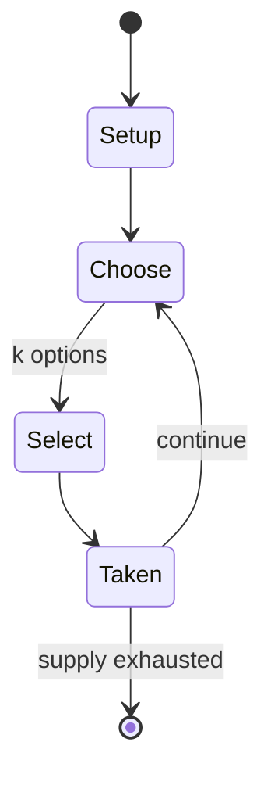

# Graveyard

*children's game aimed at teaching volunteering habit*

`graveyard` &nbsp; state: **DEEPENED** &nbsp; method: **heuristic**

## Found layer (recorded, not trusted)

| field | value |
| --- | --- |
| wikidata | Q5597943 |
| wikipedia | Graveyard (game) |
| genres (source) | -- |
| instance of (source) | party game |
| country of origin | -- |

## Declared layer (orders bench work)

| field | value |
| --- | --- |
| year created | -- |
| epoch | -- |
| region | -- |
| media | EDUCATIONAL, PARTY, PLAYGROUND |
| players | -- |
| age band | CHILD |
| exogenous process | -- |
| loss shape | -- |
| live axes | SELECT |
| horizon | -- |
| scoring shape | -- |
| information | -- |
| interaction | SOLITAIRE |
| turn structure | -- |
| tractability | SAMPLING_ONLY |
| randomness | HIDDEN_INFO |
| luck factor | 0.35 |
| rules complexity | 2.04 |
| strategic depth | 2.0 |
| novelty | 0.3965 |
| solved status | -- |
| strategies | -- |
| algorithms | -- |

## Object model

```
Episode
  players      : ?
  turn_structure: ?
  horizon       : ?
  scoring       : ?

OptionSet      -- the choices available after an exogenous draw
```

## State transition diagram



## Research item -- turn trace

```
# Graveyard -- simulated turn events
# generated from the DECLARED vector, not from a rulebook.
# structure: exo=None loss=None horizon=None scoring=None axes=SELECT

t=0    SETUP        players=2  pot=0  capacity=4
t=1    SELECT       p1 3 options; take #1  (pot_gain=+2.4, capacity=-1)
t=2    ENDTURN      turn passes to p2
t=3    SELECT       p2 2 options; take #2  (pot_gain=+1.9, capacity=-0)
t=4    SELECT       p2 3 options; take #3  (pot_gain=+2.0, capacity=-2)
t=5    SELECT       p2 4 options; take #1  (pot_gain=+1.9, capacity=-2)
t=6    SELECT       p2 4 options; take #2  (pot_gain=+1.7, capacity=-1)
t=7    SELECT       p2 3 options; take #1  (pot_gain=+0.9, capacity=-0)
t=8    SELECT       p2 3 options; take #3  (pot_gain=+2.0, capacity=-2)
t=9    SELECT       p2 2 options; take #1  (pot_gain=+1.0, capacity=-0)
t=10   SELECT       p2 2 options; take #1  (pot_gain=+1.0, capacity=-0)
t=11   ENDTURN      turn passes to p1
t=12   SELECT       p1 4 options; take #2  (pot_gain=+2.4, capacity=-0)
t=13   ENDTURN      turn passes to p2
t=14   SELECT       p2 1 options; take #1  (pot_gain=+2.0, capacity=-2)
t=15   ENDTURN      turn passes to p1
t=16   SELECT       p1 4 options; take #4  (pot_gain=+2.4, capacity=-0)
t=17   ENDTURN      turn passes to p2
t=18   SELECT       p2 4 options; take #3  (pot_gain=+1.1, capacity=-2)
t=19   SELECT       p2 4 options; take #3  (pot_gain=+1.4, capacity=-1)
t=20   SELECT       p2 1 options; take #1  (pot_gain=+2.0, capacity=-1)
t=21   SELECT       p2 3 options; take #3  (pot_gain=+1.6, capacity=-1)
t=22   SELECT       p2 3 options; take #3  (pot_gain=+0.6, capacity=-2)
t=23   SELECT       p2 2 options; take #2  (pot_gain=+1.7, capacity=-2)
t=24   SELECT       p2 1 options; take #1  (pot_gain=+2.2, capacity=-1)
t=25   SELECT       p2 3 options; take #3  (pot_gain=+1.4, capacity=-2)
t=26   SELECT       p2 3 options; take #3  (pot_gain=+2.0, capacity=-0)

terminal: VARIABLE
```

## Source extract

Graveyard is a game most commonly played by children on the playground, or at parties. It is
often initiated by one or more persons with prior knowledge of the rules and is usually played
with several others who are unaware of them. The game is very simple and is most commonly used
only as a means to select one of the participants for a task they would not be willing to
perform voluntarily.   == Gameplay == Graveyard is initiated when one of the participants
declares "Graveyard". Once begun, the only rule of the game is that the first person to speak is
the loser. Most often, one of the participants unaware of the purpose of the game will
immediately ask for the rules to be clarified, thus losing the game. If all participants are
aware of the rules at the start of the game, the purpose becomes to not be the first to give in
and speak voluntarily.   == Purpose == Graveyard is most often used to assign one of the players
to a task that none would agree to do voluntarily. For example, if none of the guests at a party
where alcohol is being consumed willingly volunteer to be the designated driver, one might
suggest to play Graveyard as a means to select one. Alternatively, the game mig

<sub>Wikipedia, CC BY-SA. Retained as evidence for the structural
classification above. Every rule inferred from it is HYPOTHESIZED
until audited against a rulebook.</sub>
